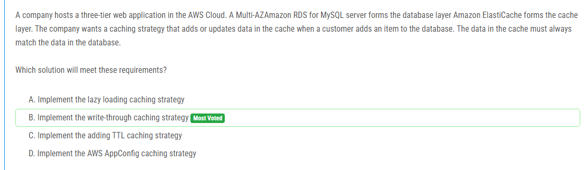

해설:

정답 B.

이는 데이터베이스에 아이템을 추가하거나 업데이트 할 때 캐시에도 해당 데이터를 즉시 추가 또는 업데이트하여 데이터베이스와 캐시의 데이터가 항상 일치하도록 하는 전략입니다. 따라서 이 전략을 사용하면 데이터베이스에 아이템이 추가될 때 캐시에도 해당 아이템이 즉시 추가되므로 데이터 일치성을 유지할 수 있습니다.

해설:

정답 B.

안정성 및 속도: AWS DataSync는 대량의 데이터를 안전하고 빠르게 마이그레이션할 수 있는 고성능 데이터 전송 서비스입니다.

암호화: AWS DataSync는 데이터를 전송하는 동안 SSL을 사용하여 데이터를 암호화합니다. 이는 요구 사항 중 하나인 데이터 이동 중 암호화를 충족합니다.

운영 오버헤드 최소화: AWS DataSync는 관리 및 모니터링이 간단하며, 클라우드 기반으로 실행되므로 온프레미스에서 별도의 인프라를 유지할 필요가 없습니다.

따라서 AWS DataSync를 사용하면 요구 사항을 충족하면서 운영 오버헤드를 최소화할 수 있습니다.

해설:

정답 C.

이는 Windows 컨테이너를 실행하는 데 적합한 옵션입니다. Amazon ECS를 사용하여 작업을 실행하고 Fargate를 사용하여 관리형 컨테이너 인프라를 프로비저닝하므로 인프라 구축에 대한 관리 부담이 줄어듭니다. 또한 작업을 정확히 10분마다 실행할 수 있는 스케줄드 태스크를 생성하여 요구 사항을 충족할 수 있습니다.

해설:

정답 A, E.

A. 먼저, 회사는 AWS Organizations 내에 새로운 조직을 생성하여 모든 기능을 활성화해야 합니다. 그런 다음 조직 내에 새로운 AWS 계정을 생성하여 비즈니스 단위별로 나눌 수 있습니다. 이렇게 하면 여러 AWS 계정을 하나의 조직으로 구성하여 중앙 집중식 관리 및 정책 관리를 가능하게 합니다.

E. 그런 다음, IAM Identity Center (AWS Single Sign-On)을 조직 내에 설정해야 합니다. IAM Identity Center를 설정하고 회사의 기업 디렉토리 서비스와 통합하여 중앙 집중식으로 인증을 처리할 수 있습니다. 이를 통해 사용자는 단일 로그인을 통해 다양한 AWS 계정에 액세스할 수 있게 됩니다.

해설:

정답 A.

정답 A는 Amazon S3 Glacier에 비디오 아카이브를 저장하고 Expedited 검색을 사용하는 것입니다.

이 옵션은 비용을 최소화하는 데 가장 효과적입니다. Amazon S3 Glacier는 저렴한 저장 비용을 제공하며, Expedited 검색을 사용하면 필요할 때 파일을 최대 5분 내에 사용할 수 있습니다.

해설:

정답 A.

Amazon S3는 정적 콘텐츠 호스팅에 이상적입니다. 이를 통해 정적 웹 사이트를 쉽게 호스팅할 수 있습니다.
Amazon ECS with AWS Fargate는 컨테이너화된 응용 프로그램을 간편하게 배포하고 관리할 수 있는 서비스입니다. Fargate를 사용하면 서버를 프로비저닝하거나 관리할 필요 없이 컨테이너를 실행할 수 있습니다. 이는 운영 비용을 줄이는 데 도움이 됩니다.
관리형 Amazon RDS 클러스터를 사용하여 데이터베이스를 쉽게 관리할 수 있습니다. 이는 배포 및 관리를 단순화하여 운영 비용을 줄이는 데 도움이 됩니다.

해설:

정답 C.

Amazon EFS는 파일 시스템으로서 기능하며, 다중 마운트 타겟을 통해 여러 Linux 인스턴스에서 마운트할 수 있습니다. 또한 네이티브 프로토콜을 통해 AWS 내부 및 온프레미스에서 마운트할 수 있습니다. 이는 회사의 요구 사항을 충족하는 데 적합한 솔루션입니다.

Amazon EFS는 또한 고가용성 및 확장 가능성을 제공하므로, 서비스가 항상 사용 가능하고 필요에 따라 스케일 아웃할 수 있습니다. Site-to-Site VPN을 통해 온프레미스 네트워크에서 VPC로 접근할 수 있으므로 Amazon EFS를 사용하여 이러한 요구 사항을 충족하는 것이 적절합니다.

해설:

정답 C.

SCP (서비스 제어 정책)를 사용하여 요구 사항을 충족할 수 있습니다. SCP를 사용하면 특정 AWS 서비스에 대한 특정 조치를 허용하거나 거부할 수 있습니다. 이 경우 SCP를 사용하여 모든 사용자, 포함하여 루트 사용자에게도 청구 정보에 액세스할 수 없도록 설정할 수 있습니다.

이 정책을 루트 조직 단위에 연결하여 모든 하위 계정에 영향을 미칠 수 있도록 만듭니다. 이렇게 함으로써 모든 회사의 회원 계정에서 청구 정보에 대한 액세스를 차단할 수 있습니다.

해설:

정답 C.

Amazon SNS dead letter queue를 구성하여 전달되지 않은 메시지를 보관할 수 있습니다. 이 dead letter queue를 Amazon SQS 대상으로 구성하면 메시지가 수신되지 않을 때 Amazon SQS에 메시지가 전송됩니다. 이렇게 하면 메시지를 보관하고 분석할 수 있습니다.

또한 Amazon SQS는 메시지를 저장하고 분석하기 위한 이상적인 서비스입니다. 이러한 솔루션은 개발 노력을 최소화하면서 요구 사항을 충족합니다.

해설:

정답 B.

DynamoDB의 Continuous Backups 및 Point-in-Time Recovery를 사용하면 백업을 S3 버킷에 자동으로 수행할 수 있습니다. 이를 통해 최소한의 코드 작성으로 백업을 구성할 수 있습니다. Continuous Backups는 테이블의 지속적인 백업을 제공하며, Point-in-Time Recovery는 데이터베이스를 특정 시간으로 복원할 수 있는 기능을 제공합니다.

이 솔루션은 애플리케이션의 가용성을 저해하지 않고 백업을 수행하며, 테이블에 정의된 Read Capacity Units (RCUs)에 영향을 미치지 않습니다. 이는 요구 사항을 충족시키기 위한 가장 간편하고 효과적인 방법입니다.

해설:

정답 A.

AWS Lambda event source mapping을 사용하여 Amazon SQS 표준 대기열을 이벤트 소스로 설정합니다. 이는 비동기 애플리케이션을 디자인하기 위한 좋은 방법 중 하나입니다.
데이터 보안을 위해 AWS Key Management Service (SSE-KMS)를 사용하여 암호화합니다. 이것은 보안을 강화하기 위한 좋은 방법입니다.
Amazon SQS 표준 대기열을 사용하면 데이터 처리 중에 메시지를 여러 번 수신할 수 있습니다. 이것은 각 요청이 적어도 한 번 처리되는 것을 보장합니다.

해설:

정답 B.

AWS Organizations를 사용하여 계정을 조직 단위로 구성하고, 서비스 제어 정책(SCP)을 정의하여 EC2 인스턴스 유형의 사용을 제어할 수 있습니다. SCP를 사용하면 특정 인스턴스 유형을 허용하거나 거부할 수 있으므로, 개발 팀이 허용된 EC2 인스턴스 유형만 사용할 수 있습니다. 이렇게 함으로써 예산 초과 문제를 해결할 수 있습니다.

이 솔루션은 개발 노력을 최소화하면서 요구 사항을 충족시킬 수 있습니다. 개발팀은 SCP를 적용하여 특정 인스턴스 유형을 사용하지 못하도록 간단히 제어할 수 있으며, 따라서 다른 솔루션보다 운영 비용이 적게 듭니다.

해설:

정답 D, E, F.

D. Amazon Transcribe은 오디오 레코딩을 텍스트로 변환하는 서비스입니다. 모든 언어의 오디오 레코딩을 텍스트로 변환할 수 있으므로 다국어 지원에 적합합니다.

E. Amazon Translate는 다른 언어를 영어로 번역하는 서비스입니다. 이를 사용하여 다국어 지원이 필요한 경우 텍스트를 영어로 번역할 수 있습니다.

F. Amazon Comprehend는 텍스트 데이터에서 감정 분석을 수행하는 서비스입니다. 오디오 레코딩을 텍스트로 변환한 후 Amazon Comprehend를 사용하여 감정 분석 보고서를 생성할 수 있습니다.

이러한 조합을 사용하면 회사는 고객 서비스 전화 녹취록에 대한 감정 분석 보고서를 생성할 수 있으며, 새로운 언어를 추가할 때도 효율적으로 처리할 수 있습니다.

해설:

정답 D.

해설:

정답 C.

Amazon Macie는 데이터 탐지 및 보안 서비스로써, 관리되는 식별자를 사용하여 PII 또는 금융 정보와 같은 민감한 데이터를 식별할 수 있습니다. Amazon S3 버킷에 연결하여 데이터 레이크에서 이러한 종류의 데이터를 발견하는 데 도움이 됩니다. 이는 회사가 내부 감사를 수행하고 민감한 고객 또는 직원 데이터가 노출되지 않도록 보호하는 데 중요합니다.

해설:

정답 B, D.

B. AWS Storage Gateway 파일 게이트웨이를 배포하여 NFS 스토리지를 대체합니다. 이는 기존 응용 프로그램을 재구성하지 않고도 로컬 캐싱을 지원하는 고성능 솔루션을 제공합니다.

D. AWS Storage Gateway 볼륨 게이트웨이를 배포하여 블록 스토리지를 대체합니다. 이것은 마찬가지로 기존 응용 프로그램을 재구성하지 않고도 로컬 캐싱을 지원하는 고성능 솔루션을 제공합니다.

이러한 조합은 회사가 로컬 캐싱을 사용하여 기존 애플리케이션을 다시 설계하지 않고도 고성능 스토리지 솔루션으로 전환할 수 있도록 도와줍니다. AWS Storage Gateway는 기존 인프라와 통합되므로 이전 작업의 변경을 최소화하면서 필요한 스토리지 용량을 확장할 수 있습니다.

해설:

정답 C.

VPC 게이트웨이 엔드포인트를 프로비저닝하여 Amazon S3와의 통신을 안전하게 하고 데이터 전송 비용을 줄일 수 있습니다. 이 방법은 Amazon S3와의 트래픽을 VPC 내에서 처리하므로 인터넷을 통한 데이터 전송 비용이 발생하지 않습니다.

따라서 이 솔루션을 선택하면 데이터 전송 비용을 최소화하고 효율적으로 데이터를 처리할 수 있습니다. 다른 옵션들은 인터넷을 통한 데이터 전송이 필요하므로 추가 비용이 발생할 수 있습니다.

해설:

정답 A.

S3 Lifecycle을 사용하여 만료된 객체 버전을 삭제하고 최근 두 개의 버전을 유지할 수 있습니다. 이를 통해 오래된 버전이 자동으로 정리되므로 운영 오버헤드가 최소화되며, 비용을 절감할 수 있습니다. 다른 옵션들은 수동으로 스크립트를 작성하거나 Lambda 함수를 설정하여 관리해야 하므로 운영 오버헤드가 더 많이 발생할 수 있습니다.

해설:

정답 D.

AWS Direct Connect 파트너에게 연락하여 기존 AWS 계정에 호스팅 연결을 주문하는 것이 좋습니다. 이렇게하면 연결의 대역폭을 1 Gbps에서 200 Mbps로 줄일 수 있습니다. 이 연결은 여전히 직접 연결을 통해 AWS 리전에 프라이빗하게 연결되어 있으므로 보안에 영향을 미치지 않습니다. 또한 연결이 실제로 사용되지 않는 경우에도 연결 비용을 줄일 수 있습니다.

해설:

정답 A, D.

A. 온프레미스에 AWS DataSync 에이전트를 배포하고, DataSync 작업을 예약하여 데이터를 FSx for Windows File Server 파일 시스템으로 전송합니다. 이 솔루션은 데이터를 안전하게 이동시키면서 파일 권한을 보존합니다.

D. AWS Snowcone 장치를 주문하여 온프레미스 네트워크에 연결한 다음, 장치에 DataSync 에이전트를 시작하고 데이터를 FSx for Windows File Server 파일 시스템으로 전송하는 DataSync 작업을 예약합니다. 이 방법은 대량의 데이터를 안전하게 이동시키는 데 유용하며, 파일 권한도 보존됩니다.

