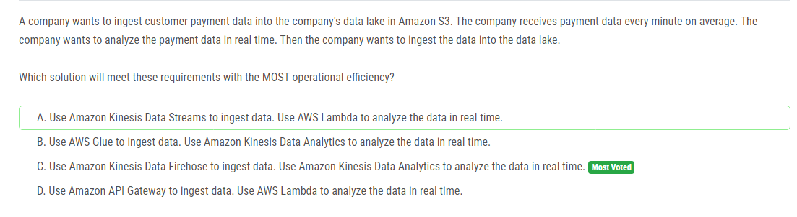

해설:

정답 C.

C. Amazon Kinesis Data Firehose를 사용하여 데이터를 쉽게 수집하고 Amazon Kinesis Data Analytics를 사용하여 실시간으로 데이터를 분석할 수 있습니다. Kinesis Data Firehose는 스트림 데이터를 S3, Redshift, Elasticsearch 등의 대상으로 자동으로 전송하는 서비스이며, 데이터를 즉시 분석할 수 있도록 Amazon Kinesis Data Analytics를 사용할 수 있습니다.

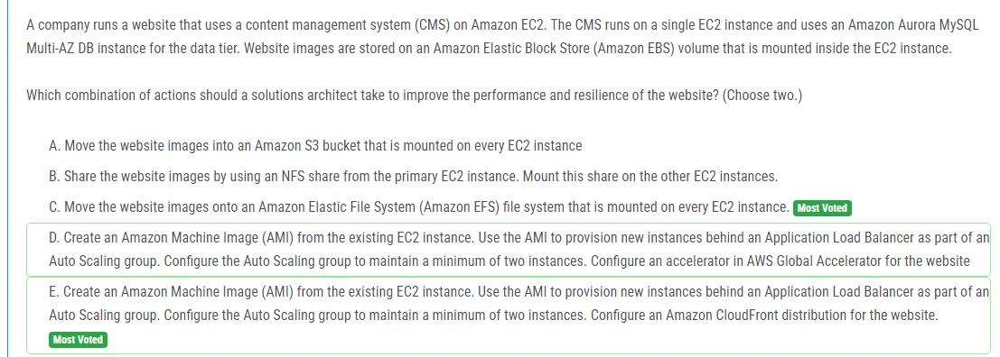

해설:

정답 C, E.

C. 웹 사이트 이미지를 Amazon Elastic File System (Amazon EFS) 파일 시스템으로 이동하여 모든 EC2 인스턴스에 마운트합니다. 이렇게 하면 여러 인스턴스 간에 이미지를 공유하고 동기화할 수 있으며, 확장성과 내결함성이 향상됩니다.

E. 기존 EC2 인스턴스에서 Amazon Machine Image (AMI)를 생성하고, 이를 사용하여 Auto Scaling 그룹의 새로운 인스턴스를 프로비저닝합니다. 이러한 방식으로 여러 인스턴스를 구성하여 확장성과 내결함성을 향상시킬 수 있습니다. 또한 웹 사이트의 정적 컨텐츠를 더 빠르게 전송하기 위해 Amazon CloudFront 배포를 설정하여 성능을 향상시킬 수 있습니다.

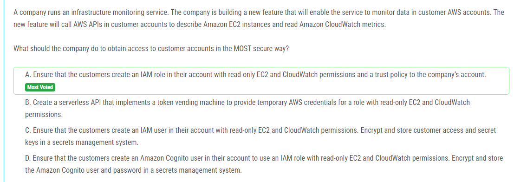

해설:

정답 A.

A. 회사에서 가장 안전한 방법은 고객이 자체 AWS 계정에 읽기 전용 EC2 및 CloudWatch 권한이 있는 IAM 역할을 생성하고, 회사의 계정을 신뢰하는 신뢰 정책을 설정하도록 하는 것입니다. 이렇게하면 회사는 고객 계정의 리소스에 접근할 수 있으며, IAM 역할을 통해 권한을 제어할 수 있습니다. 이는 보안 및 권한 관리 측면에서 가장 효과적인 방법입니다.

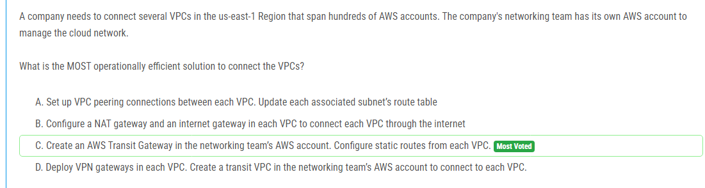

해설:

정답 C.

C. 네트워킹 팀의 AWS 계정에 AWS Transit Gateway를 생성하고, 각 VPC에서 Transit Gateway로 정적 경로를 구성합니다. 이 방법은 여러 VPC 간의 연결을 효과적으로 관리하고, 확장성을 갖추며, 운영 효율성을 높일 수 있는 방법입니다. Transit Gateway를 사용하면 여러 계정 및 리전에 걸쳐 VPC를 중앙 집중식으로 연결할 수 있습니다. 이를 통해 복잡한 VPC 피어링 구성을 피할 수 있습니다.

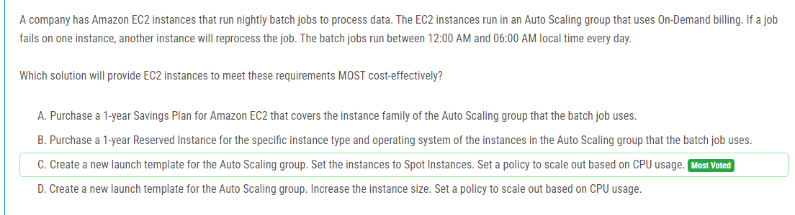

해설:

정답 C.

C. Auto Scaling 그룹의 새로운 런치 템플릿을 생성하고, 인스턴스를 Spot Instances로 설정합니다. Spot Instances는 온디맨드 인스턴스보다 저렴하게 이용할 수 있는 인스턴스 유형입니다. 또한 CPU 사용률을 기준으로 스케일 아웃 정책을 설정하여 필요에 따라 인스턴스 수를 유연하게 조절할 수 있습니다.

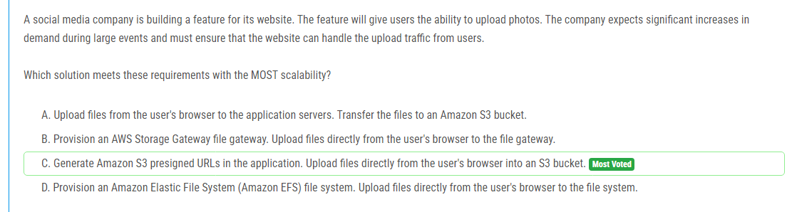

해설:

정답 C.

C. Amazon S3 사전 서명된 URL을 생성하여 응용 프로그램에서 사용자의 브라우저로 직접 파일을 업로드합니다. 이렇게 하면 파일을 안전하게 S3 버킷에 업로드할 수 있으며, 사용자의 브라우저에서 직접 업로드하기 때문에 서버의 부하를 줄일 수 있습니다. 또한 Amazon S3는 매우 확장 가능하므로 대규모 이벤트와 같이 예상치 못한 트래픽 증가에도 대응할 수 있습니다.

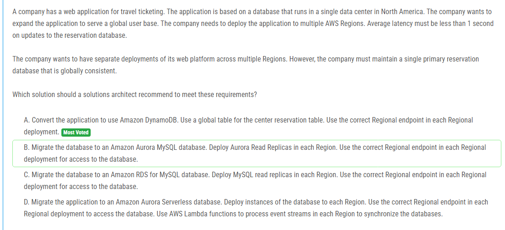

해설:

정답 A.

A. Amazon DynamoDB를 사용하여 애플리케이션을 변환하고, 중앙 예약 테이블에 대해 글로벌 테이블을 사용합니다. 각 지역 배포에서 올바른 리전 엔드포인트를 사용하여 글로벌 테이블에 액세스할 수 있습니다. 이 방법을 사용하면 전 세계의 사용자에게 저지연 시간을 제공하면서도 단일 주요 예약 데이터베이스를 유지할 수 있습니다.

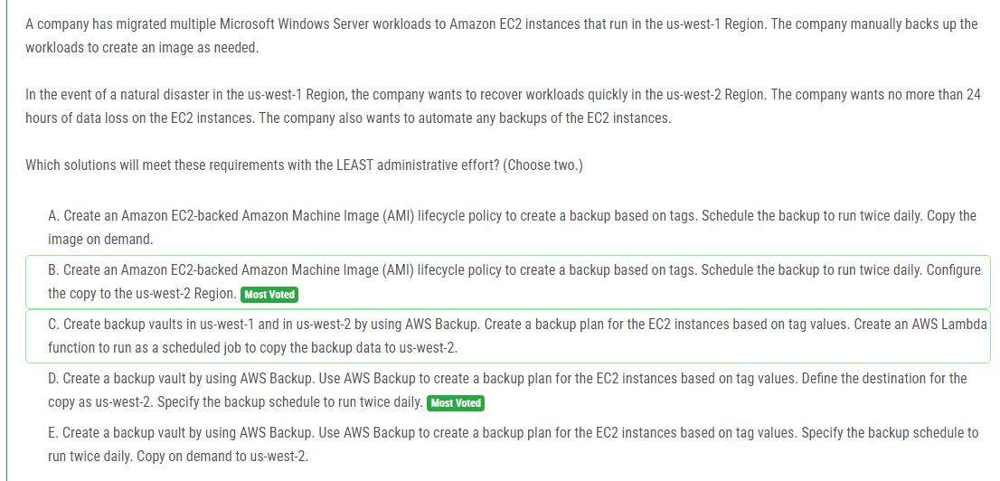

해설:

정답 B, D.

B. Amazon EC2-backed Amazon Machine Image (AMI) 라이프사이클 정책을 생성하여 태그를 기반으로 백업을 만듭니다. 백업을 하루에 두 번 실행하도록 예약하고, 이미지를 us-west-2 리전으로 복사하도록 구성합니다. 이렇게 하면 백업이 자동으로 생성되며, 복제된 이미지가 다른 리전에 저장되므로 재해 발생 시 빠르게 복구할 수 있습니다.

D. AWS Backup를 사용하여 백업 보관소를 생성하고, EC2 인스턴스를 대상으로 태그 값을 기반으로 백업 계획을 생성합니다. 복제 대상을 us-west-2로 지정하고, 백업 일정을 하루에 두 번 실행하도록 설정합니다. 이 방법도 백업을 자동화하고, 다른 리전으로의 복제를 통해 재해 시 빠르게 복구할 수 있습니다.

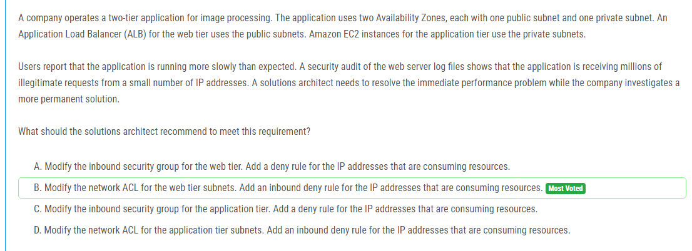

해설:

정답 B.

B. 웹 티어 서브넷의 네트워크 ACL을 수정하여 리소스를 소비하는 IP 주소에 대한 인바운드 거부 규칙을 추가합니다. 이 방법을 사용하면 애플리케이션 계층의 EC2 인스턴스로 가는 트래픽을 제한하고 공격을 차단할 수 있습니다. 보안 그룹을 사용하여 트래픽을 제한할 경우, 실제로 EC2 인스턴스에 도달하기 전에 이미 트래픽이 인바운드되므로 이 문제를 해결하는 데 효과적이지 않을 수 있습니다. 따라서 네트워크 ACL을 사용하여 네트워크 수준에서 트래픽을 제어하는 것이 더 적합합니다.

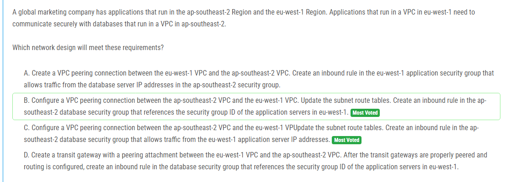

해설:

정답 C.

C. ap-southeast-2 VPC와 eu-west-1 VPC 간에 VPC 피어링 연결을 설정하고, 서브넷 경로 테이블을 업데이트합니다. 그런 다음 ap-southeast-2 데이터베이스 보안 그룹에 eu-west-1 응용 프로그램 서버 IP 주소에서의 트래픽을 허용하는 인바운드 규칙을 생성합니다. 이 방법은 데이터베이스 VPC에서 eu-west-1 애플리케이션 서버로의 트래픽을 안전하게 허용하며, VPC 피어링 연결을 통해 두 VPC 간의 통신을 설정합니다.

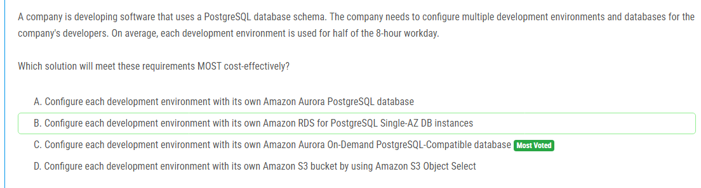

해설:

정답 C.

C. 각 개발 환경에 독립적인 Amazon Aurora On-Demand PostgreSQL 호환 데이터베이스를 구성합니다. 이 방법은 각 개발 환경에 대해 별도의 데이터베이스를 제공하여 개발자가 독립적으로 작업할 수 있도록 합니다. 또한 Amazon Aurora의 On-Demand 모델을 사용하면 사용한 리소스에 대해서만 요금을 지불하므로 비용을 효율적으로 관리할 수 있습니다.

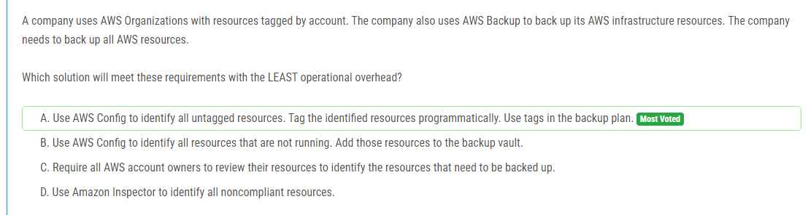

해설:

정답 A.

A. AWS Config를 사용하여 태그가 지정되지 않은 모든 리소스를 식별합니다. 그런 다음 식별된 리소스에 태그를 자동으로 지정합니다. 백업 계획에서는 태그를 사용합니다. 이 방법을 사용하면 수동으로 리소스를 식별하고 태그를 지정하는 과정을 자동화하여 운영 오버헤드를 최소화할 수 있습니다.

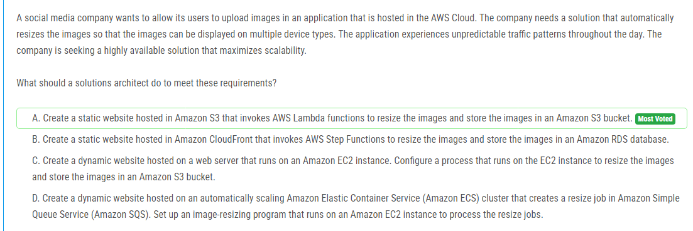

해설:

정답 A.

A. Amazon S3에 호스팅된 정적 웹사이트를 생성하고, 이미지를 리사이징하고 Amazon S3 버킷에 이미지를 저장하기 위해 AWS Lambda 함수를 호출합니다. 이 방법은 서버리스 아키텍처를 사용하여 이미지 리사이징을 자동화하며, 스케일링이 가능하고 가용성이 높은 솔루션을 제공합니다. 또한 Amazon S3의 정적 웹사이트 호스팅 기능을 활용하여 이미지를 효율적으로 제공할 수 있습니다.

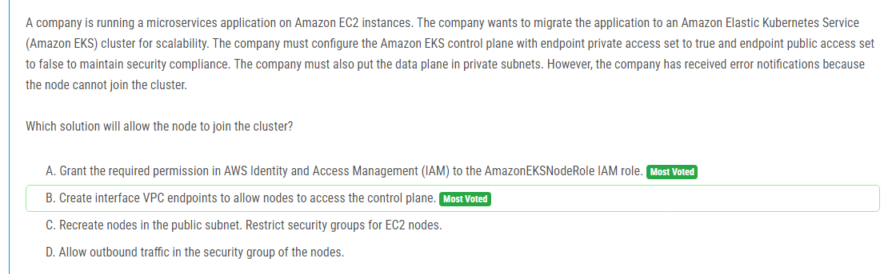

해설:

정답 A.

A. AmazonEKSNodeRole IAM 역할에 필요한 권한을 부여합니다. Amazon EKS 노드가 클러스터에 가입하기 위해서는 적절한 IAM 권한이 필요합니다. 따라서 AmazonEKSNodeRole 역할에 적절한 권한을 부여해야 합니다.

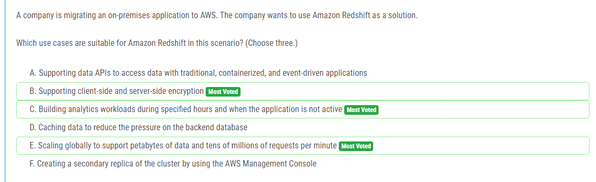

해설:

정답 B, C, E.

B. Amazon Redshift는 클라이언트 측 및 서버 측 암호화를 지원합니다. 이는 데이터 보안을 강화하는 데 유용합니다.

C. Amazon Redshift는 분석 워크로드를 구축하는 데 적합합니다. 특정 시간에 데이터를 로드하고 분석하는 것과 같은 워크로드를 지원합니다.

E. Amazon Redshift는 대규모 데이터 및 요청을 처리할 수 있으므로, 글로벌 스케일에서 페타바이트 규모의 데이터와 수천만 건의 요청을 처리하는 데 적합합니다.

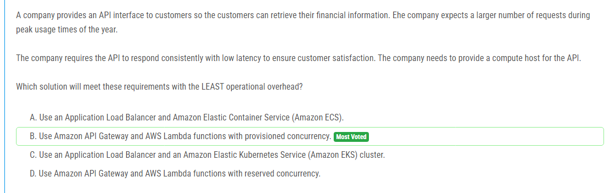

해설:

정답 B.

Amazon API Gateway 및 AWS Lambda 함수를 사용하면 서버 관리 및 운영 오버헤드를 크게 줄일 수 있습니다. 이 솔루션은 서버리스 아키텍처를 채택하여, 운영체제 및 인프라 관리 등과 같은 많은 관리 작업을 AWS에게 맡깁니다. 또한 AWS Lambda의 프로비저닝된 동시성을 사용하여 응답 시간을 일관되게 유지할 수 있습니다. 요청이 증가할 때 자동으로 확장되므로 피크 시간에도 낮은 대기 시간을 유지할 수 있습니다.

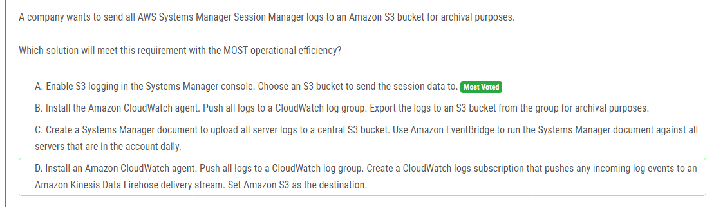

해설:

정답 A.

정답 A는 AWS Systems Manager 콘솔에서 S3 로깅을 활성화하여 세션 데이터를 지정된 S3 버킷으로 전송하는 방법입니다. 이는 Systems Manager 콘솔에서 간단히 설정할 수 있으며, 운영 효율성 면에서 가장 효율적입니다. 다른 옵션들은 CloudWatch 로그 그룹을 사용하거나 복잡한 구성이 필요하기 때문에 더 많은 운영 오버헤드가 발생할 수 있습니다.

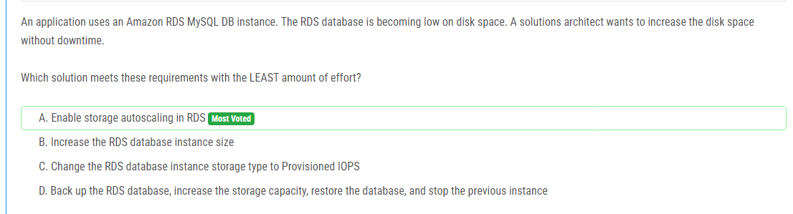

해설:

정답 A.

정답 A는 RDS에서 스토리지 자동 확장을 활성화하여 스토리지 용량을 자동으로 확장하는 방법입니다. 이는 가장 적은 노력으로 디스크 공간을 늘릴 수 있는 방법 중 하나입니다. 나머지 옵션들은 RDS 인스턴스의 구성을 변경하거나 백업 및 복원 과정이 필요하기 때문에 운영 오버헤드가 더 많이 발생할 수 있습니다.

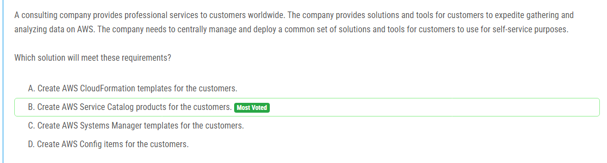

해설:

정답 B.

정답 B는 AWS Service Catalog를 사용하여 고객이 자체 서비스를 사용할 수 있도록 중앙에서 솔루션 및 도구를 관리하고 배포하는 방법입니다. AWS Service Catalog를 사용하면 회사는 사용자가 선택할 수 있는 제품 포트폴리오를 정의하고 사용자가 필요한 솔루션 및 도구를 쉽게 검색하고 배포할 수 있습니다. 이것은 다른 옵션들에 비해 중앙 집중적인 관리와 사용자 편의성을 제공합니다.

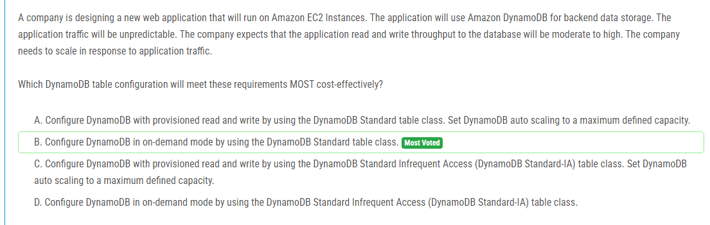

해설:

정답 B.

정답 B는 DynamoDB의 온디맨드 모드를 사용하는 것입니다. 이 모드에서는 읽기 및 쓰기 처리량을 프로비저닝할 필요 없이 요청당 지불하게 됩니다. 이는 예측 불가능한 트래픽 패턴에 대응하면서도 가장 비용 효율적인 방법입니다. 프로비저닝된 모드보다 운영 및 관리 오버헤드가 적으며, 트래픽이 변동될 때 자동으로 확장됩니다. 따라서 이러한 요구사항에 가장 적합한 옵션입니다

