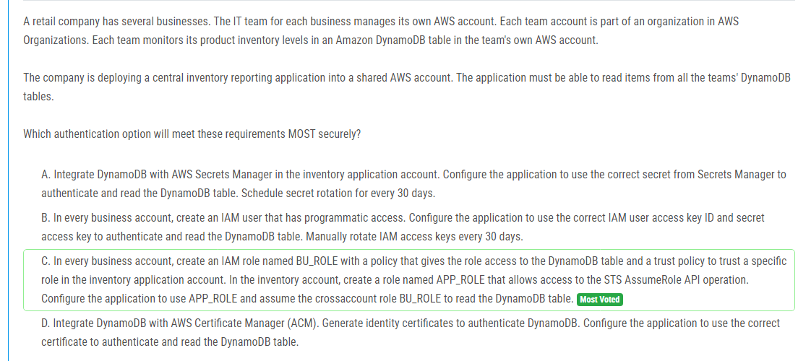

해설:

정답 C.

각 비즈니스 계정에는 BU_ROLE이라는 이름의 IAM 역할이 있습니다. 이 역할은 DynamoDB 테이블에 액세스할 권한이 있습니다. 이 역할은 신뢰 정책을 통해 인벤토리 애플리케이션 계정의 특정 역할을 신뢰합니다.

인벤토리 애플리케이션 계정에는 APP_ROLE이라는 이름의 IAM 역할이 있습니다. 이 역할은 STS AssumeRole API 작업에 대한 액세스를 허용합니다.

애플리케이션은 APP_ROLE을 사용하여 DynamoDB 테이블을 읽기 위해 교차 계정 역할인 BU_ROLE을 가정합니다. 이를 통해 애플리케이션은 각 비즈니스 팀의 DynamoDB 테이블에 대한 액세스를 안전하게 관리할 수 있습니다. 각 팀의 자격 증명이나 비밀 키를 애플리케이션에 저장하거나 관리할 필요가 없으며, IAM 역할과 교차 계정 역할을 사용하여 보안을 강화할 수 있습니다

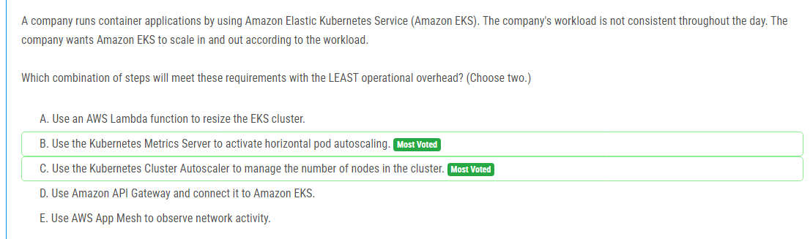

해설:

정답 B, C.

B. Kubernetes Metrics Server 사용: 이 옵션을 선택하면 Kubernetes에서 메트릭을 수집하여 수평 파드 오토스케일링을 활성화할 수 있습니다. 이는 워크로드에 따라 파드 수를 자동으로 조정하여 스케일링을 관리하므로, 요구사항에 가장 적합한 방법 중 하나입니다.

C. Kubernetes Cluster Autoscaler 사용: 이 옵션은 클러스터의 노드 수를 관리하여 스케일 인 및 스케일 아웃을 자동으로 수행합니다. 워크로드에 따라 노드를 추가하거나 제거하여 용량을 동적으로 조정하여 비용을 절감하고 효율성을 향상시킬 수 있습니다.

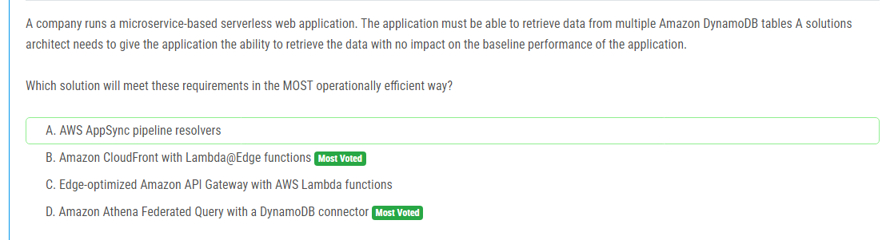

해설:

정답 D.

Amazon Athena Federated Query with a DynamoDB connector: 이 옵션은 Amazon Athena를 사용하여 여러 DynamoDB 테이블에서 데이터를 검색할 수 있도록 합니다. Amazon Athena는 서버리스 쿼리 서비스로, 데이터를 직접 분석하고 검색할 수 있습니다. Federated Query를 통해 DynamoDB 데이터에 대한 외부 쿼리를 수행할 수 있으며, 이는 애플리케이션의 기본 성능에 영향을 주지 않고 데이터를 검색할 수 있도록 합니다. 이는 데이터에 대한 실시간 액세스를 제공하면서도 서버리스 아키텍처를 유지하는 데 매우 효율적입니다.

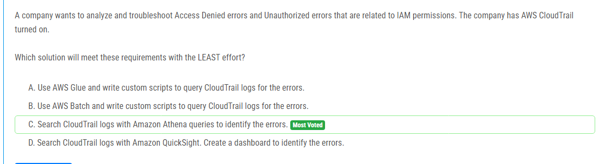

해설:

정답 C.

Amazon Athena 쿼리로 CloudTrail 로그 검색: 이 옵션을 선택하면 Amazon Athena를 사용하여 CloudTrail 로그를 쿼리하여 Access Denied 및 Unauthorized와 같은 IAM 권한 관련 오류를 식별할 수 있습니다. Athena는 서버리스 쿼리 서비스로, SQL을 사용하여 로그를 직접 분석할 수 있습니다. 이는 별도의 인프라나 서버 없이 요구사항을 충족시킬 수 있으며, AWS 계정에서 기본적으로 사용할 수 있는 서비스이므로 추가적인 설정이 필요하지 않습니다. 이것은 가장 효율적이고 적은 노력이 필요한 방법 중 하나입니다.

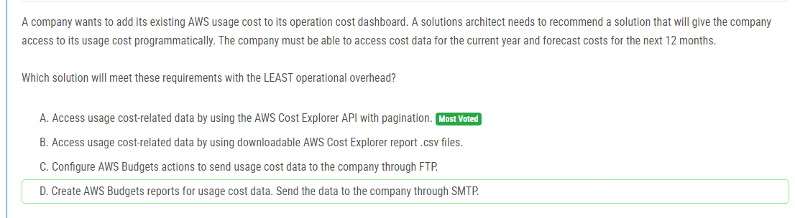

해설:

정답 A.

AWS Cost Explorer API 및 페이지네이션을 사용하여 사용량 비용 관련 데이터에 액세스: 이 옵션은 AWS Cost Explorer API를 사용하여 프로그래밍 방식으로 비용 데이터에 액세스할 수 있습니다. API를 통해 현재 연도의 비용 데이터와 다음 12개월의 비용을 예측할 수 있습니다. 또한 페이지네이션을 사용하여 대량의 데이터를 처리할 수 있으므로 대규모 데이터 집합에도 효과적입니다. 이는 추가적인 관리나 설정 없이도 비용 데이터에 액세스할 수 있으며, 운영 오버헤드를 최소화할 수 있는 방법입니다.

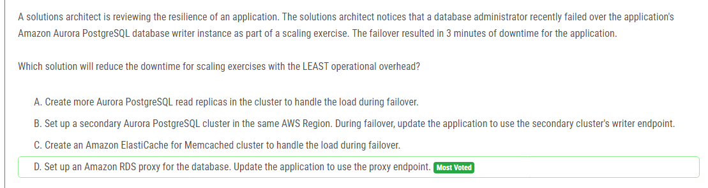

해설:

정답 D.

데이터베이스용 Amazon RDS 프록시 설정: 이 옵션을 선택하면 Amazon RDS 프록시를 구성하여 데이터베이스의 가용성과 성능을 향상시킬 수 있습니다. RDS 프록시는 애플리케이션과 데이터베이스 간의 연결을 관리하며, 장애 조치(failover) 시에도 연결을 유지합니다. 프록시를 통해 애플리케이션은 데이터베이스의 엔드포인트 대신 프록시 엔드포인트를 사용하므로, 데이터베이스 인스턴스가 장애 조치되더라도 애플리케이션은 중단되지 않고 계속 실행될 수 있습니다. 이 방법은 추가 리소스를 관리할 필요 없이 기존 데이터베이스를 프록시에 연결하면 되므로 운영 오버헤드를 최소화할 수 있습니다.

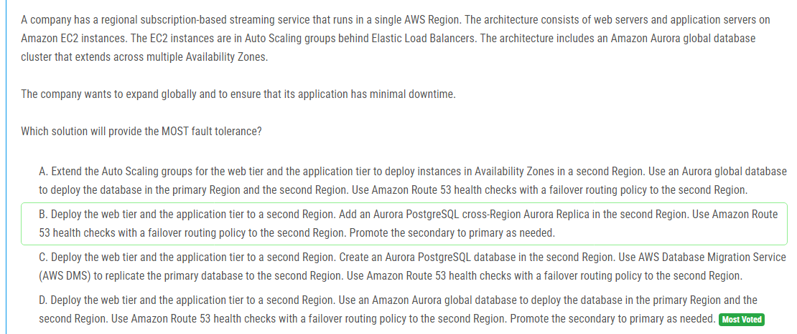

해설:

정답 D.

두 번째 지역에 웹 및 애플리케이션 계층을 배포합니다. Amazon Aurora 글로벌 데이터베이스를 사용하여 데이터베이스를 기본 지역과 두 번째 지역에 배포합니다. Amazon Route 53을 사용하여 두 지역 간의 헬스 체크와 장애 조치 라우팅 정책을 설정합니다. 이 방법은 전체적으로 장애 허용성을 최대화하고, 글로벌 확장 및 최소 다운 타임을 제공합니다. 데이터베이스의 글로벌 배포는 데이터의 가용성을 높이고, Route 53의 헬스 체크 및 장애 조치 라우팅은 지리적으로 분산된 사용자에게 항상 가장 가까운 지역에서 서비스를 제공합니다. 필요한 경우 보조 데이터베이스를 기본으로 승격시킬 수 있어 가용성을 보장합니다.

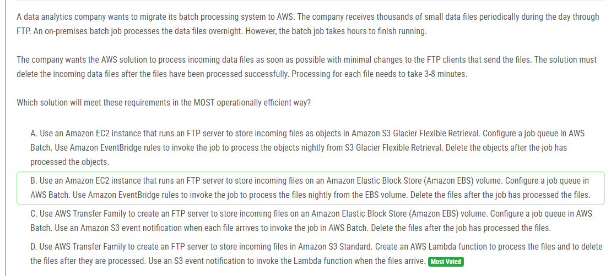

해설:

정답 D.

운영적인 효율성: AWS Transfer Family를 사용하여 FTP 서버를 쉽게 생성하고 관리할 수 있습니다.
빠른 처리: Lambda 함수를 사용하여 파일이 즉시 처리되므로 처리 속도가 빠릅니다.
자동화된 파일 삭제: Lambda 함수를 사용하여 파일 처리 후에 자동으로 삭제되므로 수동으로 파일을 삭제할 필요가 없습니다.
최소 변경: 기존 FTP 클라이언트를 최소한으로 변경하여 AWS로의 전환을 용이하게 합니다.

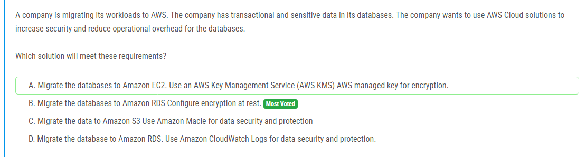

해설:

정답 B.

Amazon RDS로 데이터베이스를 마이그레이션하고, 안전한 저장을 위해 암호화를 구성합니다: 이 옵션을 선택하면 데이터베이스를 Amazon RDS로 마이그레이션하여 데이터를 보호할 수 있습니다. Amazon RDS는 데이터베이스의 암호화를 위한 여러 가지 옵션을 제공하며, 데이터베이스의 민감한 정보를 보호할 수 있습니다. 암호화된 저장은 데이터를 안전하게 보호하여 보안을 강화하고, AWS에서 관리하는 키를 사용하여 보안 및 관리 오버헤드를 줄일 수 있습니다. 이 방법은 보안을 높이고 운영 오버헤드를 최소화하는 효과적인 방법입니다.

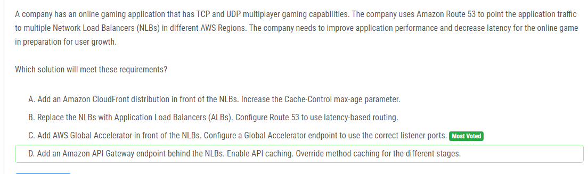

해설:

정답 C.

NLB 앞에 AWS Global Accelerator 추가 및 올바른 리스너 포트를 사용하는 Global Accelerator 엔드포인트 구성: 이 옵션을 선택하면 AWS Global Accelerator를 사용하여 전 세계의 사용자에게 더 빠르고 안정적인 서비스를 제공할 수 있습니다. Global Accelerator는 네트워크 경로 최적화 및 지연 시간 최소화를 통해 사용자의 요청을 최적의 엔드포인트로 라우팅합니다. 이를 통해 게임의 성능을 향상시키고 지연 시간을 줄일 수 있습니다. 또한 NLB의 다양한 리스너 포트에 대한 올바른 구성을 통해 TCP 및 UDP 멀티플레이어 게임 기능을 유지할 수 있습니다. Global Accelerator를 사용하면 Route 53의 지연 시간 기반 라우팅보다 더 나은 성능을 제공할 수 있으므로, 사용자 성장을 대비하여 성능을 향상시키는 데 매우 효과적인 방법입니다.

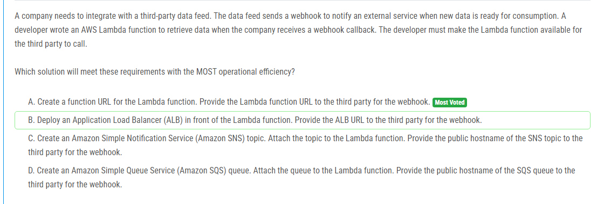

해설:

정답 A.

람다 함수를 위한 함수 URL 생성: 이 옵션을 선택하면 AWS Lambda 함수에 대한 URL을 생성하여 제공합니다. 이 URL을 제3자에게 제공하여 웹훅을 수신하고 데이터를 검색할 수 있도록 합니다. 이 방법은 구현이 간단하고 효율적이며, 추가적인 서비스나 구성 없이 Lambda 함수를 직접 호출할 수 있습니다. 요구 사항을 쉽게 충족시키면서도 운영 오버헤드를 최소화합니다.

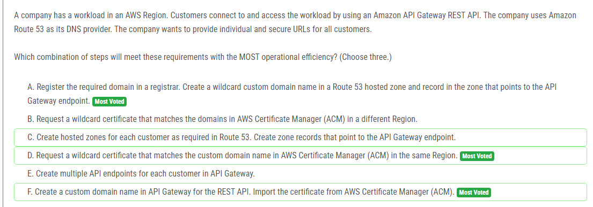

해설:

정답 A, D, F.

A. 레지스트리에서 필요한 도메인 등록 후, Route 53 호스팅 영역에서 와일드카드 사용자 정의 도메인 이름 생성 및 도메인 이름을 API Gateway 엔드포인트로 지정하는 레코드 생성: 이 옵션을 선택하면 Route 53을 사용하여 각 고객에게 개별적이고 안전한 URL을 제공할 수 있습니다. 와일드카드 도메인을 사용하여 모든 고객에 대한 URL을 지원하고, Route 53의 호스팅 영역을 통해 이를 관리할 수 있습니다.

D. AWS Certificate Manager (ACM)에서 동일 리전의 사용자 지정 도메인 이름과 일치하는 와일드카드 인증서 요청: ACM을 사용하여 SSL/TLS 인증서를 발급하면 통신이 암호화되어 보안이 강화됩니다. 이는 고객에게 개별적이고 안전한 URL을 제공하는 데 필수적입니다.

F. API Gateway를 위한 사용자 정의 도메인 이름 생성 후, ACM에서 인증서 가져오기: API Gateway의 사용자 정의 도메인 이름을 설정하고, 해당 도메인에 대한 SSL/TLS 인증서를 ACM에서 가져와 연결하면 보안된 통신을 제공할 수 있습니다. 이는 고객에게 안전한 접근을 제공하는 데 필수적입니다.

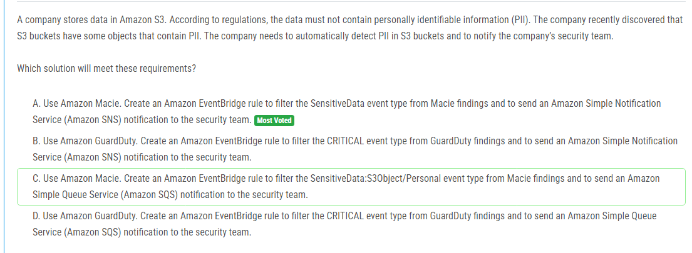

해설:

정답 A.

Amazon Macie 사용: Amazon Macie를 사용하여 S3 버킷 내에서 PII를 자동으로 감지할 수 있습니다. Amazon EventBridge를 사용하여 Macie의 발견 중에서 민감한 데이터 이벤트 유형을 필터링하고, 해당 이벤트가 발생할 때마다 Amazon Simple Notification Service (Amazon SNS)를 통해 보안 팀에게 알림을 보낼 수 있습니다. 이를 통해 회사는 실시간으로 PII를 탐지하고 즉각적인 조치를 취할 수 있습니다.

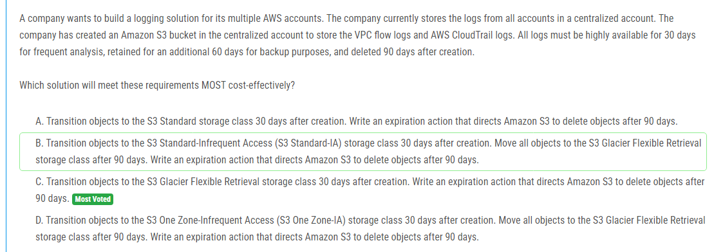

해설:

정답 C.

비용 효율성: S3 Glacier Flexible Retrieval은 비용이 낮은 아카이브 스토리지로, 30일 이후에는 비용 효율적인 옵션으로 객체를 전환합니다.
요구 사항 충족: 30일 동안 로그를 S3 Standard 스토리지 클래스에 보관한 후 S3 Glacier Flexible Retrieval로 전환하여 장기 보관을 제공합니다. 객체를 90일 후에 삭제하여 요구 사항을 충족합니다.
유연성: S3 Glacier Flexible Retrieval은 필요에 따라 데이터를 검색하고 복원할 수 있는 유연한 옵션을 제공합니다.
간편한 구성: 만료 동작을 사용하여 객체를 자동으로 삭제하도록 구성하면 관리 오버헤드를 줄일 수 있습니다.

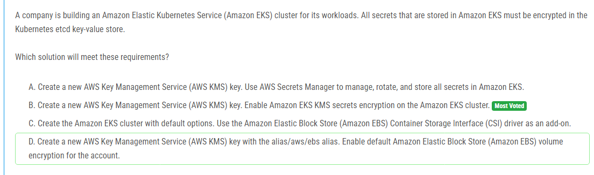

해설:

정답 B.

새 AWS Key Management Service (AWS KMS) 키 생성 및 Amazon EKS KMS 시크릿 암호화 활성화: 이 옵션을 선택하면 Amazon EKS 클러스터의 Kubernetes etcd 키-값 저장소에 저장된 모든 시크릿을 암호화할 수 있습니다. AWS KMS를 사용하여 키를 관리하고, Amazon EKS KMS 시크릿 암호화를 활성화하여 클러스터의 시크릿을 안전하게 보호할 수 있습니다. 이 방법을 선택하면 데이터의 보안이 강화되며, 암호화가 Kubernetes 레벨에서 처리되므로 모든 시크릿이 안전하게 보호됩니다.

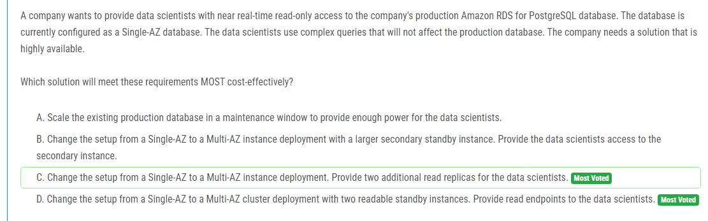

해설:

정답 D.

Multi-AZ 클러스터 배포는 높은 가용성을 제공하여 장애 발생 시 자동 장애 조치(Failover)를 수행할 수 있습니다. 이는 시스템의 신뢰성을 높이는 데 도움이 됩니다.
읽기 가능한 스탠바이 인스턴스를 사용하여 데이터 과학자들에게 실시간 또는 거의 실시간의 데이터 엑세스를 제공할 수 있습니다. 이러한 읽기 가능한 스탠바이 인스턴스를 통해 데이터베이스의 부하를 분산시키고 프로덕션 데이터베이스에 영향을 주지 않고 데이터를 분석할 수 있습니다.
데이터 과학자들에게 읽기 엔드포인트를 제공하여, 별도의 엔드포인트를 통해 데이터베이스에 액세스할 수 있습니다. 이는 데이터 과학자들이 프로덕션 데이터베이스를 직접적으로 조작하지 않고 필요한 데이터에 접근할 수 있도록 합니다.

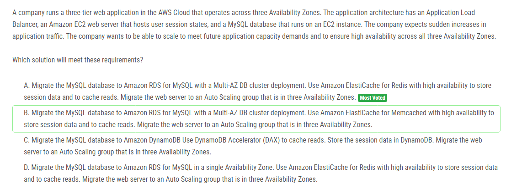

해설:

정답 A.

Amazon RDS의 Multi-AZ DB 클러스터 배포는 데이터베이스의 고가용성을 보장합니다. 하나의 가용 영역에서 장애가 발생할 경우 자동으로 다른 가용 영역으로 전환되어 가용성이 유지됩니다.
Amazon ElastiCache for Redis를 사용하여 세션 데이터를 저장하고 읽기를 캐시함으로써 성능을 향상시키고 데이터베이스의 부하를 줄일 수 있습니다. 고가용성 옵션을 선택하여 Redis 클러스터의 신뢰성을 높일 수 있습니다.
웹 서버를 세 가지 가용 영역에 걸친 Auto Scaling 그룹으로 배포함으로써 트래픽 증가에 대응할 수 있습니다. Auto Scaling은 트래픽 패턴에 따라 자동으로 EC2 인스턴스를 추가하거나 제거하여 애플리케이션의 가용성을 유지합니다.

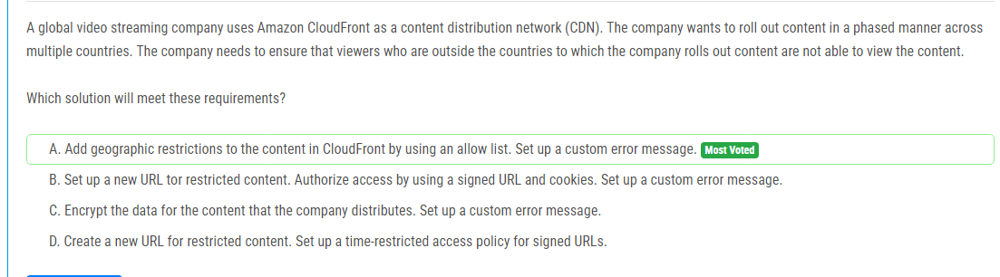

해설:

정답 A.

CloudFront에서 콘텐츠에 지리적 제한을 추가하고 허용 목록을 사용합니다. 사용자가 허용된 국가 외에 있는 경우 사용자가 콘텐츠에 액세스할 수 없습니다. 사용자가 제한된 지역에 있지 않은 경우 사용자가 콘텐츠를 볼 수 없으므로 요구 사항을 충족합니다.

이 방법은 CloudFront의 내장된 기능을 사용하여 콘텐츠의 액세스를 제어하므로 간단하고 효율적입니다. 지리적 제한을 사용하면 특정 국가의 IP 주소 목록을 허용 목록에 추가하여 해당 국가에 있는 사용자만이 콘텐츠를 볼 수 있도록 할 수 있습니다. 사용자가 허용되지 않은 국가에 있는 경우 CloudFront는 사용자에게 사용자 지정 오류 메시지를 반환하여 콘텐츠에 액세스할 수 없음을 알립니다. 이를 통해 회사는 콘텐츠를 원하는 국가로 점진적으로 출시할 수 있으며, 출시되지 않은 지역에서의 무단 액세스를 방지할 수 있습니다.

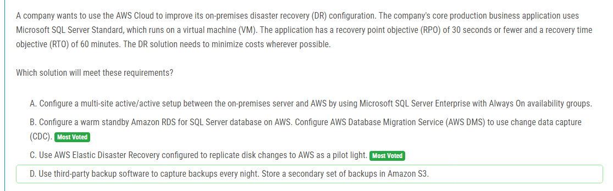

해설:

정답 B.

Amazon RDS for SQL Server는 관리형 서비스로, 쉽고 효율적으로 SQL Server 데이터베이스를 호스팅할 수 있습니다.
웜 스탠바이 구성은 복제된 데이터베이스를 유지하고 있으므로, 장애 발생 시 즉시 사용 가능한 상태가 유지됩니다. 이는 RTO를 줄이는 데 도움이 됩니다.
AWS DMS를 사용하여 변경 데이터 캡처 (CDC)를 활용하면 변경 사항이 발생할 때마다 대상 데이터베이스로 데이터를 지속적으로 복제할 수 있습니다. 이는 RPO를 줄이는 데 도움이 됩니다.
Amazon RDS의 관리형 특성은 관리 오버헤드를 최소화하고 비용을 절감할 수 있습니다.

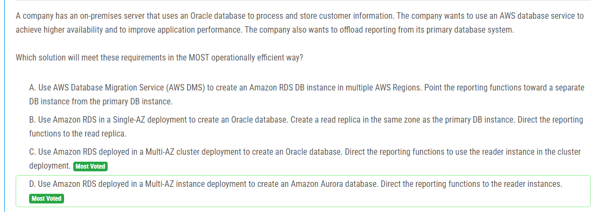

해설:

정답 D.

Amazon Aurora는 뛰어난 가용성을 제공하는 관리형 관계형 데이터베이스 서비스입니다. Multi-AZ 인스턴스 배포를 사용하여 데이터베이스의 고가용성을 보장할 수 있습니다. 이것은 주요 데이터베이스의 장애에 대비하여 자동 장애 조치(Failover)를 수행하여 시스템의 신뢰성을 높입니다.
Amazon Aurora는 높은 성능을 제공합니다. 따라서 주요 데이터베이스 시스템 및 보고 기능을 지원하기에 적합합니다.
리더 인스턴스를 사용하여 읽기 작업을 분산시킬 수 있습니다. 이를 통해 주요 데이터베이스의 부하를 줄이고 보고 기능의 성능을 향상시킬 수 있습니다.
Amazon RDS는 관리형 서비스로써 데이터베이스 설정, 관리, 백업 등의 작업을 자동화하여 운영적 효율성을 높일 수 있습니다.

