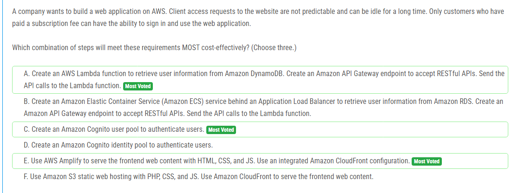

해설:

정답 A, C, E.

A. Amazon DynamoDB에서 사용자 정보를 검색하기 위해 AWS Lambda 함수를 생성합니다. RESTful API를 수락하기 위해 Amazon API Gateway 엔드포인트를 생성합니다. API 호출을 Lambda 함수로 보냅니다.

이 방법은 비용 효율적이고 서버리스 아키텍처를 사용하여 관리 오버헤드를 최소화합니다. Lambda 함수는 사용자 정보를 검색하고 인증을 처리하는 데 사용될 수 있습니다.

C. Amazon Cognito 사용자 풀을 생성하여 사용자를 인증합니다.

Amazon Cognito는 사용자 관리 및 인증 서비스를 제공하여 사용자를 관리하고 인증할 수 있습니다. 사용자 풀을 사용하여 사용자 인증을 구현하면 보안성이 높아집니다.

E. AWS Amplify를 사용하여 프론트엔드 웹 콘텐츠를 HTML, CSS 및 JS와 함께 제공하고 통합된 Amazon CloudFront 구성을 사용합니다.

AWS Amplify는 효율적이고 간편한 방법으로 프론트엔드 애플리케이션을 구축하고 배포하는 데 사용됩니다. Amazon CloudFront를 사용하여 정적 및 동적 콘텐츠를 전달하는 데 사용하면 사용자에게 빠른 성능을 제공할 수 있습니다.

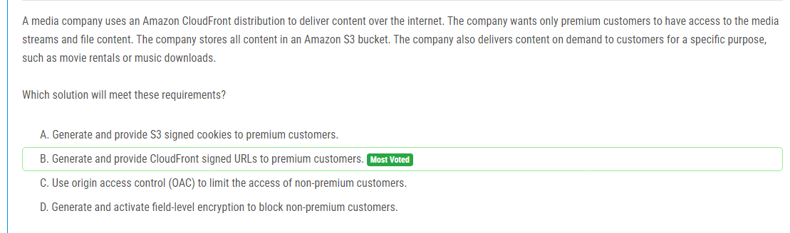

해설:

정답 B.

CloudFront 서명된 URL은 사용자에게 특정 리소스에 대한 임시 액세스 권한을 부여하는 데 사용됩니다. 이를 통해 프리미엄 고객에게만 액세스 권한을 부여할 수 있습니다.
CloudFront 서명된 URL은 링크가 유효한 기간 또는 특정 횟수에 대해 만료되도록 구성할 수 있어 보안을 높일 수 있습니다.
이 방법은 Amazon S3에 직접 서명된 URL을 제공하는 대신 CloudFront를 통해 콘텐츠에 대한 액세스를 제어하여 더욱 안전하고 유연한 방법으로 프리미엄 고객에게만 액세스 권한을 부여할 수 있습니다.

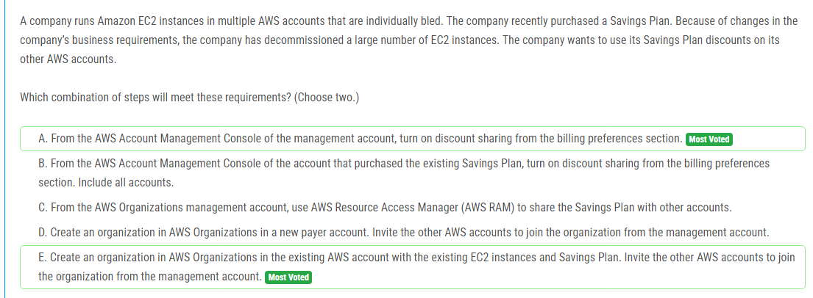

해설:

정답 A, E.

A. 관리 계정의 AWS 계정 관리 콘솔에서 청구 환경 설정 섹션에서 할인 공유를 활성화합니다.

할인 공유를 활성화하면 관리 계정에서 다른 AWS 계정으로 할인을 공유할 수 있습니다. 따라서 이 옵션을 통해 Savings Plan 할인을 다른 AWS 계정과 공유할 수 있습니다.

E. 기존의 AWS 계정에 AWS 조직을 만들고, 기존 EC2 인스턴스와 Savings Plan을 보유하는 새로운 지불 계정에서 관리 계정으로부터 다른 AWS 계정을 조직에 초대합니다.

AWS 조직을 사용하여 AWS 계정을 구성하면 각 계정 간에 리소스 및 할인을 공유할 수 있습니다. 새로운 지불 계정에서 조직을 생성하고 다른 AWS 계정을 조직에 초대함으로써 Savings Plan 할인을 다른 계정과 공유할 수 있습니다.

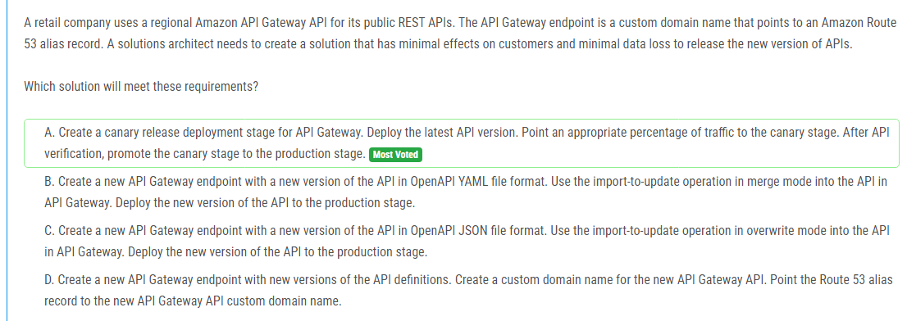

해설:

정답 A.

API Gateway에 카나리아 릴리스 배포 단계를 생성합니다. 최신 API 버전을 배포합니다. 적절한 트래픽의 백분율을 카나리아 단계로 보냅니다. API 확인 후, 카나리아 단계를 프로덕션 단계로 승격시킵니다.

이 방법은 카나리아 릴리스를 사용하여 새로운 API 버전을 출시할 수 있습니다. 일부 트래픽만 새로운 API 버전으로 보내고, 이를 확인한 후에 전체 트래픽을 새로운 버전으로 전환할 수 있습니다. 이렇게 하면 고객에게 최소한의 영향을 미치고 데이터 손실을 최소화할 수 있습니다.

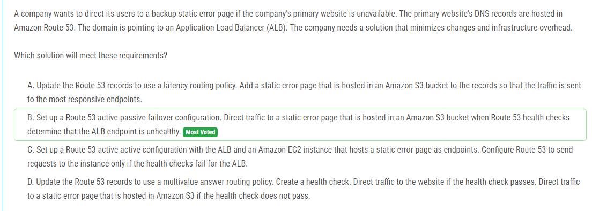

해설:

정답 B.

이 방법은 주요 웹 사이트가 사용할 수 없는 경우에만 정적 오류 페이지로 트래픽을 전환합니다. Route 53의 헬스 체크를 사용하여 ALB 엔드포인트의 건강 상태를 모니터링하므로, 건강 상태가 부적절한 경우에만 백업 정적 오류 페이지로 트래픽을 리디렉션할 수 있습니다. 이 방법은 변경 사항을 최소화하고 인프라 오버헤드를 최소화하는 데 도움이 됩니다.

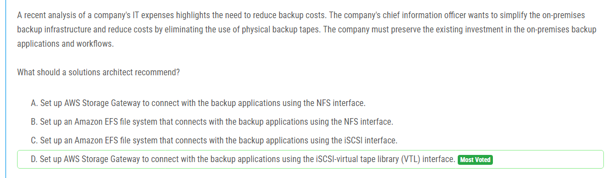

해설:

정답 D.

이 방법을 사용하면 기존의 온프레미스 백업 애플리케이션 및 워크플로우를 유지한 채 물리적 백업 테이프 사용을 제거할 수 있습니다. AWS Storage Gateway의 VTL을 사용하여 가상 테이프를 구성하고, 이를 온프레미스 백업 애플리케이션과 연결함으로써 기존 투자를 보호할 수 있습니다. 이는 백업 비용을 줄이고 간편하게 온프레미스 백업 인프라를 단순화하는 데 도움이 됩니다.

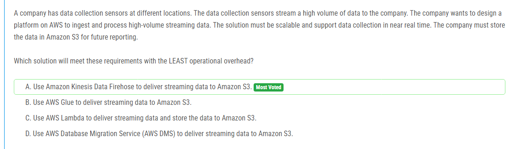

해설:

정답 A.

Amazon Kinesis Data Firehose는 스트리밍 데이터를 수신하여 필요에 따라 변환하고 Amazon S3로 직접 전송하는 완전 관리형 서비스입니다. 이를 통해 데이터 수집 및 저장이 자동화되며, 확장성이 뛰어나고 실시간 데이터 수집이 가능합니다. 운영 부담이 적으며, 데이터를 Amazon S3에 저장하여 나중에 보고 및 분석에 활용할 수 있습니다. 다른 옵션들에 비해 구성과 관리에 드는 비용과 노력이 적습니다.

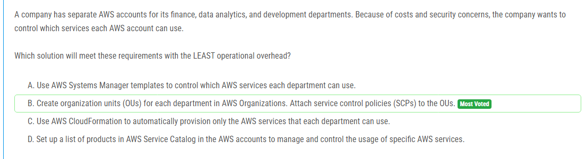

해설:

정답 B.

AWS Organizations를 사용하여 각 부서별로 별도의 조직 단위(OU)를 설정하고, 서비스 제어 정책(SCP)을 OU에 첨부하여 어떤 AWS 서비스를 사용할 수 있는지를 제어할 수 있습니다. SCP를 사용하면 각 계정에 대해 특정 서비스의 사용을 허용하거나 거부할 수 있으므로 비용과 보안 우려를 효과적으로 관리할 수 있습니다. 운영 오버헤드가 적으며, AWS 계정 간의 서비스 제어를 중앙에서 관리할 수 있습니다. 다른 옵션에 비해 운영 오버헤드가 적습니다.

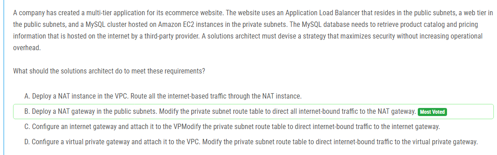

해설:

정답 B.

개인 서브넷에 위치한 MySQL 클러스터가 외부의 제공 업체로부터 제품 카탈로그 및 가격 정보를 검색해야 할 경우, 해당 서브넷에서 외부 인터넷 리소스에 액세스할 수 있어야 합니다. 이를 위해 NAT 게이트웨이를 사용하여 개인 서브넷 내부의 리소스가 인터넷에 연결될 수 있도록 합니다.
NAT 게이트웨이는 관리가 간단하며 확장성이 뛰어나며, 보안을 강화하기 위해 개인 서브넷 내부의 리소스가 외부로 직접 통신하지 않고 NAT 게이트웨이를 통해 간접적으로 통신하도록 설정할 수 있습니다. 이는 보안을 최대화하는 동시에 운영 오버헤드를 최소화합니다.

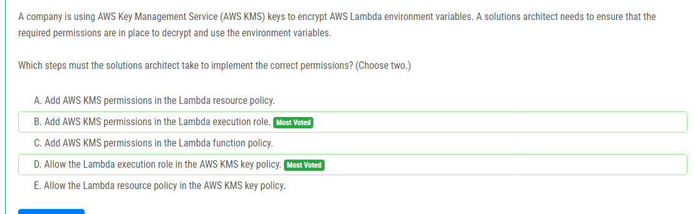

해설:

정답 B, D.

B. Lambda 실행 역할에 AWS KMS 권한을 추가합니다.

Lambda 함수가 실행될 때 Lambda 실행 역할을 사용하여 AWS 리소스에 액세스합니다. 따라서 Lambda 함수가 AWS KMS 키를 사용하여 암호화된 환경 변수를 해독해야 하므로 Lambda 실행 역할에 AWS KMS 권한을 추가해야 합니다.

D. AWS KMS 키 정책에서 Lambda 실행 역할을 허용합니다.

Lambda 함수가 암호화된 환경 변수를 해독하기 위해 AWS KMS 키를 사용하려면 해당 키에 대한 액세스 권한을 제공해야 합니다. 이를 위해 AWS KMS 키 정책에서 Lambda 실행 역할에 대한 액세스 권한을 추가해야 합니다.

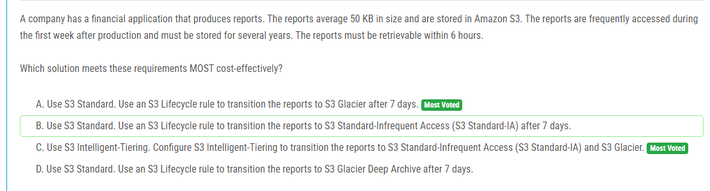

해설:

정답 A.

S3 Standard을 사용합니다. S3 표준 스토리지 클래스는 데이터의 높은 가용성과 빠른 검색을 제공합니다. 이 클래스를 사용하여 보고서를 저장하면 보고서에 대한 검색 및 엑세스가 빠르고 효율적입니다. 그러나 보고서의 활발한 액세스가 줄어들면 비용을 절감할 수 있습니다. 이를 위해 S3 Lifecycle 규칙을 사용하여 보고서를 7일 후에 S3 Glacier로 전환하여 장기 보관을 관리할 수 있습니다. 이러한 방식으로 보고서를 저렴한 비용으로 오랜 기간 동안 보관할 수 있으면서도 필요할 때 검색 및 복원이 가능합니다.

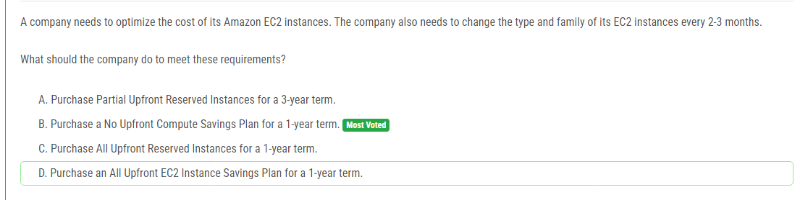

해설:

정답 B.

No Upfront Compute Savings Plan은 EC2 인스턴스의 용량을 구매할 때 초기 비용 없이 저렴한 비용으로 요금을 납부할 수 있는 옵션을 제공합니다. 이 옵션을 선택하면 특정 지역에서 특정 인스턴스 패밀리에 대해 높은 할인율을 받을 수 있습니다. 또한, 인스턴스 유형 및 패밀리를 변경해야 할 필요가 있을 때 유연성을 제공하여 비용을 최적화할 수 있습니다. 이러한 이유로 No Upfront Compute Savings Plan이 비용을 최적화하는 데 가장 적합한 옵션입니다.

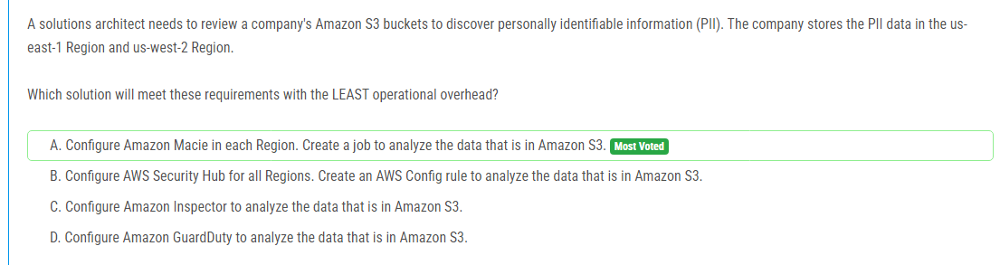

해설:

정답 A.

Amazon Macie를 활용하여 요구 사항을 가장 적은 운영 오버헤드로 충족시킬 수 있습니다. Amazon Macie를 각 리전에 구성하고 Amazon S3에 있는 데이터를 분석하기 위한 작업을 생성함으로써 PII를 식별할 수 있습니다. Macie는 자동화된 방식으로 PII를 감지하고 보고하여 조직이 쉽게 이를 검토할 수 있도록 도와줍니다. Macie는 S3 버킷에 저장된 데이터를 지속적으로 모니터링하고, 사용자가 지정한 데이터 분석 작업을 수행하여 PII를 식별하므로 최소한의 운영 오버헤드로 요구 사항을 충족하는 가장 효율적인 솔루션입니다.

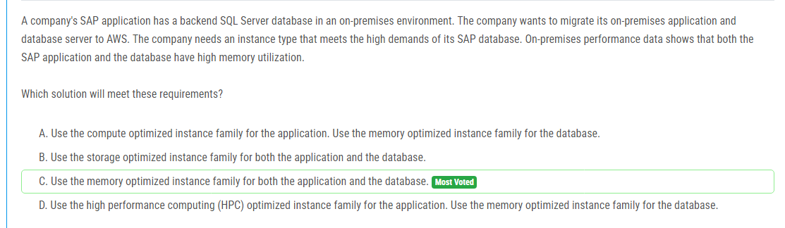

해설:

정답 C.

SAP 데이터베이스의 고 메모리 요구 사항을 충족시키기 위해 메모리 최적화된 인스턴스 패밀리를 사용하는 것이 가장 적합합니다. 고 메모리 요구 사항을 가진 데이터베이스에는 주로 메모리 최적화된 인스턴스 유형이 권장됩니다. 또한, SAP 어플리케이션도 높은 메모리 사용률을 보이므로, 어플리케이션에도 메모리 최적화된 인스턴스를 사용하는 것이 적절합니다. 따라서, 메모리 최적화된 인스턴스 패밀리를 어플리케이션과 데이터베이스 모두에 사용하는 것이 가장 적합한 선택지입니다.

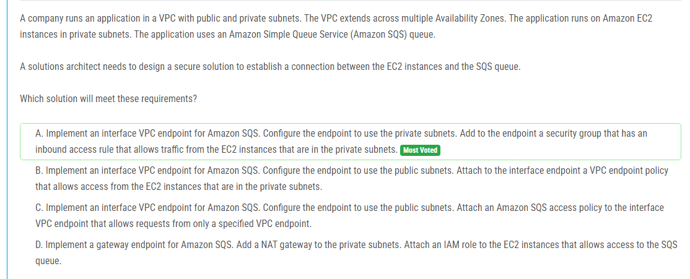

해설:

정답 A.

Amazon SQS와의 연결을 확립하기 위해 인터페이스 VPC 엔드포인트를 구현하는 것입니다. 이렇게 하면 VPC의 프라이빗 서브넷에 있는 EC2 인스턴스가 SQS 큐에 직접 연결할 수 있습니다. 엔드포인트에는 EC2 인스턴스에서 수신된 트래픽을 허용하는 인바운드 액세스 규칙이 포함된 보안 그룹이 있어야 합니다. 이를 통해 EC2 인스턴스와 SQS 큐 간의 안전한 통신이 구현됩니다.

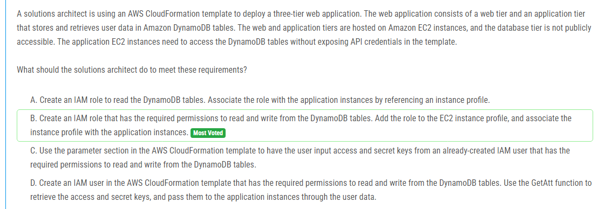

해설:

정답 B.

IAM 역할을 생성하여 DynamoDB 테이블을 읽고 쓸 수 있는 권한을 부여한 후, 이 역할을 EC2 인스턴스 프로필에 추가하고 응용 프로그램 인스턴스와 연결하는 것입니다. 이 방법을 사용하면 CloudFormation 템플릿 내에서 API 자격 증명을 노출시키지 않고도 응용 프로그램 EC2 인스턴스가 DynamoDB 테이블에 액세스할 수 있습니다.

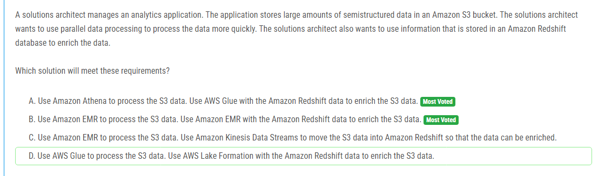

해설:

정답 B.

Amazon EMR을 사용하여 S3 데이터를 처리하고 Amazon Redshift 데이터를 사용하여 데이터를 보강하는 것입니다. Amazon EMR은 대규모 데이터를 병렬로 처리할 수 있는 클라우드 기반의 관리형 클러스터입니다. 이 솔루션을 사용하면 대량의 데이터를 효율적으로 처리할 수 있으며, Amazon Redshift를 사용하여 데이터를 보강할 수 있습니다.

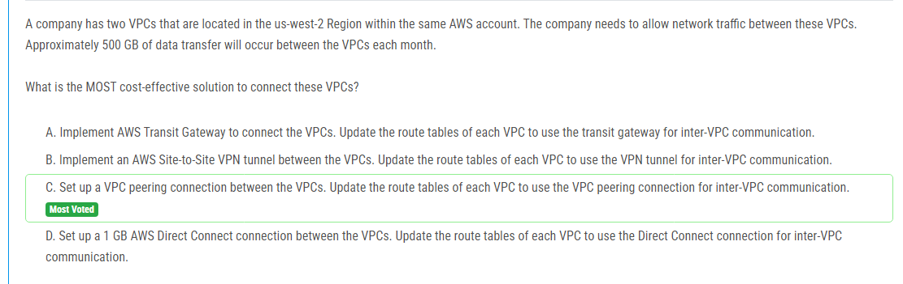

해설:

정답 C.

VPC 피어링 연결을 설정하여 VPC 간에 연결하는 것입니다. 이 솔루션은 비용 효율적이며 간단한 설정으로 구성됩니다. VPC 피어링 연결은 같은 AWS 계정 내의 두 VPC 간에 사설 IP 주소를 통해 트래픽을 라우팅할 수 있도록 해줍니다. 이러한 경우에는 VPC 피어링을 사용하여 데이터 전송 비용을 최소화할 수 있습니다. 500GB 정도의 데이터 전송량은 VPC 피어링 연결을 통해 비용 효율적으로 처리할 수 있습니다.

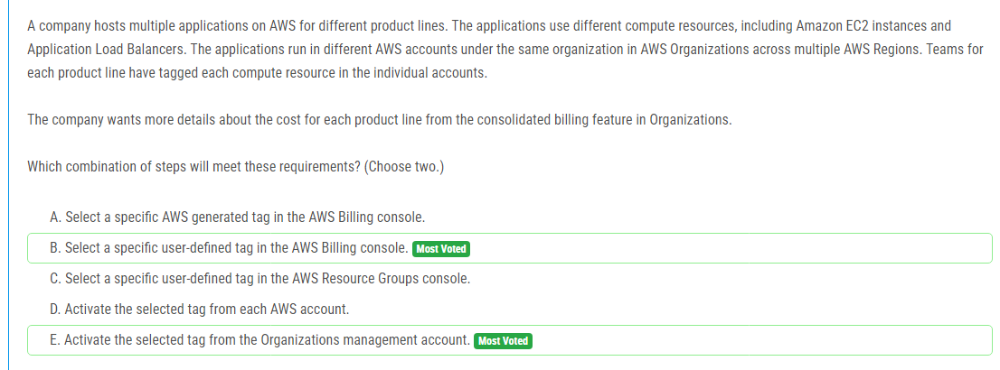

해설:

정답 B, E.

정답 B는 AWS Billing 콘솔에서 특정 사용자 정의 태그를 선택하여 해당 태그를 사용하여 비용을 필터링하는 방법입니다. 이를 통해 각 제품 라인에 대한 비용을 더 자세히 볼 수 있습니다.

정답 E는 AWS 조직 관리 계정에서 선택한 태그를 활성화하는 것입니다. 이렇게하면 조직의 모든 계정에서 선택한 태그를 사용하여 비용 및 사용률 데이터를 모으고 볼 수 있습니다.

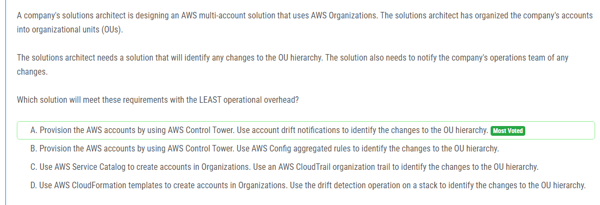

해설:

정답 A.

정답 A는 AWS Control Tower를 사용하여 AWS 계정을 프로비저닝하고, OU 계층 구조의 변경 사항을 식별하기 위해 계정 드리프트 알림을 사용하는 방법입니다. 이 솔루션은 조직 계층 구조의 변경 사항을 식별하고 운영 팀에게 알림을 제공하는 데 가장 적은 운영 오버헤드를 가지고 있습니다. AWS Control Tower는 AWS 계정을 관리하고 제어하는 데 사용되며, 계정의 변동을 추적하고 관리하기 위한 효과적인 도구입니다.