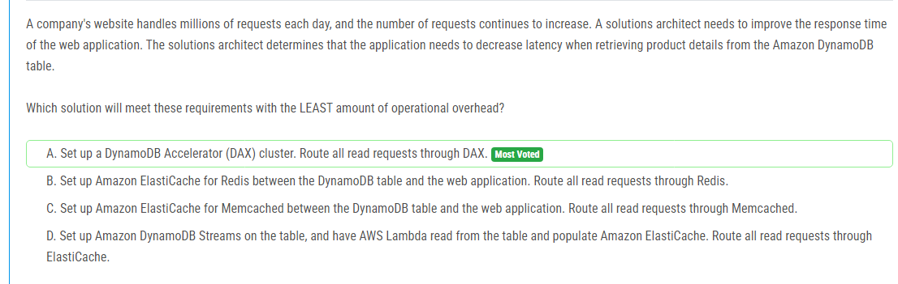

해설:

정답 A.

DynamoDB Accelerator (DAX)는 DynamoDB의 인메모리 캐싱 계층을 제공하여 읽기 성능을 향상시킵니다. DAX를 사용하면 응용 프로그램은 DynamoDB 테이블에 대한 읽기 요청을 DAX 클러스터로 보낼 수 있으며, DAX는 캐시된 데이터를 사용하여 응답 시간을 크게 줄일 수 있습니다. 이러한 방식으로 DAX를 사용하면 DynamoDB 읽기 작업의 지연 시간을 줄일 수 있으며, 운영 오버헤드가 상대적으로 적습니다. 다른 대안들에 비해 관리 오버헤드가 적고 효율적인 솔루션입니다.

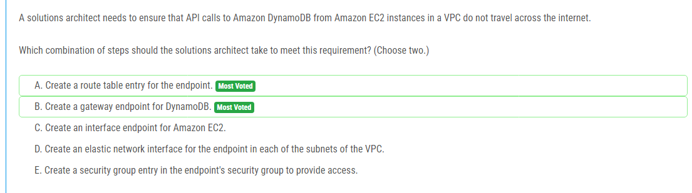

해설:

정답 A, B.

A. Gateway endpoint for DynamoDB를 생성하는 것은 VPC 내에서 DynamoDB로의 트래픽이 인터넷을 통해 전달되지 않도록 보장합니다. Gateway endpoint를 사용하면 VPC의 라우팅 테이블에 엔드포인트에 대한 라우트 항목이 자동으로 추가되어 VPC 내의 EC2 인스턴스가 DynamoDB로 직접 통신할 수 있습니다.

B. 라우팅 테이블에 엔드포인트에 대한 라우트 항목을 추가하는 것이 중요합니다. 이렇게 하면 EC2 인스턴스가 DynamoDB로의 트래픽을 인터넷을 통해 전달하지 않고 VPC 내에서 직접 엔드포인트를 통해 통신할 수 있습니다.

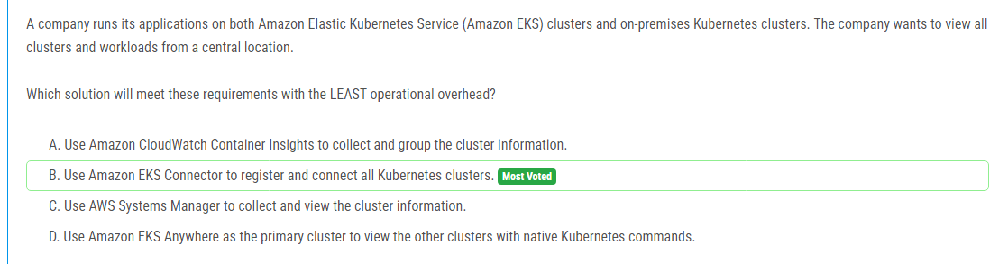

해설:

정답 B.

Amazon EKS Connector를 사용하면 온프레미스 Kubernetes 클러스터와 Amazon EKS 클러스터를 중앙 위치에서 등록하고 연결할 수 있습니다. 이를 통해 모든 클러스터 및 워크로드를 단일 대시보드에서 관리할 수 있습니다. 이 방법은 운영 오버헤드를 최소화하면서 중앙 집중화된 모니터링 및 관리를 제공합니다. 다른 대안들에 비해 구현 및 유지 관리의 복잡성이 낮으며, 모든 클러스터의 상태 및 작업을 효율적으로 모니터링할 수 있습니다.

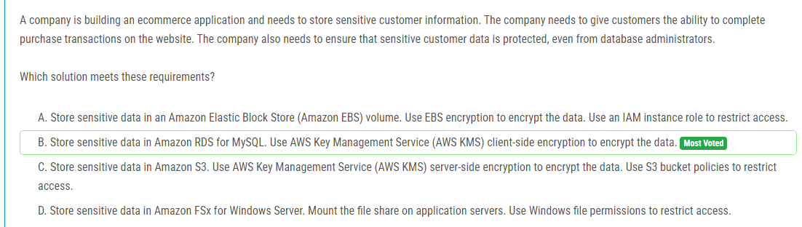

해설:

정답 B.

Amazon RDS for MySQL을 사용하여 민감한 고객 데이터를 저장할 수 있습니다. 데이터를 AWS Key Management Service (AWS KMS) 클라이언트 측 암호화를 사용하여 암호화합니다. 이는 데이터베이스 관리자를 포함한 누구에게도 액세스할 수 없도록 데이터를 보호하는 데 도움이 됩니다. AWS KMS는 사용자가 암호화 키를 생성, 관리 및 제어할 수 있도록 해주는 관리형 서비스입니다. 클라이언트 측 암호화를 사용하면 데이터는 클라이언트 응용 프로그램에서 암호화되어 데이터베이스에 저장되기 전에 보호됩니다. 이 방법은 데이터베이스 관리자를 포함한 누구에게도 액세스할 수 없도록 고객 데이터를 보호할 수 있습니다.

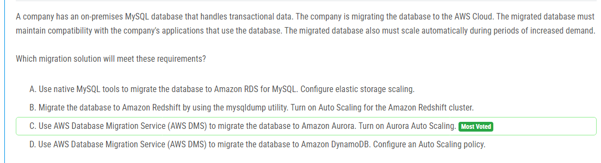

해설:

정답 C.

AWS Database Migration Service (AWS DMS)를 사용하여 데이터베이스를 Amazon Aurora로 마이그레이션할 수 있습니다. Amazon Aurora는 MySQL과 호환되는 완전 관리형 관계형 데이터베이스 엔진으로, 기존 애플리케이션과의 호환성을 유지할 수 있습니다. 또한 Amazon Aurora는 자동으로 스케일링되므로 수요 증가 시 자동으로 확장됩니다. 이를 통해 애플리케이션은 변화에 빠르게 대응할 수 있으며, 호환성을 유지하면서 쉽게 확장할 수 있습니다. 따라서 C가 이러한 요구 사항을 충족하는 가장 적합한 옵션입니다.

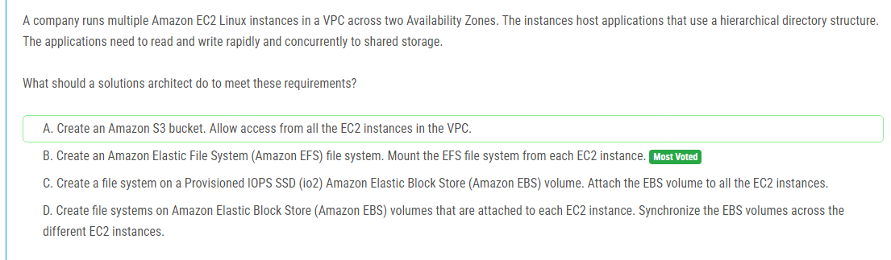

해설:

정답 B.

Amazon Elastic File System (Amazon EFS)는 여러 EC2 인스턴스 간에 공유 스토리지를 제공하는 완전 관리형 파일 시스템입니다. Amazon EFS를 사용하면 다중 AZ에서 동시에 읽고 쓸 수 있으며, 여러 인스턴스 간에 파일을 공유할 수 있습니다. 이러한 상황에서는 Amazon EFS를 사용하여 애플리케이션에서 공유 디렉터리에 대한 읽기 및 쓰기 액세스를 신속하게 처리할 수 있습니다. 다른 대안들에 비해 Amazon EFS가 다중 AZ에서의 고가용성과 스케일링 기능을 제공하고 관리 오버헤드가 적기 때문에 이 문제에 가장 적합한 솔루션입니다.

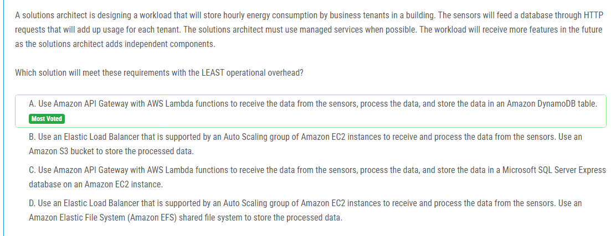

해설:

정답 A.

Amazon API Gateway와 AWS Lambda를 사용하여 센서에서 데이터를 수신하고 처리한 다음 Amazon DynamoDB 테이블에 데이터를 저장할 수 있습니다. 이 방법은 서버리스 아키텍처를 사용하므로 관리 오버헤드가 최소화됩니다. AWS Lambda 함수는 필요에 따라 자동으로 확장되므로 트래픽이 증가할 때도 자동으로 대응할 수 있습니다. 또한 Amazon DynamoDB는 관리형 서비스이며, 데이터의 확장성과 가용성을 제공하여 추가적인 기능이나 컴포넌트를 추가하는 과정에서 유연성을 제공합니다. 이러한 이유로 A가 가장 적절한 솔루션입니다.

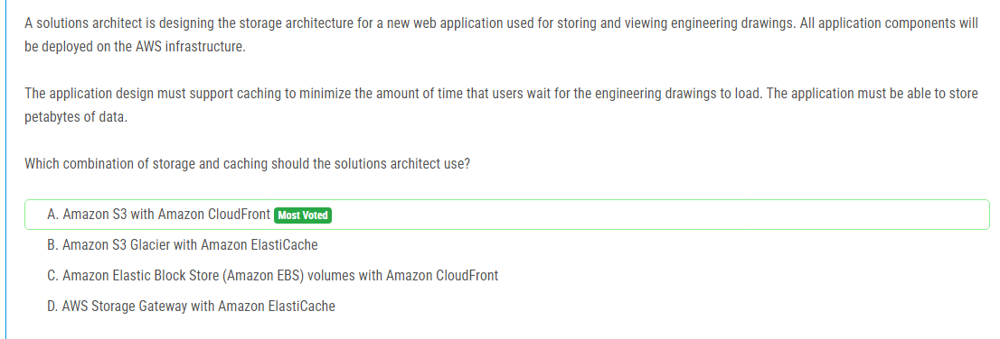

해설:

정답 A.

Amazon S3는 대규모 데이터를 저장하기에 이상적이며, 엔지니어링 도면과 같은 대용량 파일을 저장하는 데 특히 효과적입니다. 또한 Amazon CloudFront은 전 세계적으로 데이터를 배포하여 빠르고 안정적인 콘텐츠 전송을 제공합니다. CloudFront는 사용자와 가장 가까운 엣지 위치에서 콘텐츠를 캐싱하여 사용자가 콘텐츠를 더 빨리 로드할 수 있도록 합니다. 이러한 조합은 대용량 파일 저장 및 빠른 콘텐츠 전송을 위한 이상적인 솔루션입니다. 따라서 정답은 A입니다.

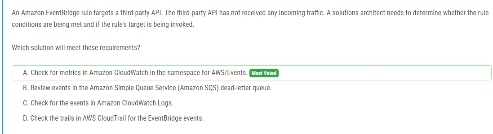

해설:

정답 A.

Amazon EventBridge는 AWS 서비스 간에 이벤트를 전송하고, 이러한 이벤트는 AWS CloudWatch에 기록됩니다. AWS/Events 네임스페이스에는 EventBridge 규칙에 대한 메트릭이 포함되어 있습니다. 이 메트릭을 확인하여 이벤트가 발생하고 규칙의 대상이 호출되는지 여부를 확인할 수 있습니다. 따라서 정답은 A입니다.

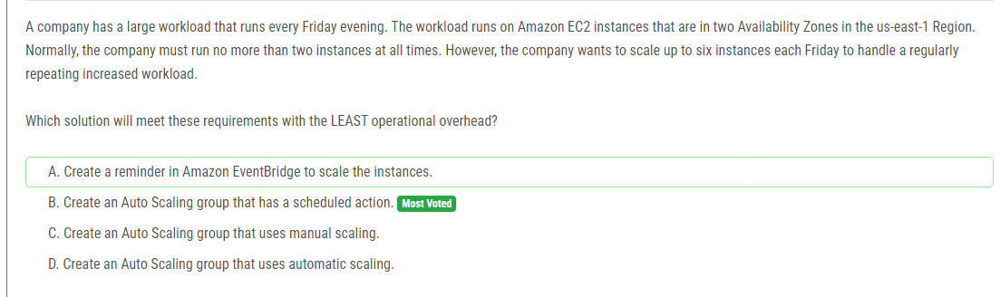

해설:

정답 B.

오토 스케일링 그룹을 사용하여 스케줄된 작업을 수행할 수 있습니다. 스케줄된 작업을 사용하면 특정 시간에 인스턴스 수를 자동으로 조정할 수 있습니다. 따라서 이 시나리오에서는 매주 금요일 저녁에 필요한 인스턴스 수를 늘리는 데 사용할 수 있습니다. 이 방법은 운영 오버헤드를 최소화하면서 요구 사항을 충족시킬 수 있는 가장 효율적인 방법입니다.

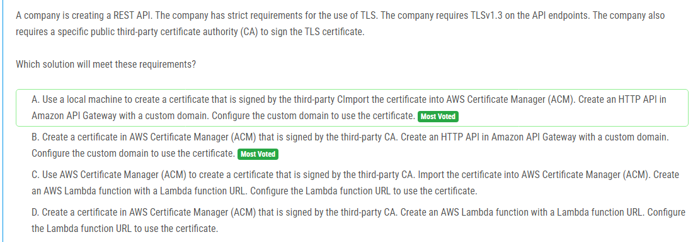

해설:

정답 A.

사용자 정의 도메인을 사용하는 Amazon API Gateway의 HTTP API를 생성할 때 AWS Certificate Manager (ACM)에서 가져온 인증서를 사용할 수 있습니다. 이를 통해 요청이 API Gateway로 전달될 때 TLS 연결이 설정되고, TLS 1.3을 요구하는 요구 사항을 충족시킬 수 있습니다. 사용자가 생성한 인증서를 ACM에 가져온 후에는 사용자가 요구하는 특정 공인 제3자 CA에 의해 서명된 인증서인 경우 사용할 수 있습니다. 따라서 이러한 요구 사항을 충족하는 가장 적합한 옵션은 A입니다.

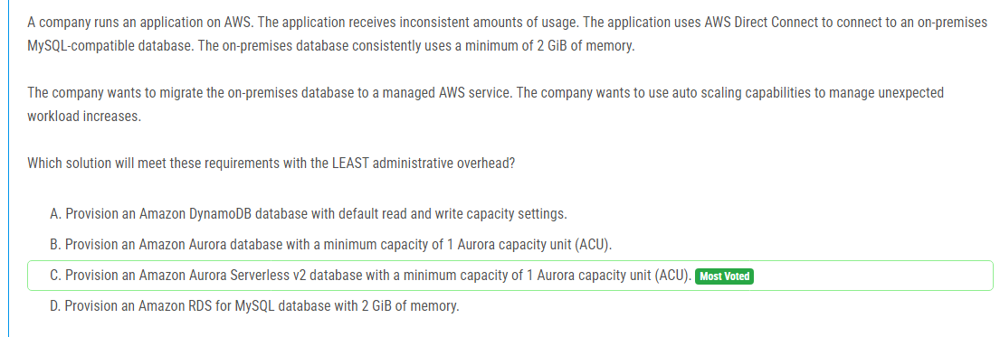

해설:

정답 C.

Amazon Aurora Serverless v2를 사용하면 작업 부하에 따라 자동으로 확장되는 관리형 서비스를 제공합니다. 이는 예상치 못한 작업량 증가에 대응하는 데 매우 유용합니다. 또한 Aurora Serverless v2는 최소 용량을 설정할 수 있으므로 온프레미스 데이터베이스의 메모리 요구 사항을 충족할 수 있습니다. 이를 통해 관리 오버헤드를 최소화하면서 요구 사항을 충족할 수 있습니다. 따라서 이러한 이유로 C가 가장 적합한 솔루션입니다.

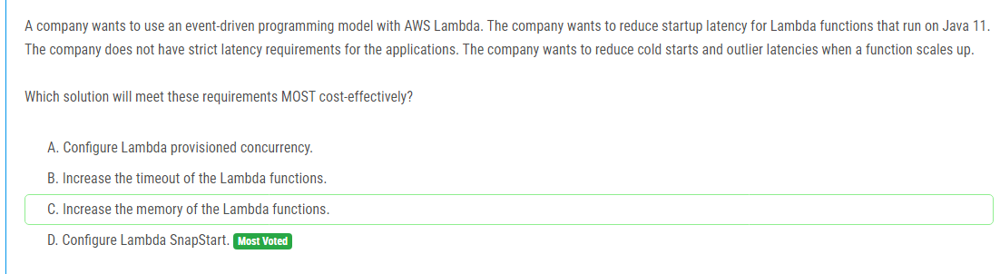

해설:

정답 D.

Lambda 함수의 시작 지연 시간을 줄이고 콜드 스타트를 개선하기 위해 SnapStart를 사용할 수 있습니다. SnapStart는 AWS Lambda에서 사용할 수 있는 새로운 기능으로, 이전 실행에서 초기화된 JVM 프로세스를 재사용하여 콜드 스타트의 시작 지연 시간을 크게 줄입니다. 이를 통해 Java 11 Lambda 함수의 시작 지연 시간을 줄이고 콜드 스타트 문제를 완화할 수 있습니다. 또한, SnapStart는 비용 효율적인 솔루션으로, 기존 실행에서 초기화된 JVM 프로세스를 재사용함으로써 리소스를 효율적으로 활용합니다. 따라서 D가 가장 비용 효율적인 솔루션입니다.

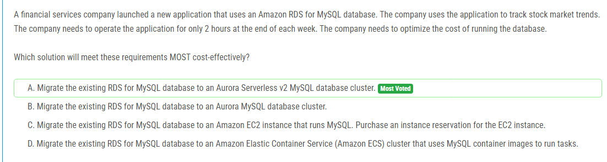

해설:

정답 A.

Aurora Serverless v2를 사용하면 애플리케이션에 필요한 정확한 용량만 사용하므로 비용을 최적화할 수 있습니다. 주간의 2시간 동안만 애플리케이션을 운영해야 하므로, Aurora Serverless v2는 이러한 짧은 기간 동안 필요한 용량을 자동으로 확장하고 필요하지 않은 경우 자동으로 축소할 수 있습니다. 따라서 이 시나리오에서 Aurora Serverless v2를 사용하는 것이 가장 비용 효율적인 솔루션입니다.

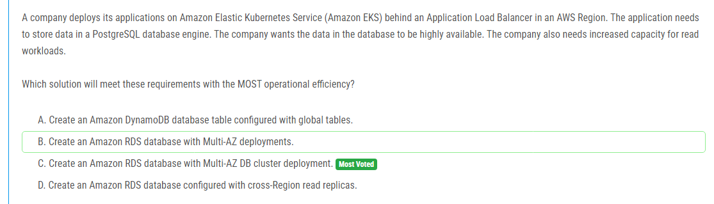

해설:

정답 C.

Amazon RDS의 Multi-AZ DB 클러스터 배포를 사용하면 데이터베이스의 고가용성을 확보할 수 있습니다. Multi-AZ 배포는 주 데이터베이스 인스턴스와 동일한 AWS 리전 내에서 다른 가용 영역에 복제본을 생성하여 장애 발생 시 자동 장애 조치(Failover)를 제공합니다. 이를 통해 데이터베이스의 가용성이 향상됩니다. 또한, Multi-AZ DB 클러스터를 사용하면 읽기 워크로드를 처리하기 위해 필요한 추가 용량을 쉽게 확장할 수 있습니다. 따라서 이러한 이유로 C가 가장 효율적인 솔루션입니다.

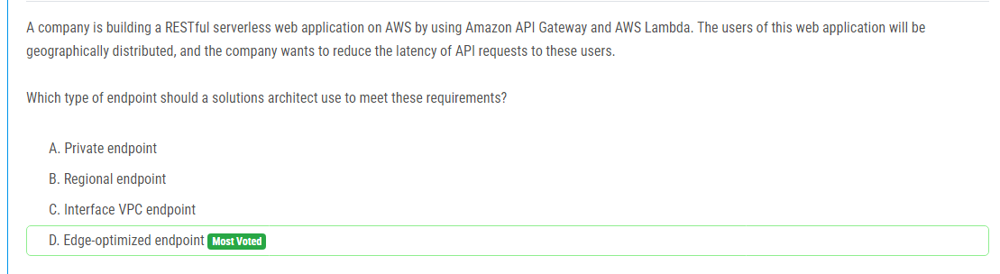

해설:

정답 D.

Edge-optimized 엔드포인트는 CloudFront 콘텐츠 전송 네트워크 (CDN)를 활용하여 전 세계 사용자에게 API 요청에 대한 최적의 성능을 제공합니다. CloudFront는 요청을 가장 가까운 엣지 위치로 라우팅하여 응답 시간을 줄이고 네트워크 지연을 최소화합니다. 이는 사용자가 지리적으로 분산되어 있을 때 API 요청의 지연 시간을 최소화하는 데 효과적입니다. 따라서 이러한 이유로 D가 가장 적합한 엔드포인트 유형입니다.

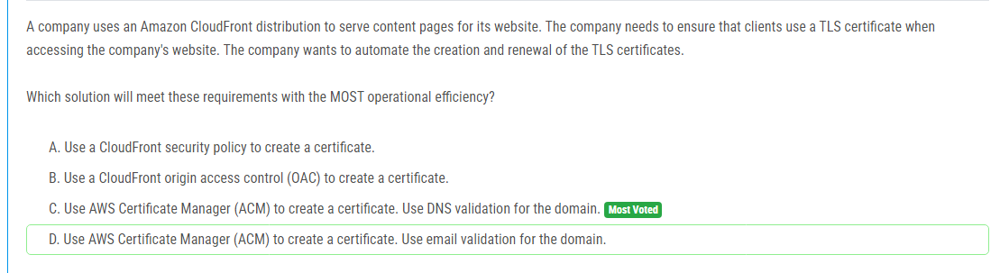

해설:

정답 C.

AWS Certificate Manager (ACM)을 사용하여 TLS 인증서를 생성하고 갱신할 수 있습니다. ACM은 간단한 프로세스로 인증서를 자동으로 발급하고 관리할 수 있는 관리형 서비스입니다. ACM을 사용하여 인증서를 생성할 때 도메인의 DNS 검증을 사용하면 DNS 레코드를 통해 인증서의 유효성을 자동으로 확인할 수 있습니다. 이는 자동화된 프로세스를 통해 인증서를 생성하고 갱신하는 데 가장 효율적인 방법입니다. 따라서 이러한 이유로 C가 가장 적합한 솔루션입니다.

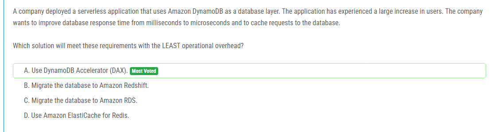

해설:

정답 A.

DynamoDB Accelerator (DAX)를 사용하면 DynamoDB의 읽기 성능을 향상시킬 수 있습니다. DAX는 인메모리 캐싱 계층을 제공하여 데이터베이스 응답 시간을 밀리초에서 마이크로초 수준으로 줄일 수 있습니다. 또한 DAX는 요청을 캐시하여 데이터베이스로의 요청을 줄여주므로 응용 프로그램의 응답 시간을 더욱 향상시킵니다. 이러한 이유로 DAX를 사용하는 것이 운영 오버헤드를 최소화하면서 요구 사항을 충족하는 가장 효율적인 솔루션입니다.

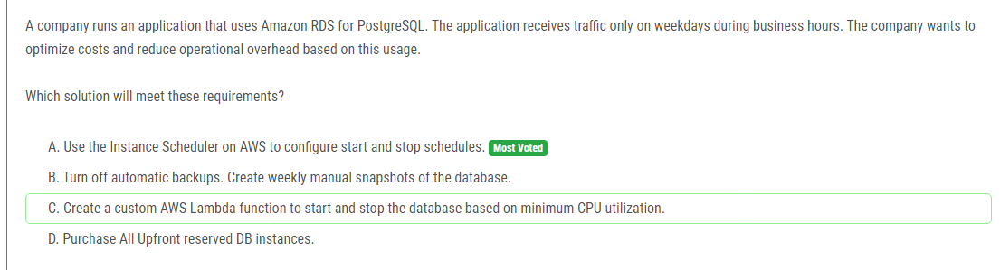

해설:

정답 A.

AWS의 인스턴스 스케줄러를 사용하면 주중 영업 시간에만 RDS 인스턴스를 실행하고 주말이나 비영업 시간에는 인스턴스를 중지하여 비용을 최적화할 수 있습니다. 이를 통해 비영업 시간에는 인스턴스를 중지하여 사용하지 않는 리소스를 낭비하지 않고, 주중 영업 시간에만 필요한 경우에만 인스턴스를 실행하여 비용을 절감할 수 있습니다. 또한 이 솔루션은 AWS에서 제공하는 서비스를 사용하므로 추가적인 개발이나 관리 오버헤드가 필요하지 않습니다. 따라서 이러한 이유로 A가 가장 효율적인 솔루션입니다.

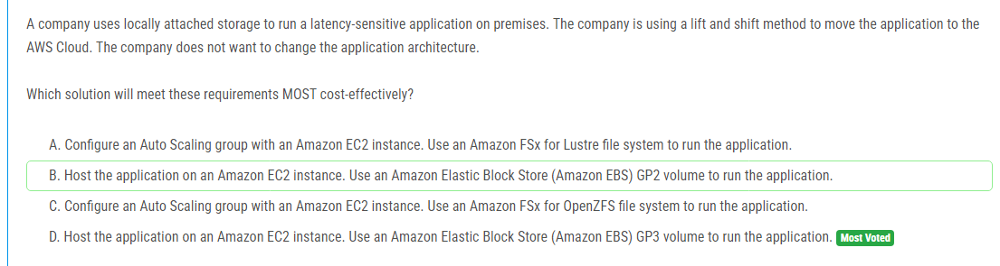

해설:

정답 D.

로컬로 직접 연결된 저장소를 사용하여 애플리케이션을 실행하는 것과 가장 유사한 솔루션은 Amazon EC2 인스턴스에서 애플리케이션을 호스팅하고 Amazon Elastic Block Store (Amazon EBS) GP3 볼륨을 사용하는 것입니다. GP3 볼륨은 다양한 성능 및 용량 옵션을 제공하며, IOPS 및 스루풋을 조정할 수 있어 애플리케이션의 레이턴시 요구 사항을 충족하는 데 유연성을 제공합니다. 또한 lift and shift 방법을 사용하여 애플리케이션 아키텍처를 변경하지 않으며, EC2 인스턴스 및 EBS 볼륨을 사용하여 워크로드를 운영하는 것이 비용 효율적입니다. 따라서 D가 가장 비용 효율적인 솔루션입니다.

