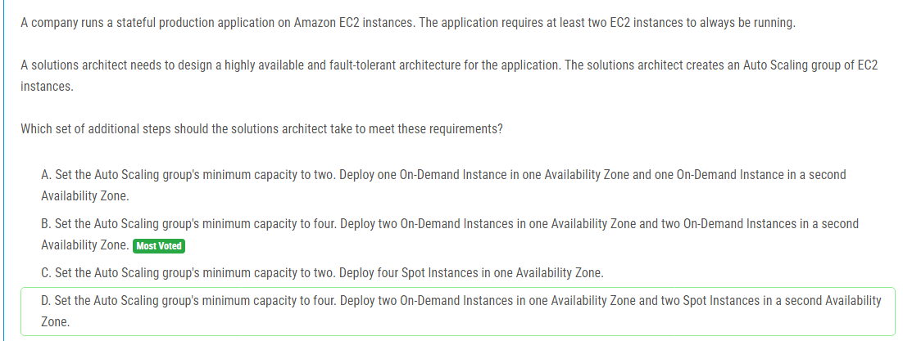

해설:

정답 B.

해당 애플리케이션은 항상 최소한 두 개의 EC2 인스턴스가 실행되어야 하므로, Auto Scaling 그룹의 최소 용량을 두 개로 설정해야 합니다. 그런 다음 이러한 두 개의 인스턴스를 서로 다른 가용 영역에 배포하여 고가용성 및 내결함성을 확보해야 합니다. 따라서 옵션 B가 이러한 요구 사항을 충족시키기 위해 필요한 추가 단계를 가장 잘 설명합니다.

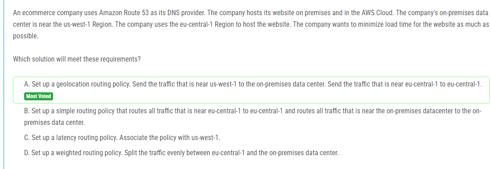

해설:

정답 A.

지리적 위치 기반 라우팅 정책을 사용하여 가까운 지역의 사용자에게 지연 시간을 최소화하고 성능을 최적화할 수 있습니다. 이 정책을 사용하면 Route 53은 사용자의 IP 주소를 기반으로 가장 가까운 지역의 엔드포인트로 트래픽을 전송합니다. 따라서 옵션 A가 이러한 요구 사항을 충족시키기 위해 필요한 추가 단계를 가장 잘 설명합니다.

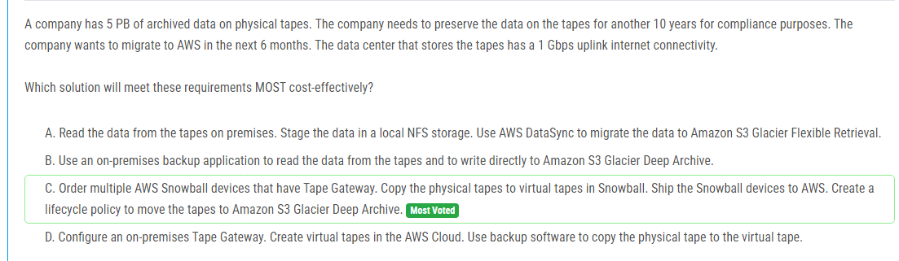

해설:

정답 C.

이 솔루션은 물리적 테이프에서 가상 테이프로 데이터를 이동하는 데 AWS Snowball 디바이스를 사용합니다. 이는 대량의 데이터를 안전하게 AWS로 이전하는 데 효과적인 방법입니다. 또한 Amazon S3 Glacier Deep Archive는 비용 효율적인 저장소 옵션으로 장기 보존을 위해 이상적입니다. 이러한 솔루션은 네트워크 대역폭을 효율적으로 활용하며 빠르고 안전한 데이터 이전을 보장합니다. 따라서 비용 효율적이며 효율적인 방법으로 데이터를 AWS로 이전할 수 있습니다.

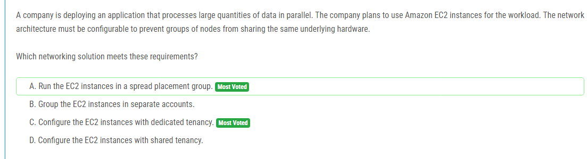

해설:

정답 A.

Spread Placement 그룹을 사용하면 EC2 인스턴스를 물리적으로 분리된 호스트에 배치하여 단일 하드웨어에 여러 인스턴스가 동시에 실행되는 것을 방지할 수 있습니다. 이는 각 인스턴스가 다른 하드웨어 리소스를 공유하지 않고 독립적으로 실행되도록 보장합니다. 따라서 이러한 요구 사항을 충족하기 위해 Spread Placement 그룹이 가장 적합한 네트워킹 솔루션입니다.

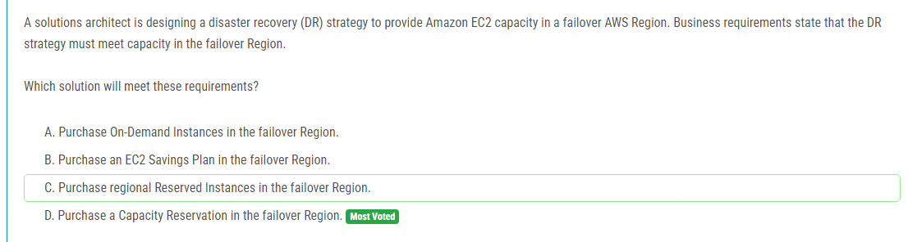

해설:

정답 D.

용량 예약(Capacity Reservation)을 사용하면 특정 인스턴스 유형에 대해 특정한 수의 인스턴스 용량을 예약할 수 있습니다. 따라서 재해 대응(Disaster Recovery) 전략을 위해 예약된 용량을 설정함으로써, 재해 시에도 필요한 EC2 용량을 보장할 수 있습니다. 용량 예약은 인스턴스 유형과 AZ(Availability Zone)에 대한 용량 예약을 설정할 수 있으므로, 재해 대응 지역에서 필요한 용량을 확보할 수 있습니다. 따라서 이러한 요구 사항을 충족하기 위해 용량 예약이 가장 적합한 솔루션입니다.

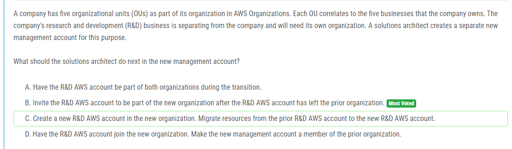

해설:

정답 B.

분리되는 R&D 비즈니스를 위해 새로운 관리 계정이 생성되었으므로 이 계정을 새로운 조직에 초대해야 합니다. 이렇게 하면 R&D 계정이 이전 조직을 떠난 후에 새로운 조직의 일원이 될 수 있습니다. 이를 통해 조직 간 이전 과정이 완료된 후에 R&D 비즈니스를 새로운 조직으로 이관할 수 있습니다.

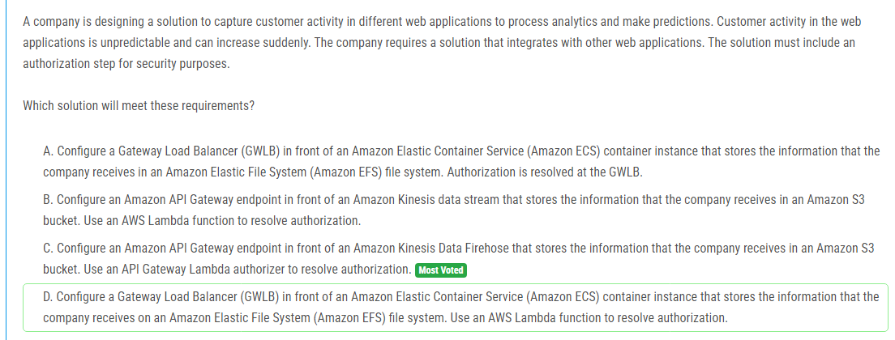

해설:

정답 C.

이 해결책은 Amazon API Gateway를 사용하여 웹 애플리케이션에서 데이터를 수집하는 방법을 제공합니다. Amazon API Gateway는 다른 웹 애플리케이션과 통합할 수 있으며, 요청의 인증을 위한 API Gateway Lambda authorizer를 사용할 수 있습니다. 또한 Amazon Kinesis Data Firehose를 사용하여 데이터를 Amazon S3로 전송하여 분석 및 예측을 위해 저장할 수 있습니다. 이러한 솔루션은 확장 가능하며 보안 요구 사항을 충족시키기 위한 인증 절차를 포함합니다. 따라서 이 요구 사항을 가장 잘 충족하는 옵션입니다.

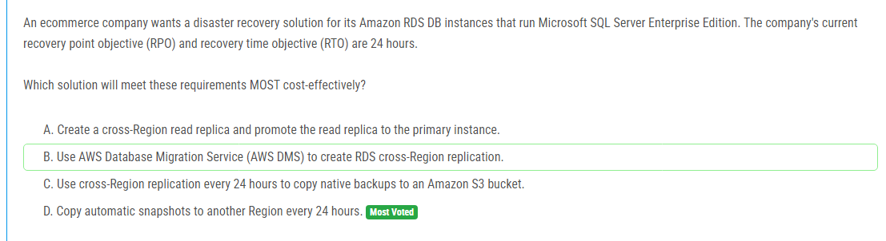

해설:

정답 D.

예비 복구 시나리오를 위해 RDS 자동 스냅샷을 다른 지역으로 복사하는 것이 가장 비용 효율적인 방법입니다. 이 방법은 복제된 데이터베이스를 유지하기 위해 추가 인프라를 배치할 필요가 없으며, 자동 스냅샷은 데이터베이스의 완전한 상태를 캡처하여 복구 시에 유용합니다. 또한 자동 스냅샷은 RDS에서 제공하는 기능이므로 추가 비용이 발생하지 않습니다. 따라서 이 방법이 요구되는 RPO 및 RTO를 충족하는 가장 비용 효율적인 솔루션입니다.

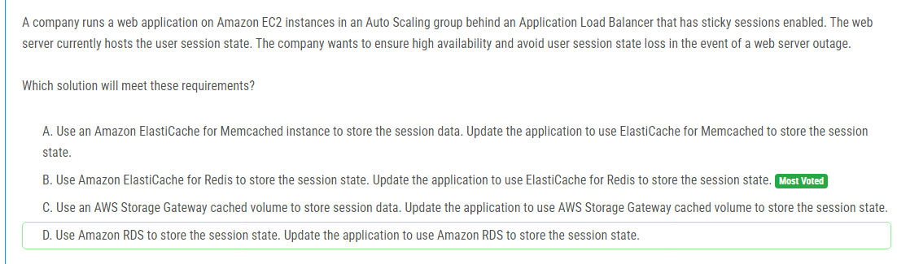

해설:

정답 B.

Amazon ElastiCache for Redis는 인 메모리 데이터 스토어로서 세션 데이터와 같은 상태 정보를 안정적으로 저장하는 데 적합합니다. ElastiCache for Redis는 고가용성을 제공하고, 데이터 손실 없이 장애 복구를 지원합니다. 또한 ElastiCache는 Auto Scaling 그룹에서 실행되는 여러 EC2 인스턴스 간에 세션 데이터를 공유할 수 있도록하는 공유 데이터 스토어로 사용될 수 있습니다. 이러한 이유로 ElastiCache for Redis를 사용하여 세션 상태를 저장하는 것이 가장 적절한 솔루션입니다.

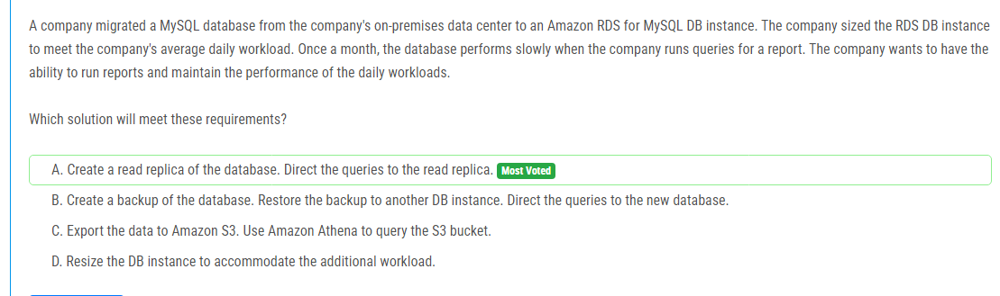

해설:

정답 A.

일일 작업 부하에 대해 충분히 큰 RDS DB 인스턴스를 프로비저닝했지만 월별 보고서 쿼리 실행 시간에 성능이 저하됩니다. 이러한 경우에는 주기적인 보고서 작업이 일상적인 작업에 영향을 미치지 않도록 하기 위해 읽기 전용 복제본을 만들어야 합니다. 이렇게 하면 보고서 쿼리가 주 DB 인스턴스에 영향을 주지 않고 읽기 전용 복제본에서 실행될 수 있습니다. 따라서 이 요구 사항을 충족하기 위해 가장 적절한 솔루션은 데이터베이스의 읽기 전용 복제본을 생성하고 보고서 쿼리를 해당 복제본으로 리디렉션하는 것입니다.

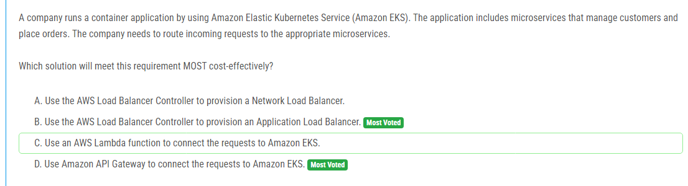

해설:

정답 B.

Amazon EKS에서 마이크로서비스를 실행하는 경우, 요청을 적절한 마이크로서비스로 라우팅하기 위해 AWS 로드 밸런서 컨트롤러를 사용하여 Application Load Balancer(ALB)를 프로비저닝하는 것이 가장 효율적인 방법입니다. ALB는 HTTP 및 HTTPS 트래픽을 마이크로서비스로 전달하는 데 사용될 수 있습니다. 이를 통해 요청을 처리하고 요청을 적절한 마이크로서비스로 라우팅할 수 있으며, 비용 효율적인 솔루션으로 제공됩니다.

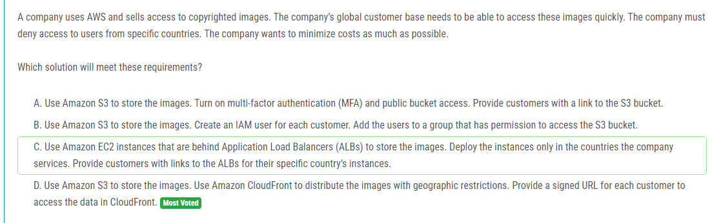

해설:

정답 D.

Amazon S3를 사용하여 이미지를 저장하고, Amazon CloudFront를 사용하여 이미지를 전달하는 것이 가장 비용 효율적인 솔루션입니다. CloudFront는 이미지를 전 세계적으로 배포하고, 지리적 제한을 설정하여 특정 국가의 사용자에게만 액세스를 허용하거나 거부할 수 있습니다. 또한, CloudFront를 통해 서명된 URL을 제공하여 각 고객에게 액세스를 제어할 수 있습니다. 이 방법은 비용을 최소화하면서 필요한 기능을 모두 충족시키는 가장 적절한 솔루션입니다.

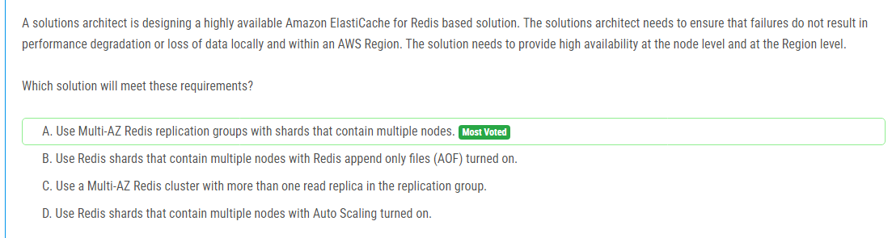

해설:

정답 A.

이 문제는 노드 수준 및 리전 수준에서의 고가용성을 요구합니다. Multi-AZ Redis replication groups를 사용하면 노드 수준에서 고가용성을 제공할 수 있습니다. 이는 주 노드와 여러 개의 읽기 전용 복제본 사이의 자동 장애 조치(Failover)를 제공합니다. 또한, 샤드를 사용하여 데이터를 여러 노드로 분할하면 데이터 손실을 최소화할 수 있습니다. 이를 통해 리전 수준에서의 고가용성을 제공할 수 있습니다. 따라서 Multi-AZ Redis replication groups를 사용하는 것이 이러한 요구 사항을 가장 잘 충족하는 솔루션입니다.

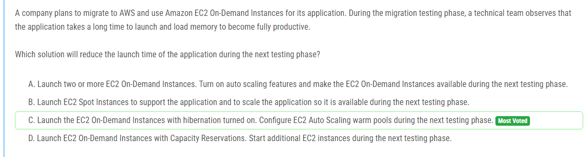

해설:

정답 C.

이 문제는 애플리케이션의 시작 시간을 줄이는 것을 목표로 하고 있습니다. EC2 On-Demand 인스턴스를 시작할 때 메모리를 로드하는 데 시간이 오래 걸린다는 문제가 있습니다. 이를 해결하기 위해 hibernation이 활성화된 EC2 On-Demand 인스턴스를 시작하는 것이 좋습니다. hibernation을 사용하면 인스턴스의 상태를 디스크에 저장한 다음, 나중에 다시 시작할 때 이 상태를 복원할 수 있습니다. 따라서 다음 테스트 단계에서 EC2 Auto Scaling 웜 풀을 구성하여 hibernation이 활성화된 EC2 On-Demand 인스턴스를 사용하면 시작 시간을 줄일 수 있습니다.

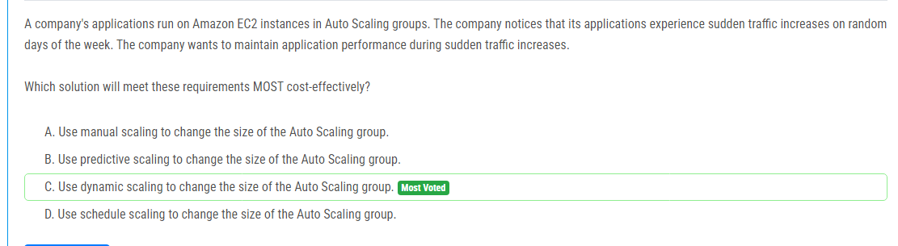

해설:

정답 C.

이 문제는 갑작스러운 트래픽 증가로 인한 애플리케이션 성능을 유지하는 것을 목표로 하고 있습니다. Dynamic scaling을 사용하면 Auto Scaling 그룹의 크기를 자동으로 조정하여 트래픽 증가에 대응할 수 있습니다. 이를 통해 애플리케이션 성능을 유지할 수 있으며, 수동 조정이나 예측 스케일링보다 비용을 더 효율적으로 관리할 수 있습니다.

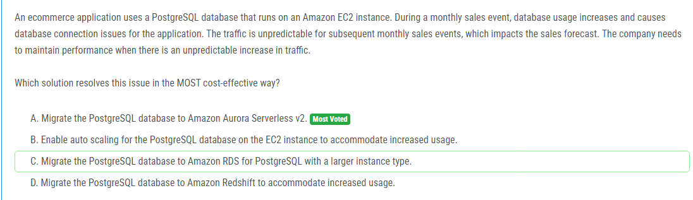

해설:

정답 A.

이 문제는 예측할 수 없는 트래픽 증가로 인한 데이터베이스 연결 문제를 해결하는 것을 목표로 하고 있습니다. Amazon Aurora Serverless v2를 사용하면 데이터베이스 용량이 자동으로 조정되므로 예측할 수 없는 트래픽 증가에 대응할 수 있습니다. 이는 비용 효율적인 해결책이며, 또한 관리 오버헤드를 줄일 수 있습니다. Auto Scaling, Amazon RDS로의 마이그레이션, Amazon Redshift로의 마이그레이션은 모두 가능한 대안이지만, Aurora Serverless v2는 가장 비용 효율적이고 관리가 용이한 옵션입니다.

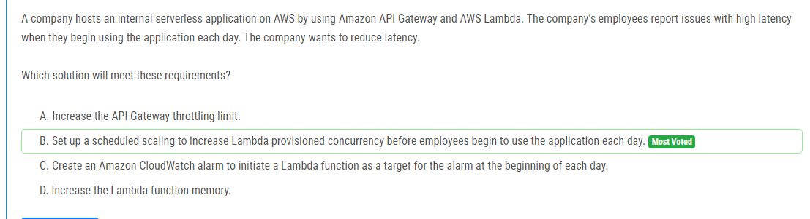

해설:

정답 B.

이 문제를 해결하기 위해 Lambda 함수의 provisioned concurrency를 미리 증가시켜 두는 것이 가장 좋은 방법입니다. 이렇게 하면 애플리케이션 시작 시에 함수가 이미 활성화되어 있으므로 높은 대기 시간을 줄일 수 있습니다. 

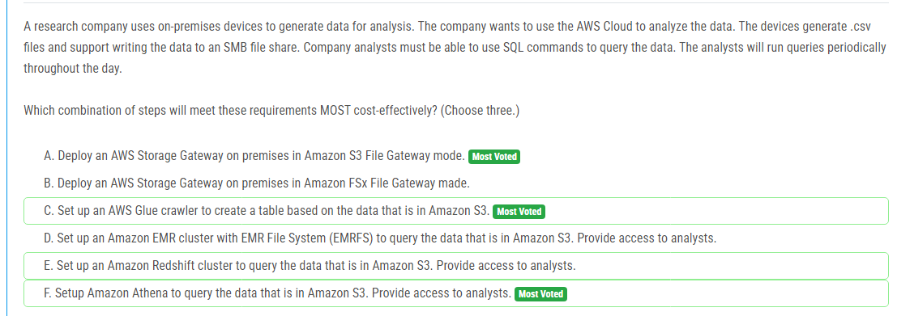

해설:

정답 A, C, F.

A. 온프레미스 디바이스에서 생성된 .csv 파일을 AWS S3로 업로드해야 합니다. 이를 위해 AWS Storage Gateway를 온프레미스에 배포하여 Amazon S3 파일 게이트웨이 모드로 설정합니다. 이렇게 하면 .csv 파일을 S3 버킷으로 전송할 수 있습니다.

C. AWS Glue 크롤러를 설정하여 Amazon S3에 있는 데이터를 기반으로 테이블을 생성합니다. 이렇게 하면 .csv 파일의 데이터를 자동으로 스키마로 변환하여 Athena에서 쿼리할 수 있는 형식으로 만들어 줍니다.

F. Amazon Athena를 설정하여 Amazon S3에 저장된 데이터를 쿼리할 수 있습니다. 이를 통해 SQL 쿼리를 사용하여 데이터에 직접 액세스할 수 있으므로 비용을 절감하면서도 분석가가 데이터에 대한 요구사항을 충족할 수 있습니다.

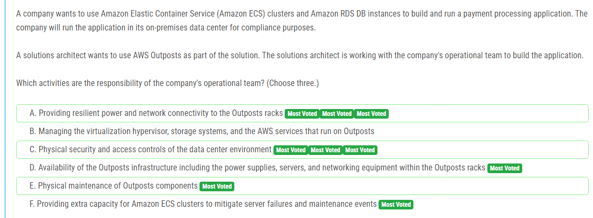

해설:

정답 A, C, F.

A. Outposts 랙에 견고한 전원 및 네트워크 연결을 제공해야 합니다. 이는 운영팀이 담당하는 부분으로, 온프레미스 데이터 센터의 인프라 관리에 해당합니다.

C. 데이터 센터 환경의 물리적 보안 및 접근 제어는 운영팀이 담당합니다. 이는 Outposts가 온프레미스 환경에서 운영되기 때문에 중요한 책임입니다.

F. Amazon ECS 클러스터에 대한 추가 용량을 제공하여 서버 장애 및 유지보수 이벤트를 완화하는 것은 운영팀의 책임입니다. 이는 애플리케이션의 가용성과 성능을 유지하는 데 필요한 작업입니다.

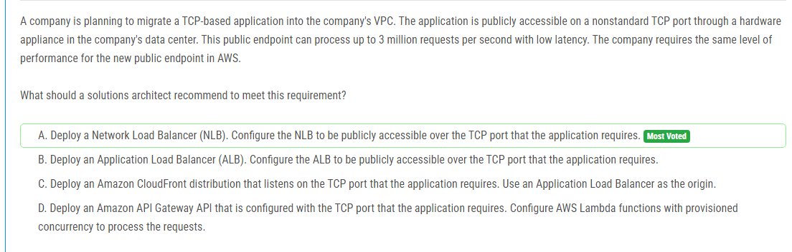

해설:

정답 A.

솔루션 아키텍트는 고성능과 저지연을 유지하면서 애플리케이션을 AWS로 마이그레이션해야 합니다. TCP 기반의 공개 엔드포인트를 제공하기 위해 Network Load Balancer (NLB)를 사용하는 것이 가장 적절한 선택입니다. NLB는 TCP 및 UDP 트래픽을 고성능으로 처리하며, 네트워크 수준에서 최대 성능을 제공합니다. NLB를 사용하면 기존의 TCP 포트를 사용하여 애플리케이션에 대한 공개적인 엔드포인트를 쉽게 구성할 수 있습니다. 따라서 솔루션 아키텍트는 NLB를 선택하여 이러한 요구 사항을 충족시켜야 합니다.

