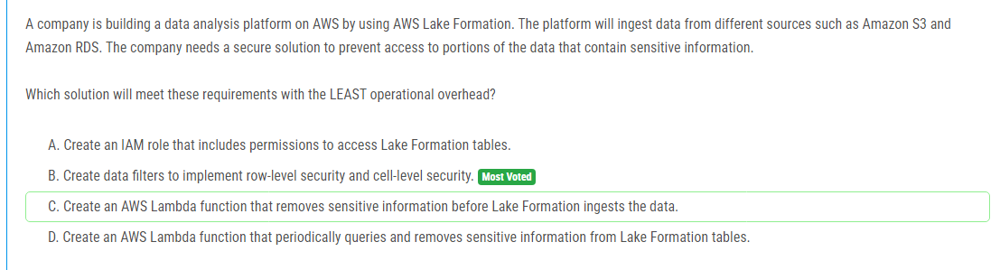

해설:

정답 B.

Aurora PostgreSQL의 장점을 최대한 활용하며 downtime을 최소화합니다. Aurora read replica를 생성하고 이를 새로운 Aurora PostgreSQL DB 클러스터로 승격시킵니다. 이는 실시간 복제를 통해 데이터 손실을 최소화하고, 별도의 데이터 이전 단계 없이 Aurora의 기능을 활용하여 마이그레이션을 수행합니다. 또한 Aurora는 RDS보다 더 높은 성능과 확장성을 제공하므로, 운영 오버헤드를 최소화하면서도 최상의 성능을 유지할 수 있습니다. 따라서 옵션 B가 LEAST operational overhead를 가지면서 요구 사항을 충족하는 가장 적절한 선택지입니다.

해설:

정답 C.

옵션 C는 가장 미니멀한 노력으로 모든 EC2 인스턴스를 재복구할 수 있도록 보장합니다. AWS Backup을 사용하여 EC2 인스턴스 그룹에 대한 백업 계획을 설정합니다. 이는 여러 EC2 인스턴스의 복구 프로세스를 단순화하고, AWS Backup API 또는 AWS CLI를 사용하여 복원 프로세스를 가속화할 수 있습니다. 이 방법을 사용하면 각 EC2 인스턴스에 대한 별도의 스냅샷을 관리할 필요가 없으며, 일관된 백업 및 복원 프로세스를 유지할 수 있습니다. 옵션 C는 이러한 이점을 제공하면서도 노력을 최소화하여 요구 사항을 충족시키는 가장 적절한 선택지입니다.

해설:

정답 B.

옵션 B인 AWS Step Functions의 Map state를 분산 모드로 사용하는 것이 가장 효율적인 방법입니다. 이 옵션을 선택하면 대규모 데이터 집합을 병렬로 처리할 수 있습니다. 분산 모드를 사용하면 Step Functions이 각 항목을 별도의 실행으로 분할하여 동시에 여러 항목을 처리합니다. 이는 서버리스 환경에서 대규모 데이터를 효율적으로 처리하기 위한 이상적인 방법 중 하나입니다. Step Functions을 사용하면 관리할 서버가 없으며, 분산 모드를 통해 대규모 병렬 처리를 구현할 수 있어서 운영 효율성이 뛰어납니다.

해설:

정답 D.

주어진 상황에서는 대량의 데이터를 안정적으로 빠르게 전송할 수 있는 가장 효율적인 방법은 AWS Snowball을 사용하는 것입니다. 데이터 센터의 인터넷 대역폭이 상당히 낮기 때문에 직접적인 온라인 전송은 시간이 오래 걸릴 수 있습니다. AWS Snowball은 대량의 데이터를 물리적으로 전송할 수 있는 서비스이며, 이러한 용량의 데이터를 안정적으로 Amazon S3로 이전하는 데 적합합니다.

따라서 옵션 D인 여러 AWS Snowball 장치를 주문하여 데이터를 복사하고 이를 AWS로 보내 Amazon S3로 데이터를 복사하는 것이 이러한 요구 사항을 가장 잘 충족시키는 방법입니다. Snowball을 사용하면 대량의 데이터를 안정적으로 이동할 수 있으며, 물리적 전송을 통해 데이터 이전 프로세스를 가속화할 수 있습니다.

해설:

정답 D.

요구 사항을 충족하기 위해서는 AWS Storage Gateway의 캐시된 볼륨을 사용하는 것이 가장 적합합니다. 캐시된 볼륨을 사용하면 자주 액세스되는 데이터에 대한 저지연 시간의 접근이 가능하며, 동시에 인프라 변경을 최소화하여 기존 온프레미스 서버에 대한 의존성을 줄일 수 있습니다.

캐시된 볼륨을 사용하면 자주 액세스되는 데이터가 로컬로 캐싱되므로 로컬 인프라에 대한 의존성이 줄어듭니다. 이는 데이터를 AWS 클라우드로 쉽게 마이그레이션할 수 있도록 해주며, 동시에 저지연 시간의 데이터 액세스를 제공합니다.

해설:

정답 B.

모든 객체를 S3 Standard에 저장하고, 이후 30일 후에 객체를 S3 Standard-Infrequent Access (S3 Standard-IA)로 전환하는 S3 Lifecycle 규칙을 설정합니다. 이는 최초 30일 동안 매우 빈번하게 액세스되는 객체에 대한 높은 가용성을 제공하면서, 30일 이후에는 저렴한 저장 비용을 제공하는 S3 Standard-IA로 객체를 이동시킴으로써 비용을 절감합니다.

따라서 이 솔루션은 객체 내구성을 최대화하고 언제든지 액세스할 수 있으며, 액세스 패턴에 따라 비용을 최적화하는 데 가장 효과적입니다.

해설:

정답 C.

옵션 C는 가장 비용 효율적인 방법으로 요구 사항을 충족시킵니다. 이 옵션은 Amazon S3를 사용하여 문서를 저장하는 방식으로 데이터베이스에서 BLOB 데이터를 완전히 제거하고 데이터베이스의 용량을 크게 줄입니다. 이것은 데이터베이스 성능을 향상시키고 비용을 절감하는 데 도움이 됩니다.

Amazon S3는 비용 효율적이며 확장 가능한 스토리지 옵션을 제공하므로 대량의 BLOB 데이터를 저장하는 데 이상적입니다. 또한 S3는 고 가용성과 내구성을 제공하여 안정성이 요구되는 경우에도 적합합니다.

따라서 옵션 C가 가장 적절한 선택지입니다. 데이터베이스 용량을 줄이고 성능을 향상시키면서 비용을 절감할 수 있습니다.

해설:

정답 A.

옵션 A에서 AWS WAF 웹 ACL을 사용하여 ALB와 연결하고, ALB의 IP rule 세트를 사용하여 트래픽을 필터링합니다. 이렇게 함으로써 등록된 IP 주소만이 애플리케이션에 액세스할 수 있도록 제한할 수 있습니다. AWS WAF는 웹 애플리케이션의 보안을 강화하는 데 사용되며, IP 규칙을 통해 특정 IP 주소 또는 범위의 IP 주소로부터의 트래픽을 허용 또는 거부할 수 있습니다.

이 방법은 각 소매점 위치가 등록된 IP 주소로만 허용되도록 하는 보안 요구 사항을 가장 효과적으로 충족합니다. 이러한 제한은 AWS WAF를 사용하여 ALB 앞에서 트래픽을 필터링함으로써 쉽게 구현할 수 있습니다.

해설:

정답 B.

옵션 B에서 데이터 필터를 사용하여 행 수준 보안 및 셀 수준 보안을 구현할 수 있습니다. 이는 민감한 정보가 포함된 데이터에 대한 액세스를 제어하고 필요한 보안 요구 사항을 충족시키는 가장 효과적인 방법 중 하나입니다. 데이터 필터를 사용하면 Lake Formation 테이블의 특정 행 또는 셀에 액세스하는 데 필요한 보안 규칙을 정의할 수 있습니다.

해설:

정답 B.

옵션 B에서는 Amazon S3에 대한 게이트웨이 VPC 엔드포인트를 배포하고, 온프레미스 네트워크와 VPC 간에 AWS Direct Connect 연결을 설정합니다.

게이트웨이 VPC 엔드포인트를 통해 EC2 인스턴스가 Amazon S3로 데이터를 보낼 때 인터넷을 통하지 않고도 안전하게 통신할 수 있습니다. 또한, AWS Direct Connect 연결을 통해 온프레미스 네트워크와 VPC 간에 비공개 네트워크 연결이 설정됩니다. 이는 데이터가 인터넷을 통하지 않고도 안전하게 전송되며, 규정 준수 요구 사항을 충족시킵니다.

해설:

정답 A.

옵션 A에서는 Amazon Kinesis Data Streams를 사용하여 데이터를 수집하고, AWS Lambda 함수를 사용하여 데이터를 처리합니다. 이는 서버리스 아키텍처를 통해 애플리케이션을 더 확장 가능하게 만들어줍니다. 데이터 스트림은 무한한 데이터를 처리할 수 있으며, Lambda 함수는 요청에 따라 자동으로 확장되므로 트래픽 증가에 대응할 수 있습니다. 이러한 아키텍처는 데이터 볼륨이 급격하게 증가할 때도 안정적으로 동작할 수 있습니다.

따라서 옵션 A가 가장 적합한 솔루션입니다.

해설:

정답 D.

옵션 D에서는 VPC 엔드포인트를 구성하여 EC2 인스턴스가 인터넷을 통하지 않고도 Amazon S3 버킷에 안전하게 액세스할 수 있습니다. VPC 엔드포인트를 통해 트래픽은 VPC 내부에서만 처리되므로 인터넷에 노출되지 않습니다. 또한, S3 버킷 정책을 업데이트하여 VPC 엔드포인트로부터의 액세스만 허용하도록 구성할 수 있습니다.

이러한 아키텍처는 보안 요구 사항을 충족시키면서도 EC2 인스턴스가 S3 버킷에 안전하게 연결되도록 보장합니다. 따라서 옵션 D가 가장 적절한 솔루션입니다.

해설:

정답 B.

옵션 B에서는 Amazon EKS 클러스터에서 AWS Key Management Service (AWS KMS)를 사용하여 시크릿 암호화를 활성화합니다. 이를 통해 Kubernetes 시크릿 오브젝트에 저장된 데이터가 자동으로 암호화됩니다. 이 방법을 사용하면 운영자는 추가적인 작업을 수행하지 않아도 됩니다. 단순히 EKS 클러스터 설정에서 시크릿 암호화를 활성화하는 것만으로도 데이터 암호화를 보장할 수 있습니다.

따라서 옵션 B가 가장 적절한 솔루션입니다.

해설:

정답 D.

옵션 D에서는 Application Load Balancer (ALB)를 사용하여 애플리케이션 서버의 Auto Scaling 그룹을 대상 그룹으로 구성합니다. 이렇게하면 웹 서버만이 ALB를 통해 애플리케이션 서버에 연결할 수 있습니다. 그런 다음, 보안 그룹을 구성하여 웹 서버만이 애플리케이션 서버에 대한 액세스를 허용하도록 설정합니다.

이 방법은 간단하게 구현할 수 있으며, 보안을 강화하여 애플리케이션 서버에 직접 액세스할 수 없도록 합니다. 또한, Application Load Balancer는 트래픽 분산 및 로드 밸런싱을 수행하므로 애플리케이션의 확장성과 가용성을 높일 수 있습니다.

해설:

정답 D.

옵션 D에서는 Amazon CloudWatch Container Insights를 구성하여 기존의 Amazon EKS 클러스터에서 메트릭과 로그를 수집, 집계 및 요약합니다. CloudWatch Container Insights는 EKS 클러스터 내의 컨테이너 및 마이크로서비스에서 생성되는 로그 및 메트릭 데이터를 자동으로 수집하고 모니터링합니다. 이를 통해 중앙 집중식 위치에서 애플리케이션의 성능을 실시간으로 관찰하고 문제를 식별할 수 있습니다.

또한 CloudWatch는 강력한 대시보드 및 경보 기능을 제공하여 모니터링 및 운영을 더욱 효과적으로 수행할 수 있습니다.

해설:

정답 C.

옵션 C에서는 Amazon GuardDuty를 구성하여 AWS 계정, 워크로드 및 Amazon S3 버킷에 대한 악성 활동을 지속적으로 모니터링하고, 이러한 활동을 AWS Security Hub에 보고합니다. GuardDuty는 다양한 AWS 리소스 및 서비스에서 수집된 데이터를 분석하여 악성 행위를 탐지하고 경보를 생성합니다. 이 경보는 Security Hub로 전송되어 중앙 집중식 대시보드에 표시됩니다.

이러한 솔루션을 통해 회사는 AWS 계정과 리소스에 대한 악성 활동을 식별하고 대응할 수 있습니다. GuardDuty와 Security Hub의 결합은 모니터링 및 보안 운영을 효과적으로 관리할 수 있는 강력한 도구입니다.

해설:

정답 B, E.

B. Amazon Elastic File System (Amazon EFS) 파일 시스템 생성:
Amazon EFS는 여러 AWS 리소스가 NFS 프로토콜을 통해 데이터에 액세스할 수 있는 완전 관리형 파일 시스템을 제공합니다. 기존 데이터 센터의 NFS 기반 파일 시스템과 유사한 방식으로 동작하여 데이터 마이그레이션을 단순화합니다. 또한 Amazon EFS는 스토리지 용량에 따라 과금되므로 작은 규모의 데이터 마이그레이션에 비용 효율적입니다.

E. AWS DataSync를 사용하여 온프레미스 위치와 AWS 간의 데이터 전송:
AWS DataSync를 사용하면 온프레미스 데이터 센터와 AWS 간에 대량의 데이터를 안전하고 신속하게 전송할 수 있습니다. DataSync는 자동으로 데이터 일관성을 유지하고, 대용량 데이터를 병렬로 처리하여 빠르게 전송합니다. 또한 네트워크 대역폭을 효율적으로 활용하여 데이터 이전을 최적화합니다.

해설:

정답 C.

옵션 C에서는 Multi-AZ 배포 유형의 FSx for Windows File Server 파일 시스템을 us-east-1 리전에 생성합니다. Multi-AZ 배포를 선택하면 높은 가용성과 내결함성을 제공하여 시스템 유지 보수 또는 서비스 중단 시간 동안 RPO를 충족시키는 데 도움이 됩니다.
AWS Backup를 사용하여 매일 백업 계획을 생성하고 백업 규칙에 따라 백업을 us-west-2 리전으로 복사합니다. 이를 통해 데이터를 다른 리전으로 신속하게 복제할 수 있습니다.
AWS Backup Vault Lock을 사용하여 복제된 데이터를 안전하게 유지합니다. 옵션 C에서는 이를 사용하여 목표 보관에 대한 AWS Backup Vault Lock을 구성합니다. 복잡성 및 비용을 줄이기 위해 컴플라이언스 모드를 선택하여 5년 동안 데이터를 안전하게 보관합니다.

해설:

정답 C.

옵션 C에서는 서비스 제어 정책(SCP)을 생성하여 개발자 계정에서 CloudTrail 설정 변경을 금지합니다. AWS Organizations를 사용하여 SCP를 개발자 계정에 첨부함으로써 특정 보안 제어를 강제할 수 있습니다. SCP를 사용하면 특정 AWS 서비스에 대한 개발자의 권한을 제어하고 원하는 정책을 적용할 수 있습니다.

해설:

정답 C.

Provisioned IOPS SSD Amazon Elastic Block Store (Amazon EBS) 볼륨은 지속적인 저지연과 일관된 성능을 제공하는 스토리지 유형입니다. 이 유형의 스토리지는 IOPS (입출력 작업 속도)와 함께 사전 예약된 일정한 성능을 제공하여 응용 프로그램에 필요한 특정 성능 요구 사항을 충족시킵니다.

비즈니스 중요한 애플리케이션에는 일관된 성능과 낮은 지연 시간이 필요하므로 Provisioned IOPS SSD Amazon EBS 볼륨을 사용하는 것이 적합합니다.

