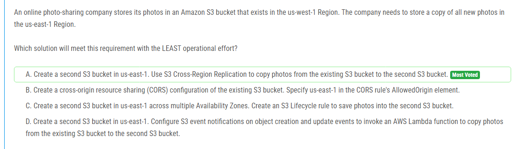

해설:

정답 A.

옵션 A에서는 S3 Cross-Region Replication을 사용하여 기존의 S3 버킷에서 새로운 사진을 us-east-1 리전에 있는 두 번째 S3 버킷으로 복사합니다. 이 방법을 사용하면 AWS에서 자동으로 사진 복사 작업을 관리하므로 운영 노력이 최소화됩니다. 또한 Cross-Region Replication은 데이터 신뢰성을 유지하고 일관된 복사를 보장하기 위해 내결함성이 있는 서비스입니다.

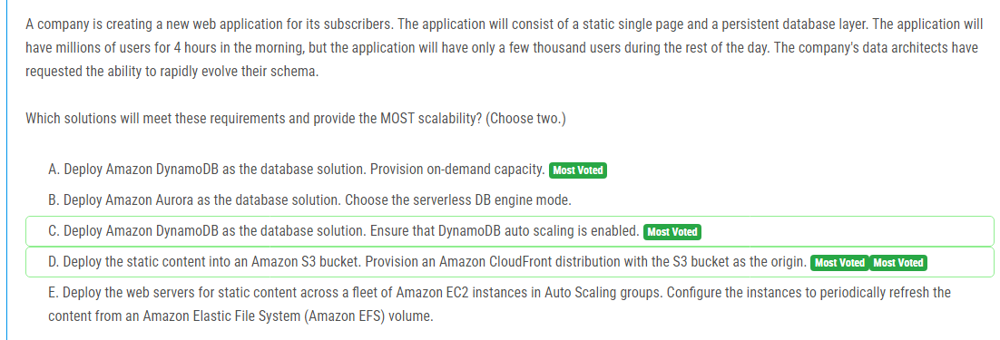

해설:

정답 A, D.

A. Amazon DynamoDB를 사용하여 데이터베이스 솔루션을 배포하고 온디맨드 용량을 프로비저닝합니다. DynamoDB는 가변적인 트래픽을 처리하고 스키마의 빠른 진화를 지원하기 위해 이상적인 선택입니다. 온디맨드 용량을 사용하면 애플리케이션 요청에 따라 DynamoDB 용량이 자동으로 확장되므로 변동적인 트래픽에 대응할 수 있습니다.

D. 정적 콘텐츠를 Amazon S3 버킷에 배포하고 Amazon CloudFront를 사용하여 전 세계적으로 콘텐츠를 배포합니다. 이를 통해 정적 콘텐츠에 대한 높은 확장성과 저렴한 비용을 얻을 수 있습니다. 또한 CloudFront는 정적 콘텐츠에 대한 빠른 전송 속도와 성능을 제공하여 사용자 경험을 향상시킵니다.

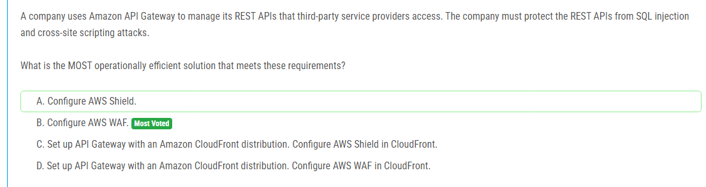

해설:

정답 B.

AWS WAF(웹 애플리케이션 방화벽)는 웹 애플리케이션을 보호하기 위한 관리형 서비스로, SQL 인젝션 및 크로스 사이트 스크립팅(XSS)과 같은 일반적인 웹 공격으로부터 API Gateway를 보호할 수 있습니다. AWS WAF는 사용자 지정 규칙을 사용하여 웹 요청을 분석하고 차단할 수 있으며, 이를 통해 보안 정책을 쉽게 구현할 수 있습니다.

따라서 API Gateway를 보호하기 위해 AWS WAF를 구성하는 것이 가장 효율적인 솔루션입니다. AWS WAF는 관리가 간편하며, 쉽게 구성할 수 있어서 운영 효율성을 제공합니다.

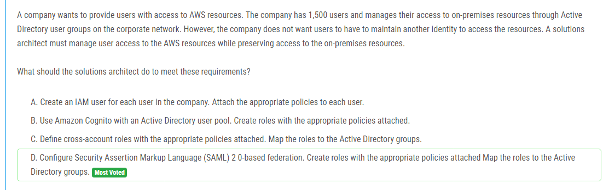

해설:

정답 D.

D. 보안 주장 표식 언어 (SAML) 2.0 기반 연합을 구성합니다. 이를 통해 사용자는 기존의 Active Directory 그룹 멤버십을 유지하면서 AWS 리소스에 대한 액세스를 관리할 수 있습니다. 이 방법을 사용하면 사용자는 추가 AWS ID나 비밀번호를 관리하지 않아도 되므로 편리하게 사용할 수 있습니다. 또한 IAM 역할을 사용하여 필요한 AWS 리소스에 대한 액세스를 제어할 수 있습니다. 이를 통해 사용자는 기업 네트워크의 Active Directory 그룹에 대한 액세스를 통해 AWS 리소스에 대한 적절한 권한을 자동으로 부여받을 수 있습니다. 따라서 D가 가장 적합한 솔루션입니다.

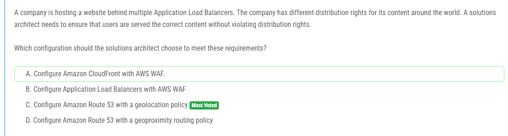

해설:

정답 C.

C. Amazon Route 53을 지리적 위치 정책으로 구성합니다. 이를 통해 사용자의 지리적 위치에 따라 요청을 다르게 라우팅할 수 있습니다. 이것은 콘텐츠의 지역적 배포를 쉽게 관리하고 권리를 위반하지 않으면서 올바른 콘텐츠를 사용자에게 제공하는 데 도움이 됩니다. 예를 들어, 다른 지역에 있는 사용자에게 다른 콘텐츠를 제공해야 하는 경우, Route 53의 지리적 라우팅을 사용하여 각 지역별로 올바른 서버로 트래픽을 라우팅할 수 있습니다.

이 방법을 사용하면 사용자의 지역에 따라 올바른 콘텐츠를 제공할 수 있으므로 지리적 배포 규칙을 준수하면서 요구 사항을 충족할 수 있습니다. 따라서 C가 가장 적합한 솔루션입니다.

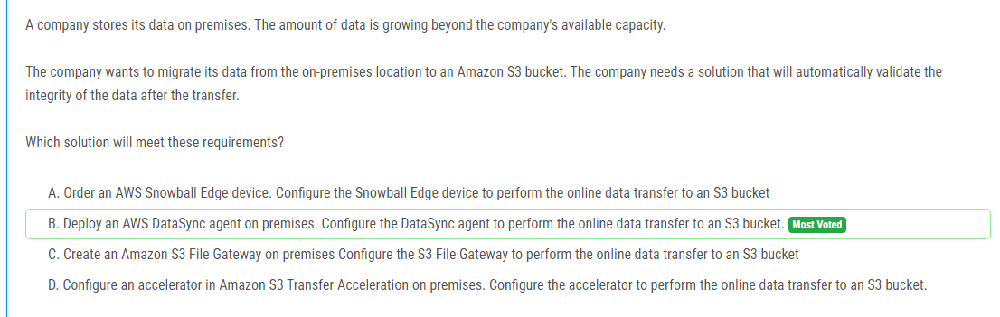

해설:

정답 B.

B. AWS DataSync 에이전트를 온프레미스에 배포하여 데이터를 Amazon S3 버킷으로 온라인으로 전송합니다. DataSync는 데이터 전송 중에 데이터 무결성을 자동으로 확인합니다. 이는 데이터가 손상되지 않고 정확하게 전송되었음을 보장합니다. DataSync는 복제 후 대상과 원본 데이터의 체크섬을 비교하여 데이터 무결성을 확인합니다. 이러한 자동 검사는 데이터 전송 프로세스를 간소화하고 오류를 최소화하여 신뢰할 수 있는 데이터 이관을 보장합니다.

따라서 AWS DataSync를 사용하여 데이터를 Amazon S3로 안정적으로 이관하는 것이 가장 적절한 솔루션입니다.

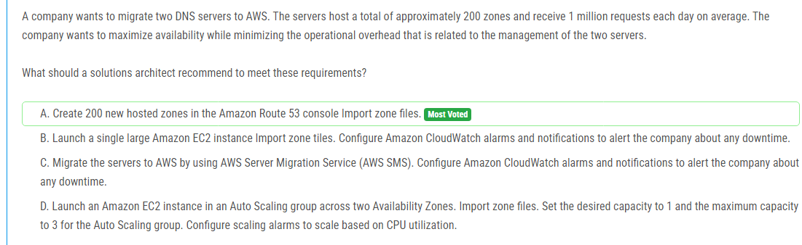

해설:

정답 A.

A. Amazon Route 53 콘솔에서 200개의 새로운 호스팅된 존을 생성하고, 기존 DNS 서버에서 가져온 존 파일을 Route 53으로 가져옵니다. 이를 통해 회사는 DNS 서버를 AWS로 이전할 수 있으며, 최소한의 운영 부담으로 고가용성을 확보할 수 있습니다. Amazon Route 53은 관리가 간편하며, 고가용성을 제공하는 관리형 DNS 서비스이므로 운영 오버헤드를 최소화하면서 DNS 서버를 AWS로 이전하는 데 적합한 솔루션입니다.

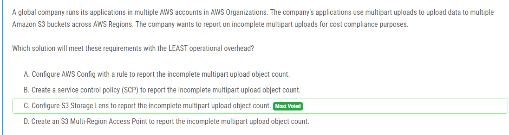

해설:

정답 C.

C. S3 Storage Lens를 구성하여 미완료된 멀티파트 업로드 객체 수를 보고할 수 있습니다. S3 Storage Lens는 각 AWS 계정에 대한 포괄적인 데이터 및 성능 분석을 제공하는 AWS의 데이터 분석 및 모니터링 서비스입니다. S3 Storage Lens를 사용하면 여러 AWS 계정 및 리전의 S3 버킷에 대한 심층적인 인사이트를 얻을 수 있습니다. 또한 S3 Storage Lens는 비용 규정 준수를 위해 필요한 미완료된 멀티파트 업로드 객체 수와 같은 중요한 지표를 보고할 수 있습니다. 이러한 솔루션을 구성하면 운영 오버헤드가 최소화되고 요구 사항을 충족시킬 수 있습니다.

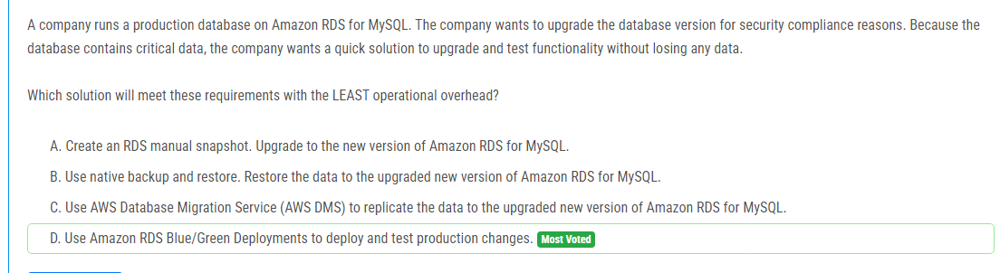

해설:

정답 D.

D. Amazon RDS Blue/Green Deployments를 사용하여 프로덕션 변경 사항을 배포하고 테스트할 수 있습니다. 이 방법을 사용하면 프로덕션 데이터베이스의 버전을 안전하게 업그레이드하고 기존 데이터를 손상시키지 않으면서 새로운 버전의 Amazon RDS for MySQL을 테스트할 수 있습니다. Blue/Green 배포를 통해 이전 버전의 데이터베이스와 새 버전의 데이터베이스를 병렬로 유지하면서 전환할 수 있으므로, 운영 오버헤드를 최소화하면서 빠르고 안전한 업그레이드를 수행할 수 있습니다.

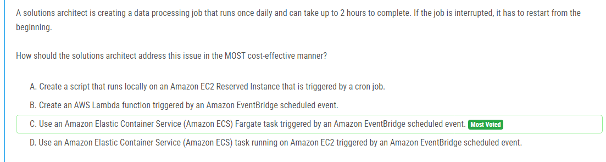

해설:

정답 C.

C. Amazon ECS Fargate 작업을 사용하면 필요한 컴퓨팅 리소스만 지불하면서도 데이터 처리 작업을 실행할 수 있습니다. Amazon ECS Fargate는 서버 없이 컨테이너를 실행할 수 있으므로 EC2 인스턴스의 관리나 유지보수에 대해 걱정할 필요가 없습니다. 또한 Amazon EventBridge 스케줄된 이벤트를 사용하여 데이터 처리 작업을 자동으로 트리거할 수 있습니다. 이러한 솔루션은 가장 비용 효율적이며, 데이터 처리 작업이 중단되어도 작업이 처음부터 다시 시작되므로 작업의 완료를 보장합니다.

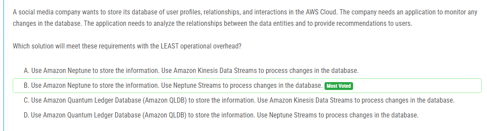

해설:

정답 B.

B. Amazon Neptune은 관계형 데이터를 저장하고 처리하는데 이상적인 그래프 데이터베이스 솔루션입니다. Neptune Streams은 Neptune에서 발생하는 변경 사항을 모니터링하고 처리하는데 사용됩니다. 이를 통해 데이터베이스의 변경 사항을 감지하고 해당 변경 사항을 처리하는데 최소한의 운영 오버헤드로 애플리케이션을 구축할 수 있습니다.

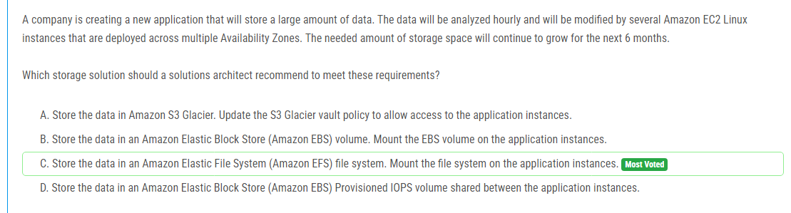

해설:

정답 C.

C. Amazon Elastic File System (EFS)는 여러 EC2 인스턴스 간에 파일을 공유하고 공동으로 액세스할 수 있는 완전 관리형 파일 시스템을 제공합니다. 데이터 용량이 지속적으로 증가하므로 Amazon EFS는 필요한 스토리지 공간을 동적으로 확장할 수 있습니다. 또한 여러 가용 영역에서 데이터를 안전하게 저장하고 고가용성을 보장합니다. 이러한 이점들로 인해 Amazon EFS는 대량의 데이터를 저장하고 분석하는데 이상적인 솔루션입니다.

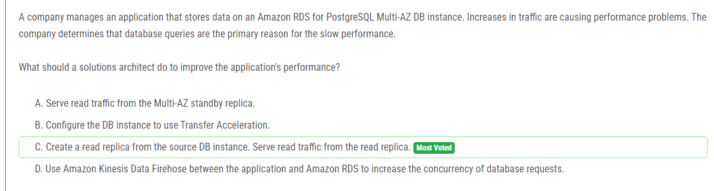

해설:

정답 C.

C. 읽기 전용 복제본을 생성하여 읽기 트래픽을 분산시키는 것이 데이터베이스 성능을 향상시키는 가장 일반적인 방법 중 하나입니다. 읽기 전용 복제본을 사용하면 원본 DB 인스턴스에서 읽기 작업을 분리하여 읽기 작업의 부하를 줄일 수 있습니다. 이로 인해 원본 DB 인스턴스의 응답 시간이 개선되고 전체적인 성능이 향상됩니다.

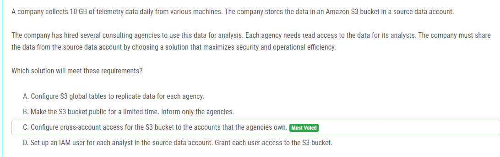

해설:

정답 C.

C. 이 해결책은 여러 컨설팅 기관에 대한 액세스를 관리하기 위해 S3 버킷에 대한 다중 계정 액세스를 구성합니다. 다른 AWS 계정에 대한 권한을 설정함으로써 데이터의 보안을 유지하면서 각 컨설팅 기관이 데이터에 액세스할 수 있습니다. 이것은 보안과 운영 효율성을 모두 최대화하는 가장 좋은 방법 중 하나입니다.

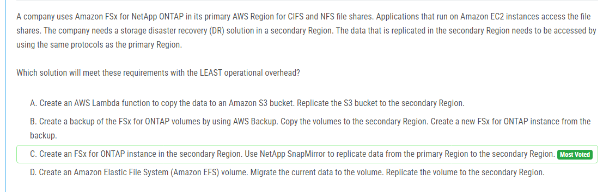

해설:

정답 C.

C. 이 해결책은 NetApp SnapMirror를 사용하여 주요 지역에서 보조 지역으로 데이터를 복제합니다. Amazon FSx for NetApp ONTAP 인스턴스를 보조 지역에 생성하여 동일한 프로토콜을 사용하여 데이터에 액세스할 수 있습니다. 이것은 가장 적은 운영 오버헤드를 가지며 가장 신속하고 효율적인 DR 솔루션입니다.

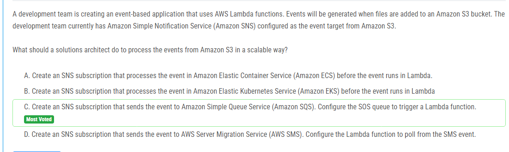

해설:

정답 C.

C. 이 해결책은 Amazon S3 버킷에서 생성된 이벤트를 처리하기 위해 Amazon SNS를 사용하여 Amazon SQS에 이벤트를 전송합니다. 그런 다음 SQS 큐에서 Lambda 함수를 트리거하도록 구성됩니다. 이는 Amazon S3에서 발생하는 이벤트를 처리하기 위해 확장 가능하고 견고한 아키텍처를 제공하며 Lambda 함수의 부하를 분산시킵니다.

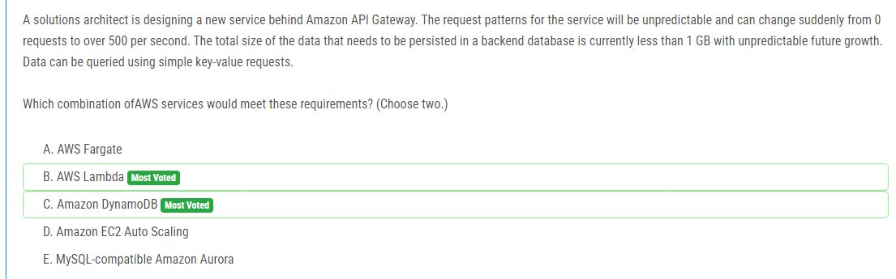

해설:

정답 B, C.

B. AWS Lambda: Lambda는 무한한 확장성을 제공하며 요청 패턴에 맞춰 자동으로 확장됩니다. 또한 Lambda 함수는 서버리스 아키텍처로 작업하기에 이상적이며 실행시간에 따라 비용이 청구됩니다.

C. Amazon DynamoDB: DynamoDB는 무한한 확장성을 가진 완전관리형 NoSQL 데이터베이스입니다. 요청 패턴에 따라 용량을 자동으로 조정할 수 있으며 초당 수백만 개의 요청을 처리할 수 있습니다. DynamoDB는 간단한 키-값 쿼리에 적합하며 데이터 크기의 예측 불가능한 성장에 대비할 수 있습니다.

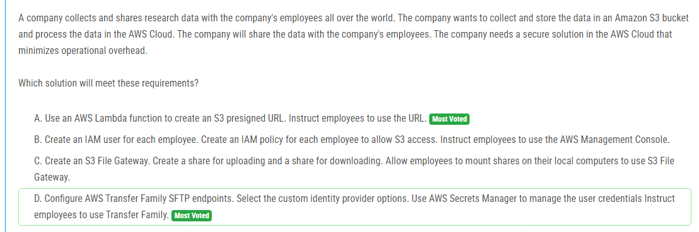

해설:

정답 D.

D. AWS Transfer Family를 구성하여 SFTP 엔드포인트를 생성합니다. 사용자 인증에 사용자 지정 ID 공급자 옵션을 선택하고 사용자 자격 증명을 관리하기 위해 AWS Secrets Manager를 사용합니다. 이 방법은 데이터에 대한 안전한 전송을 보장하고, 사용자는 기존의 SFTP 클라이언트를 사용하여 데이터에 액세스할 수 있으므로 운영 부담이 최소화됩니다. SFTP 엔드포인트를 통해 사용자는 AWS S3 버킷에 대해 안전한 파일 전송을 수행할 수 있습니다.

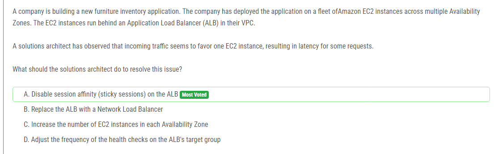

해설:

정답 A.

A. ALB에서 세션 어피니티(스티키 세션)를 비활성화합니다. 세션 어피니티가 활성화되면 ALB는 동일한 사용자의 요청을 항상 동일한 EC2 인스턴스로 라우팅하려고 시도합니다. 이로 인해 특정 인스턴스에 대한 부하가 증가하고 다른 인스턴스에 대한 부하가 감소하여 불균형이 발생할 수 있습니다. 세션 어피니티를 비활성화하면 ALB는 각 요청을 가장 적합한 EC2 인스턴스로 라우팅하여 부하를 분산시키게 됩니다.

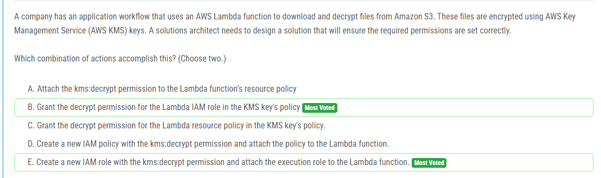

해설:

정답 B, E.

B. Lambda 함수의 IAM 역할에 대한 KMS 키의 정책에 decrypt 권한을 부여합니다. Lambda 함수가 KMS 키로 암호화된 파일을 복호화해야 하므로 해당 역할에 대한 액세스 권한이 필요합니다.

E. kms:decrypt 권한을 가진 새 IAM 역할을 생성하고 실행 역할로 Lambda 함수에 연결합니다. 이렇게 하면 Lambda 함수는 KMS 키를 사용하여 파일을 복호화하는 데 필요한 권한을 얻을 수 있습니다.

