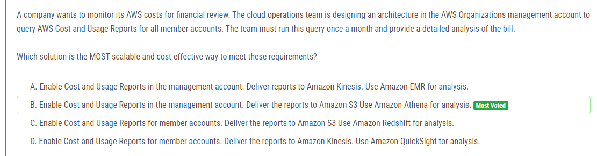

해설:

정답 B.

스케일 가능성: Amazon S3는 매우 스케일 가능한 스토리지 서비스이며, AWS Cost and Usage Reports를 저장하기에 이상적입니다. 여러 회원 계정의 보고서를 처리하더라도 S3는 대규모 데이터 처리를 지원합니다.

비용 효율성: Amazon S3는 저장된 데이터 양에 따라 요금을 부과하므로 사용량에 따라 비용이 발생합니다. 그러나 Amazon Athena는 쿼리당 요금을 부과하며 실행한 쿼리의 양에 따라 비용이 발생합니다. 이것은 특정 쿼리만 실행될 때만 비용이 발생한다는 의미이며, 월별 비용 분석을 수행할 때 비용을 절약할 수 있습니다.

분석 도구의 적합성: Amazon Athena는 SQL 쿼리를 사용하여 S3에 저장된 데이터를 직접 쿼리할 수 있는 서비스입니다. 이는 비용 및 사용 분석과 같은 데이터 분석에 적합한 도구입니다. 또한 Amazon Athena를 사용하면 데이터를 처리하고 분석하는 데 필요한 인프라를 구축하거나 유지 관리할 필요가 없으므로 관리 부담이 줄어듭니다.

그러므로 Amazon S3 및 Amazon Athena를 사용하는 B가 가장 스케일 가능하고 비용 효율적인 솔루션입니다.

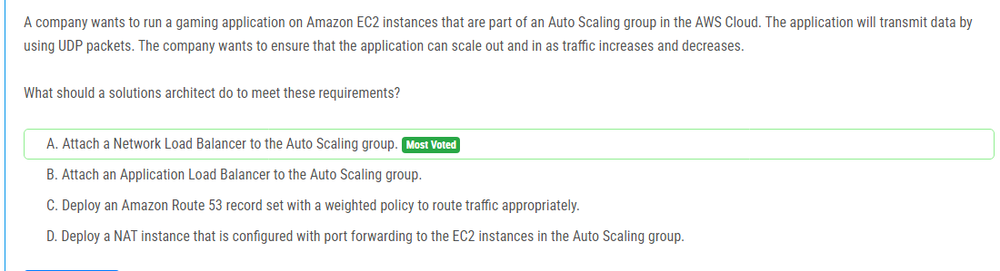

해설:

정답 A.

UDP 지원: Network Load Balancer는 UDP 프로토콜을 지원합니다. 따라서 UDP 패킷을 전달하는 게임 애플리케이션에 적합한 옵션입니다.

Auto Scaling과 통합: Network Load Balancer를 Auto Scaling 그룹에 연결하면 트래픽이 증가하거나 감소할 때 EC2 인스턴스가 자동으로 확장되거나 축소됩니다. 이는 게임 애플리케이션의 요구에 따라 유연하게 스케일링할 수 있는 기능을 제공합니다.

네트워크 성능: Network Load Balancer는 고성능 네트워킹을 제공하여 게임 애플리케이션의 높은 네트워크 요구 사항을 충족시킬 수 있습니다.

따라서 UDP 패킷을 처리하고 Auto Scaling 그룹을 통해 자동으로 스케일링할 수 있는 Network Load Balancer를 사용하는 것이 적절합니다.

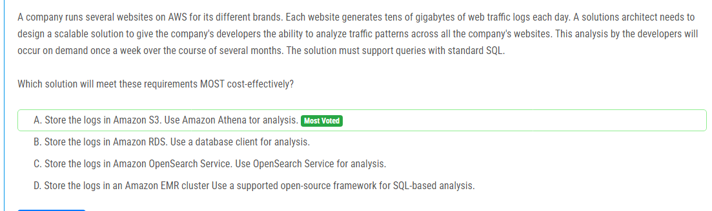

해설:

정답 A.

비용 효율성: Amazon S3는 데이터를 저장하기 위한 매우 비용 효율적인 솔루션입니다. 데이터를 S3에 저장하고 필요한 경우에만 처리하므로 비용이 발생합니다. Amazon Athena는 쿼리당 요금을 부과하므로 실행한 쿼리의 양에 따라 비용이 발생합니다. 주간으로 실행되는 쿼리에 대한 요금이 과다하게 발생하지 않을 것으로 예상됩니다.

스케일링 가능성: Amazon S3는 매우 스케일 가능한 스토리지 서비스이며, 수십 기가바이트의 웹 트래픽 로그를 저장하는 데 충분히 대응할 수 있습니다. 또한 Amazon Athena는 필요에 따라 자동으로 쿼리를 처리하므로 대규모 데이터 세트도 처리할 수 있습니다.

편리한 쿼리: Amazon Athena는 표준 SQL을 사용하여 쿼리를 수행할 수 있으므로 개발자가 익숙한 쿼리 도구를 사용하여 데이터를 분석할 수 있습니다.

따라서 비용 효율적이고 스케일 가능하며 표준 SQL을 지원하는 솔루션으로서 Amazon S3와 Amazon Athena를 사용하는 것이 가장 적합합니다.

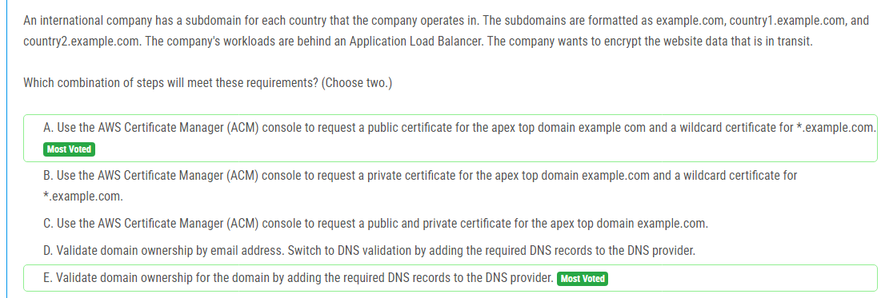

해설:

정답 A, E.

A. AWS Certificate Manager (ACM) 콘솔을 사용하여 상위 최상위 도메인 example.com에 대한 공용 인증서와 *.example.com에 대한 와일드카드 인증서를 요청합니다. 이렇게하면 example.com 및 모든 하위 도메인의 트래픽이 암호화됩니다.

E. 요청한 인증서의 소유권을 확인하기 위해 DNS 공급자에 필요한 DNS 레코드를 추가하여 도메인 소유권을 검증합니다. 이것은 ACM에서 제공하는 도메인 소유권 확인 방법 중 하나입니다.

이 조합을 선택하면 상위 도메인과 하위 도메인 모두에 대한 인증서를 보유하고 모든 웹 사이트 트래픽을 암호화 할 수 있습니다.

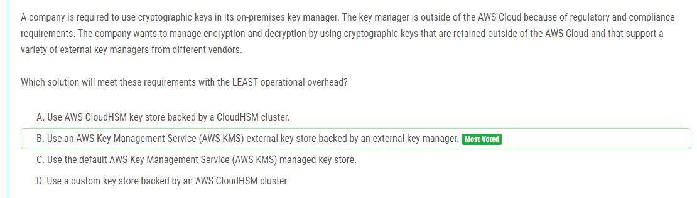

해설:

정답 B.

B. AWS Key Management Service (AWS KMS) 외부 키 저장소를 사용하면 외부 키 관리자를 지원하여 회사가 외부에 보유한 키를 관리할 수 있습니다. 이는 여러 제조업체의 다양한 외부 키 관리자를 지원하므로 회사가 특정 제조업체에 종속되지 않고 여러 제조업체의 외부 키 관리자를 사용할 수 있습니다. 또한 AWS KMS는 관리 오버헤드를 최소화하며 쉽게 키를 관리하고 암호화 및 복호화 작업을 수행할 수 있습니다. 따라서 이것이 가장 적합한 옵션입니다.

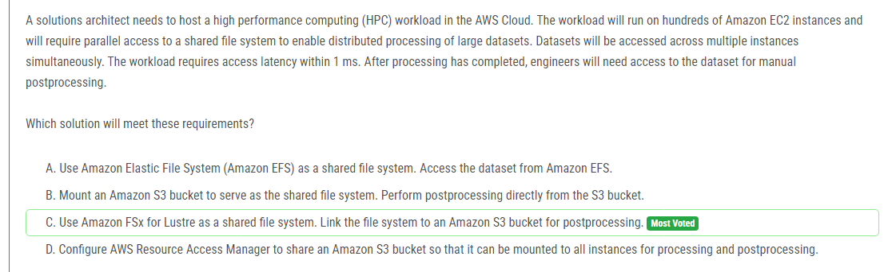

해설:

정답 C.

C. Amazon FSx for Lustre는 고성능 컴퓨팅 워크로드를 위한 최적의 솔루션 중 하나입니다. Lustre 파일 시스템은 대규모 데이터 세트에 대한 분산 액세스를 허용하고, 빠른 액세스 속도를 제공하며, 수백 개의 EC2 인스턴스에 대한 병렬 액세스를 지원합니다. 또한 Amazon FSx for Lustre는 Amazon S3와 직접 연동하여 데이터를 쉽게 이동하고 저장할 수 있습니다. 이를 통해 처리가 완료된 후에 엔지니어가 데이터 세트를 필요로 할 때 Amazon S3 버킷에서 데이터를 가져와서 후속 처리를 수행할 수 있습니다.

Amazon EFS는 높은 액세스 지연 시간을 가지고 있기 때문에 요구 사항을 충족시키기에는 적합하지 않습니다. Amazon S3는 데이터를 저장하는 데 유용하지만, 직접적인 파일 시스템 액세스와 저렴한 데이터 처리에는 적합하지만, 필요한 접근 시간이 1ms 이내인 경우에는 적합하지 않을 수 있습니다. AWS Resource Access Manager를 사용하여 S3 버킷을 공유하는 것은 파일 시스템의 고성능 액세스를 위한 적합한 솔루션이 아닙니다.

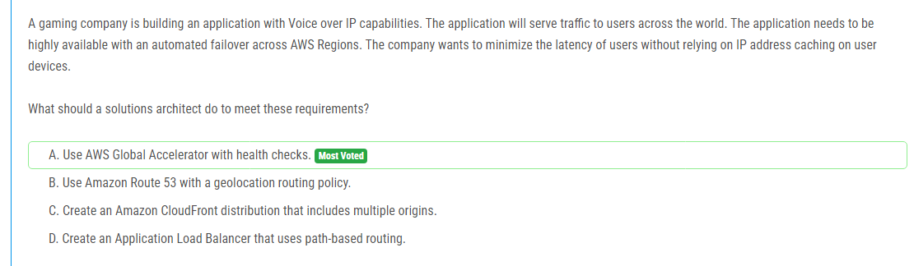

해설:

정답 A.

A. AWS Global Accelerator는 AWS의 글로벌 네트워크를 활용하여 전 세계 사용자에게 최적의 경로를 제공하는 서비스입니다. 이를 사용하면 고객의 요청을 가장 가까운 엔드포인트로 라우팅하고, 지연 시간을 최소화하면서 고가용성을 제공할 수 있습니다. 또한 AWS Global Accelerator는 상태 검사를 통해 엔드포인트의 상태를 지속적으로 모니터링하고, 문제가 발생한 경우 자동으로 다른 지역의 엔드포인트로 트래픽을 전환하여 자동화된 페일오버를 제공합니다. IP 주소 캐싱을 사용하지 않고도 사용자에게 최소 지연 시간을 제공하기 때문에 이러한 요구 사항을 충족시키는 데 가장 적합한 옵션입니다.

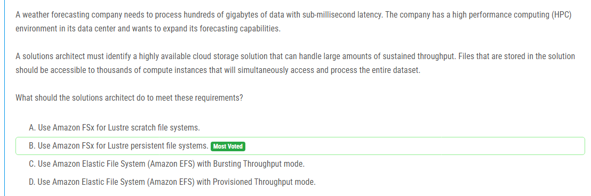

해설:

정답 B.

B. Amazon FSx for Lustre는 대규모 데이터 세트에 대한 고성능 파일 시스템을 제공합니다. Lustre 파일 시스템은 높은 처리량과 낮은 지연 시간을 제공하여 HPC 환경에 이상적입니다. Amazon FSx for Lustre의 지속적인 파일 시스템은 데이터를 안정적으로 저장하면서도 대규모 병렬 액세스를 지원합니다. 이것은 수천 개의 컴퓨팅 인스턴스가 동시에 전체 데이터 세트에 액세스하고 처리할 수 있는 솔루션을 제공합니다. 따라서 이것이 가장 적합한 옵션입니다.

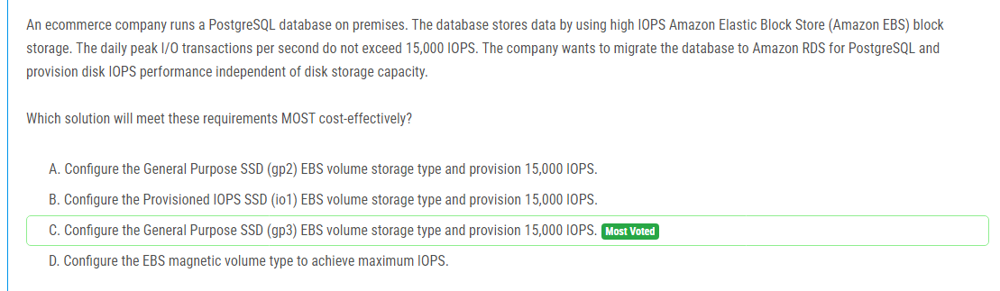

해설:

정답 C.

C. General Purpose SSD (gp3) EBS 볼륨은 Provisioned IOPS SSD (io1) 볼륨에 비해 더 경제적이지만, 고성능을 제공합니다. gp3 볼륨을 사용하면 IOPS와 스토리지 용량을 독립적으로 프로비저닝할 수 있으므로, 스토리지 용량에 관계없이 필요한 IOPS 성능을 프로비저닝할 수 있습니다. 또한 gp3 볼륨은 기본적으로 io1 볼륨보다 더 낮은 비용으로 제공되므로 비용 효율적입니다. 그러므로 이것이 가장 적절한 선택입니다.

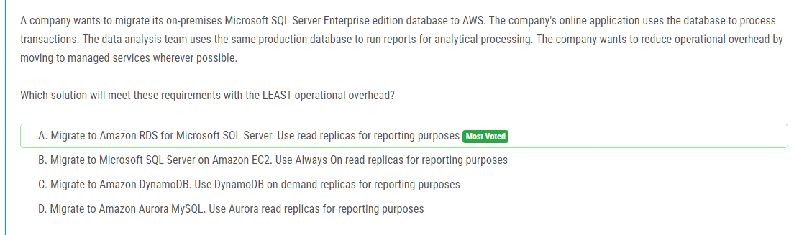

해설:

정답 A.

A. Amazon RDS for Microsoft SQL Server는 관리형 서비스로서 데이터베이스 관리와 관련된 많은 작업을 AWS에게 맡길 수 있습니다. Amazon RDS를 사용하면 데이터베이스를 배포, 운영, 확장 및 백업하는 데 필요한 작업의 대부분이 자동화되므로 운영 부담이 크게 줄어듭니다. 또한 Amazon RDS는 읽기 전용 복제본을 제공하여 데이터베이스의 읽기 작업을 처리하는 데 도움이 되므로 보고용 작업에 최적화됩니다. 그러므로 이것이 가장 적절한 선택입니다.

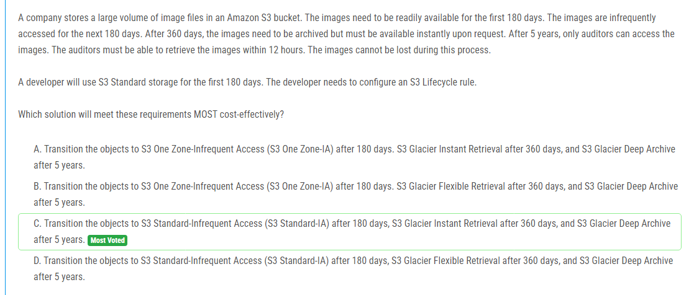

해설:

정답 C.

C. 이 옵션은 요구 사항을 가장 비용 효율적으로 충족시킵니다. 첫 180일 동안 S3 표준 스토리지를 사용하여 이미지를 저장합니다. 그 다음 180일 동안 S3 표준-IA로 이동하여 저렴한 비용으로 저장하면서도 데이터에 쉽게 액세스할 수 있습니다. 360일 이후에는 S3 Glacier Instant Retrieval로 전환하여 데이터를 보관하고 필요한 경우에 즉시 검색할 수 있습니다. 5년 후에는 S3 Glacier Deep Archive로 이동하여 최저 비용으로 데이터를 보관할 수 있습니다. 이 라이프사이클 규칙을 사용하면 데이터가 적절한 스토리지 클래스로 이동하고 요구 사항에 따라 적절한 비용을 지불할 수 있습니다.

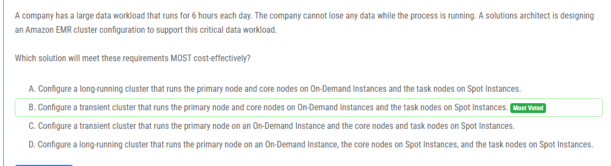

해설:

정답 B.

B. 일괄 처리 작업이 6 시간 동안 실행되므로 일괄 처리 클러스터를 시작하고 작업이 완료될 때 종료하는 일시적인 클러스터가 적합합니다. 이러한 일괄 처리 작업은 데이터 손실이 발생하면 안 되므로 On-Demand 인스턴스가 필요합니다. 그러나 Spot 인스턴스는 일괄 처리 작업에 사용되어 비용을 절약할 수 있습니다. 따라서 On-Demand 인스턴스를 사용하여 기본 노드와 코어 노드를 실행하고, Spot 인스턴스를 사용하여 작업 노드를 실행하는 방식이 가장 비용 효율적이고 요구 사항을 충족하는 방법입니다. Spot 인스턴스가 언제든지 종료될 수 있으므로 작업 노드에 사용되는 것이 가장 적절합니다.

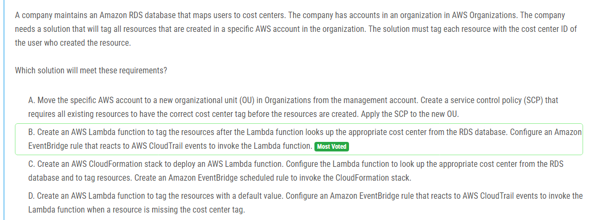

해설:

정답 B.

B. 이 솔루션은 Lambda 함수를 사용하여 요구 사항을 쉽게 충족할 수 있습니다. Lambda 함수는 사용자가 리소스를 생성할 때마다 해당 사용자의 비용 센터 ID를 RDS 데이터베이스에서 검색하고 리소스에 태그를 할당합니다. 이러한 동작은 CloudTrail 이벤트에 의해 트리거되는 Amazon EventBridge 규칙을 사용하여 구현됩니다. 이를 통해 리소스가 생성되기 전에 적절한 태그가 적용됩니다. 이는 자동화된 태깅 프로세스를 통해 일관된 비용 관리를 보장하는 효율적인 방법입니다.

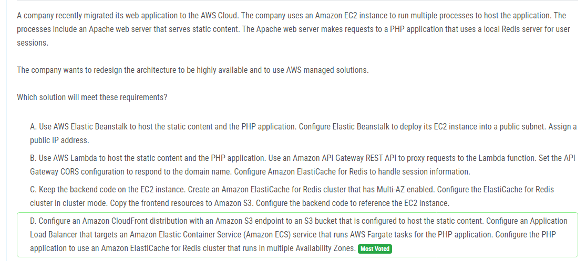

해설:

정답 D.

D. 이 옵션은 고가용성 및 AWS 관리형 솔루션을 활용하여 요구 사항을 충족시킵니다. Amazon CloudFront를 사용하여 정적 콘텐츠를 전 세계적으로 배포하고, Amazon S3를 사용하여 정적 콘텐츠를 호스팅합니다. Application Load Balancer를 사용하여 PHP 애플리케이션을 실행하는 Amazon ECS 서비스에 대한 트래픽을 분산합니다. AWS Fargate를 사용하면 관리형 서버리스 컨테이너를 실행하므로 관리 오버헤드가 줄어들고 확장성이 향상됩니다. 또한 Amazon ElastiCache for Redis를 사용하여 세션 정보를 처리하고, Multi-AZ 옵션을 사용하여 고가용성을 제공합니다. 이를 통해 시스템이 고가용성을 갖추고 AWS에서 관리되는 솔루션을 사용하여 운영 부담을 최소화할 수 있습니다.

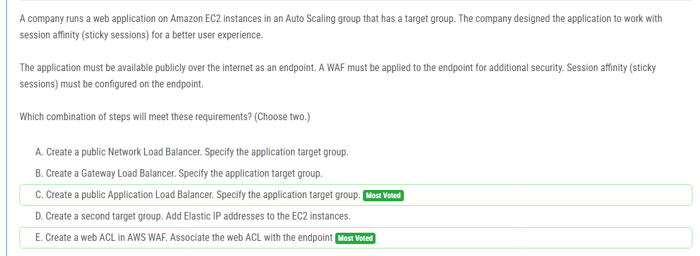

해설:

정답 C, E.

C. 공개 Application Load Balancer를 생성하고 애플리케이션 대상 그룹을 지정합니다. Application Load Balancer는 HTTP 및 HTTPS 트래픽을 관리하는 기능을 제공하므로 웹 애플리케이션을 공개적으로 제공할 수 있습니다. 또한 Application Load Balancer는 기본적으로 세션 어피니티(스티키 세션)를 지원합니다.

E. AWS WAF 웹 ACL을 생성하고 엔드포인트와 연관시킵니다. 이 웹 ACL을 사용하여 웹 애플리케이션에 대한 보안 정책을 적용할 수 있습니다. AWS WAF를 사용하면 웹 애플리케이션에서 발생할 수 있는 다양한 유형의 공격을 감지하고 차단할 수 있습니다.

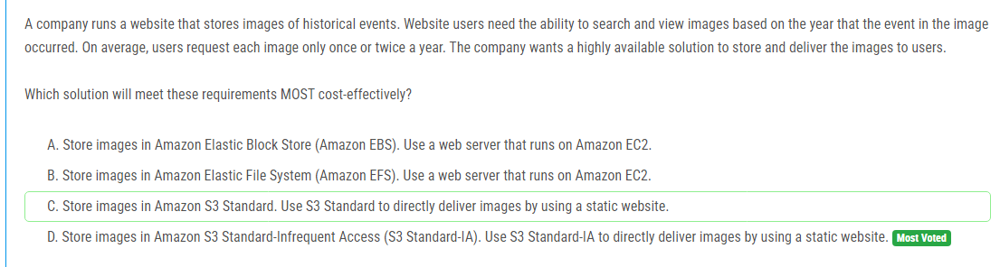

해설:

정답 D.

D. Amazon S3 Standard-Infrequent Access (S3 Standard-IA)는 비용 효율적인 스토리지 옵션 중 하나이며, 주어진 요구 사항을 가장 효율적으로 충족시킵니다. 이미지는 평균적으로 매년 한 또는 두 번만 요청되므로 S3 Standard-IA 스토리지 클래스로 저장하여 비용을 절감할 수 있습니다. 또한 S3 Standard-IA를 사용하여 이미지를 직접 전달하는 정적 웹 사이트를 구성함으로써 사용자에게 빠르고 안정적인 이미지 액세스를 제공할 수 있습니다. 이는 가장 비용 효율적이고 요구 사항을 충족하는 방법입니다.

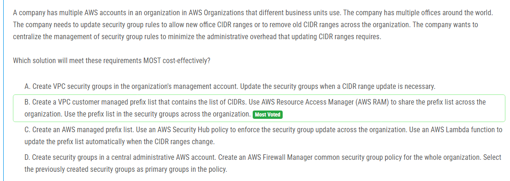

해설:

정답 B.

B. 이 솔루션은 AWS Organizations의 다른 계정 간에 CIDR 범위를 중앙 집중식으로 관리하는 데 효과적입니다. VPC에서 고객 관리형 접두어 목록을 생성하여 원하는 CIDR 범위를 포함시킵니다. 그런 다음 AWS RAM을 사용하여 해당 접두어 목록을 조직 전체에서 공유합니다. 이것은 관리 오버헤드를 최소화하고 보안 그룹 규칙을 업데이트하는 프로세스를 단순화합니다. 새로운 사무실 CIDR 범위를 추가하거나 이전 CIDR 범위를 제거할 때에는 단지 접두어 목록을 업데이트하면 됩니다. 이렇게 함으로써 모든 보안 그룹이 자동으로 업데이트되어 편리하고 일관된 보안을 유지할 수 있습니다.

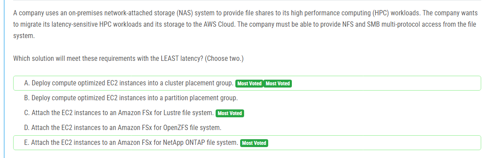

해설:

정답 A, E.

A. 클러스터 배치 그룹 내에서 컴퓨팅 최적화된 EC2 인스턴스를 배포하면 물리적으로 가까운 위치에 인스턴스가 배치되어 네트워크 지연 시간을 최소화할 수 있습니다. 이는 HPC 워크로드의 지연을 최소화하는 데 도움이 됩니다.

E. Amazon FSx for NetApp ONTAP은 다중 프로토콜 액세스(NFS 및 SMB)를 지원하는 관리형 파일 시스템 서비스입니다. 이 서비스를 사용하면 HPC 워크로드에 필요한 NFS 및 SMB 액세스를 제공할 수 있으며, AWS 내에서 네트워크 지연을 최소화하여 빠른 성능을 유지할 수 있습니다.

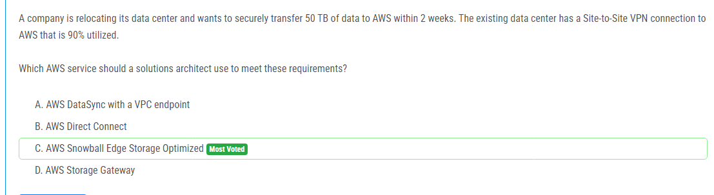

해설:

정답 C.

C. AWS Snowball Edge Storage Optimized를 사용하여 이전된 데이터를 안전하게 전송할 수 있습니다. Snowball Edge는 대량의 데이터를 빠르고 안전하게 AWS로 전송하는 데 사용됩니다. 이 경우에는 데이터 전송량이 많고 시간이 제한되어 있으므로 Snowball Edge가 이러한 요구 사항을 충족하는 가장 적합한 서비스입니다. Snowball Edge Storage Optimized는 로컬로 데이터를 저장할 수 있는 장치이므로 데이터가 전송되는 동안 빠른 로컬 액세스도 가능합니다.

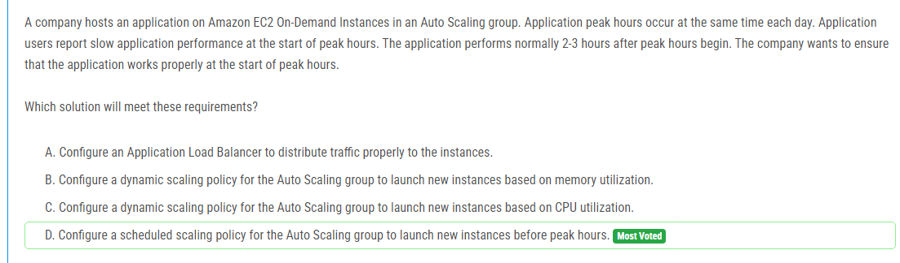

해설:

정답 D.

D. Auto Scaling 그룹에 스케줄링된 스케일링 정책을 구성하여, 피크 시간이 시작되기 전에 새로운 인스턴스를 시작하도록 스케줄을 설정할 수 있습니다. 이렇게 하면 피크 시간에 충분한 수의 인스턴스가 준비되어 있어서 애플리케이션이 시작될 때 성능 문제가 발생하지 않을 것입니다. 이 방법을 통해 애플리케이션이 시작될 때 곧바로 사용 가능하도록 보장할 수 있습니다.

