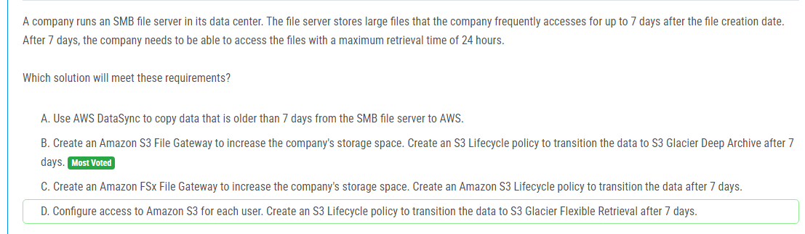

해설:

정답 B.

B. Amazon RDS Proxy를 사용하면 데이터베이스 스케일링을 효과적으로 처리할 수 있습니다. RDS Proxy는 애플리케이션과 데이터베이스 사이에서 중간 계층 역할을 하며, 연결 관리, 로드 밸런싱, 스케일링, 보안 등을 관리합니다. 이를 통해 애플리케이션은 단일 엔드포인트를 통해 안정적으로 데이터베이스에 연결될 수 있으며, RDS Proxy가 연결 관리를 담당하여 데이터베이스에 대한 부하를 분산시킵니다. 이는 운영 부담을 최소화하면서 데이터베이스 스케일링을 더 효과적으로 처리할 수 있는 방법입니다.

해설:

정답 D.

D. 비용을 최적화하기 위해 필요하지 않은 스냅샷을 삭제하고, Amazon Data Lifecycle Manager를 사용하여 회사의 스냅샷 정책 요구 사항에 따라 스냅샷을 생성 및 관리합니다. 이를 통해 스냅샷 비용을 줄일 수 있습니다. Amazon Data Lifecycle Manager는 정책에 따라 자동으로 스냅샷을 관리하므로 운영 오버헤드가 최소화됩니다. 이는 현재 스토리지 사용량을 기반으로 비용을 최적화하는 데 가장 효과적인 방법입니다.

해설:

정답 A.

A. Amazon ECS 클러스터만 RDS for MySQL 데이터베이스 및 S3 버킷의 데이터에 액세스할 수 있도록 보장하기 위해, 새로운 AWS Key Management Service (KMS) 고객 관리형 키를 생성하여 S3 버킷과 RDS for MySQL 데이터베이스를 암호화합니다. 그런 다음 KMS 키 정책을 구성하여 ECS 태스크 실행 역할에 대한 암호화 및 복호화 권한이 포함되도록 합니다. 이렇게 하면 애플리케이션의 데이터는 암호화되며, ECS 클러스터만 해당 데이터에 액세스할 수 있습니다.

해설:

정답 D.

D. 이 솔루션은 CPU 사용량이 급격하게 증가할 때 애플리케이션을 자동으로 확장하는 데 가장 적합합니다. Elastic Beanstalk 환경을 설정하여 burstable 성능 인스턴스를 사용하고, 이 인스턴스를 무제한 모드로 구성합니다. 이렇게 하면 애플리케이션이 예기치 않게 높은 수요에 대응하여 CPU 사용량이 급격하게 증가할 때 즉시 인스턴스가 자동으로 확장됩니다.

해설:

정답 B.

B. 이 솔루션은 인프라를 자동화하고 변경 사항을 추적하는 데 가장 적합합니다. AWS CloudFormation을 사용하여 인프라를 설정하면 변경 사항을 정확하게 추적하고, 추적된 변경 사항을 리버스 엔지니어링하거나 롤백하는 데 용이합니다. 또한 AWS Config를 사용하여 인프라 구성의 변경 사항을 지속적으로 모니터링하고, 변경 사항을 추적하여 보안 팀이 감사하고 모니터링할 수 있습니다.

해설:

정답 B, E.

B. MySQL 데이터베이스를 Amazon RDS for MySQL Multi-AZ DB 인스턴스로 마이그레이션하여 데이터베이스의 가용성을 향상시킵니다. Multi-AZ 설정을 사용하면 데이터베이스의 프라이머리 인스턴스와 스탠바이 인스턴스 간의 동기식 복제가 자동으로 설정되어 있어, 주요 인스턴스의 장애 발생 시에도 스탠바이 인스턴스가 자동으로 트래픽을 처리하여 높은 가용성을 제공합니다.

E. Application Load Balancer를 생성하여 트래픽을 분산하고, 두 가용 영역에 걸쳐있는 EC2 인스턴스의 Auto Scaling 그룹으로 트래픽을 라우팅하여 애플리케이션의 가용성을 높입니다. 이를 통해 EC2 인스턴스의 신뢰성을 향상시키고, 한 가용 영역에서의 장애 발생 시에도 다른 가용 영역의 인스턴스로 트래픽을 전달하여 서비스의 연속성을 보장할 수 있습니다.

해설:

정답 C.

C. 이 솔루션은 Amazon S3에 대한 인터페이스 엔드포인트를 생성하여 요구 사항을 충족시킵니다. 인터페이스 엔드포인트를 통해 Amazon S3에 대한 안전한 연결이 설정되며, 인터넷을 통하지 않고도 회사의 AWS 리전 및 온프레미스 위치에서 데이터에 안전하게 액세스할 수 있습니다. AWS Direct Connect 연결을 통해 온프레미스 위치로부터 데이터에 접근할 때 인터페이스 엔드포인트를 통해 데이터를 전송할 수 있습니다.

해설:

정답 D.

D. 이 솔루션은 AWS Organizations에서 태그 정책을 생성하여 요구 사항을 충족시킵니다. 태그 정책을 사용하여 특정 애플리케이션 이름의 태그가 허용되는지 여부를 정의할 수 있습니다. 개발 팀이 리소스를 생성할 때 허용된 애플리케이션 이름의 태그만을 사용하도록 제약할 수 있습니다. 이를 통해 리소스 생성 시 일관된 애플리케이션 이름이 사용되고, 보안 및 정책 준수가 강화됩니다.

해설:

정답 C.

C. 이 솔루션은 AWS Secrets Manager를 사용하여 비밀번호 회전을 자동화하여 요구 사항을 충족시킵니다. AWS Secrets Manager는 Amazon RDS for PostgreSQL과 통합하여 비밀번호를 안전하게 관리하고 주기적으로 회전시킬 수 있습니다. 비밀번호 회전을 자동화하므로 운영 오버헤드를 최소화할 수 있습니다. AWS Secrets Manager를 사용하면 비밀번호를 안전하게 저장하고, 회전 및 엑세스 관리 등의 관련 기능을 제공하여 보안을 강화할 수 있습니다.

해설:

정답 B.

B. 이 솔루션은 프로비저닝된 용량 모드를 선택하여 요구 사항을 충족시킵니다. 프로비저닝된 용량 모드를 사용하면 예약된 읽기 및 쓰기 용량 단위를 설정하여 용량을 미리 예약할 수 있습니다. 이를 통해 요구 사항에 따라 테이블의 용량을 쉽게 조정할 수 있습니다. 이 경우 주 단위로 실행되는 테스트에 맞게 읽기 및 쓰기 용량을 적절하게 조정하여 테이블의 비용을 최적화할 수 있습니다. 동시에 테이블에 대한 일관된 성능을 보장할 수 있습니다.

해설:

정답 B.

B. AWS 비용 이상 감지 모니터를 생성하여 비정상적인 지출을 모니터링하고 책임 있는 이해 관계자에게 알림을 전송합니다. 이 솔루션은 비정상적인 비용 지출을 감지하고 조치를 취할 수 있도록 해줍니다. AWS의 기본 모니터링 및 경고 메커니즘을 사용하여 비용에 대한 효과적인 모니터링과 관리를 제공합니다.

해설:

정답 B.

B. 이 솔루션은 AWS Glue 크롤러를 사용하여 데이터를 크롤링하고 Amazon Athena를 구성하여 데이터를 쿼리합니다. 이것은 가장 적은 운영 오버헤드를 가지는 솔루션입니다. AWS Glue 크롤러를 사용하면 데이터를 자동으로 검색하고 메타데이터를 생성할 수 있으며, Amazon Athena를 사용하면 SQL 쿼리를 사용하여 데이터를 빠르게 분석할 수 있습니다. 이를 통해 데이터 처리를 위한 추가 작업을 결정할 수 있습니다. AWS Glue와 Amazon Athena는 관리형 서비스이므로 관리 오버헤드를 최소화하면서 신속하게 데이터를 분석할 수 있습니다.

해설:

정답 B.

B. 이 솔루션은 Amazon S3 파일 게이트웨이를 생성하여 회사의 스토리지 공간을 확장하고, S3 라이프사이클 정책을 생성하여 데이터를 7일 이후에 S3 Glacier Deep Archive로 전환합니다. 이는 요구 사항을 충족하는 가장 효율적인 솔루션입니다. 파일이 7일 이내에 필요한 경우에는 신속하게 S3에서 검색할 수 있으며, 7일 이후에는 S3 Glacier Deep Archive로 전환되어 비용을 절감할 수 있습니다. Amazon S3는 회사의 요구 사항을 충족하기에 충분한 내구성과 가용성을 제공하며, S3 라이프사이클 정책을 사용하여 데이터를 효과적으로 관리할 수 있습니다.

해설:

정답 B, D.

B. 읽기 복제본을 만들고 응용 프로그램을 수정하여 읽기 트래픽을 읽기 복제본으로 전송하는 것이 좋습니다. 이렇게하면 주 DB 인스턴스의 부하를 줄이고 성능을 향상시킬 수 있습니다.

D. Amazon ElastiCache 클러스터를 생성하여 쿼리 결과를 캐시하도록 응용 프로그램을 구성하는 것이 좋습니다. 이를 통해 응용 프로그램은 캐시된 결과를 사용하여 데이터베이스에 대한 부하를 줄일 수 있습니다.

해설:

정답 D.

D는 EBS 스냅샷을 삭제하는 것을 방지하기 위해 스냅샷을 잠그는 방법을 제안합니다. 이렇게 하면 관리자가 스냅샷을 삭제하는 것을 방지할 수 있으며, 관리 작업을 최소화할 수 있습니다. 반면, 다른 선택지들은 스냅샷을 삭제하는 권한을 변경하거나, 삭제를 방지하기 위해 복잡한 규칙을 설정해야 하므로 관리적 부담이 더 많이 발생할 수 있습니다.

해설:

정답 B.

B는 Amazon VPC의 트래픽에 대한 정보를 캡처하여 Amazon OpenSearch Service로 분석하기 위한 솔루션을 제안합니다. 이를 위해 먼저 Amazon CloudWatch Logs에서 로그 그룹을 생성하고, VPC Flow Logs를 사용하여 로그 데이터를 해당 로그 그룹으로 보냅니다. 그런 다음 Amazon Kinesis Data Firehose를 사용하여 로그 그룹에서 로그를 OpenSearch Service로 스트리밍합니다. 이 방법은 실시간으로 로그를 처리하고 분석하기에 적합하며, 솔루션의 간편한 구성과 확장 가능성으로 인해 가장 적합한 선택지입니다.

해설:

정답 A.

A는 개발용 Amazon EKS 클러스터를 가장 비용 효율적으로 구축하는 방법을 제안합니다. 이 방법은 Spot 인스턴스만 포함하는 관리형 노드 그룹을 생성합니다. Spot 인스턴스는 온디맨드 인스턴스보다 저렴하게 이용할 수 있으므로 비용을 절감할 수 있습니다. 또한, 이러한 특성은 테스트 및 개발 목적으로 특히 적합합니다. 개발 환경에서 애플리케이션의 탄력성을 테스트할 때 자주 사용되지 않으므로 Spot 인스턴스를 사용하여 비용을 절감할 수 있습니다.

해설:

정답 B.

B는 고객 관리형 키를 생성하여 Amazon S3 객체를 암호화하는 것을 제안합니다. 이 방법은 고객이 암호화 키를 완전히 제어하면서도 AWS KMS를 사용하여 데이터를 보호하는 가장 효율적인 방법 중 하나입니다. SSE-KMS를 사용하면 고객은 키를 생성, 회전 및 비활성화하는 등의 작업을 수행할 수 있습니다. 또한, AWS KMS는 보안 및 관리 기능을 제공하여 데이터 보안을 강화할 수 있습니다. 따라서 이것이 가장 적절한 솔루션입니다.

해설:

정답 A, C, E.

A는 S3 Object Lock을 활성화하여 객체 잠금을 설정하여 해결책의 일부로써 30일 동안 객체를 보호합니다. 이를 통해 객체는 잠금 기간 동안 수정 및 삭제를 방지할 수 있습니다.

C는 객체에 대한 기본 보존 기간을 30일로 설정하여 해결책의 일부로써 30일 동안 객체를 보호합니다. 이것은 S3 버킷에 대해 적용된 기본 보존 기간을 지정합니다.

E는 S3 Lifecycle 정책을 구성하여 객체를 30일 후에 만료시키는 것을 의미합니다. 이것은 30일 이후에는 객체가 자동으로 삭제되도록 보장합니다.

해설:

정답 A.

A는 AWS DataSync를 사용하여 최소의 운영 오버헤드로 파일을 Amazon S3 버킷에서 Amazon EFS 파일 시스템과 다른 S3 버킷으로 지속적으로 복사하는 방법입니다. DataSync를 사용하면 변경된 데이터만 전송할 수 있으므로 대량의 데이터를 효율적으로 처리할 수 있습니다. 설정된 작업은 변경된 데이터만 전송하므로 변동 사항이 있는 경우에만 복사본을 덮어쓸 수 있습니다.