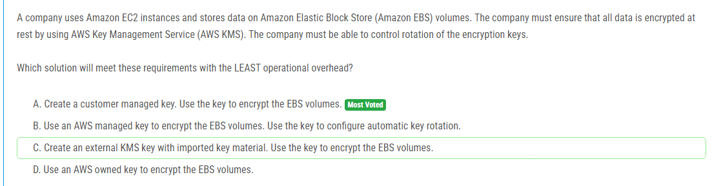

해설:

정답 A.

A. 고객 관리형 키를 생성하여 사용하면 해당 키를 사용하여 EBS 볼륨을 암호화할 수 있습니다. 이 방법은 데이터를 안전하게 보호하는 데 필요한 요구 사항을 충족하면서도 고객이 키의 회전을 제어할 수 있습니다. 이는 가장 적은 운영 오버헤드를 유지하면서 요구 사항을 충족하는 방법입니다.

해설:

정답 A.

A. IAM 정책을 사용하여 사용자가 암호화되지 않은 Amazon EBS 볼륨을 생성하지 못하도록 제한할 수 있습니다. 그런 다음 AWS Config 및 AWS Systems Manager를 사용하여 암호화되지 않은 EBS 볼륨을 자동으로 감지하고 해결할 수 있습니다. 이 방법은 관리 오버헤드를 최소화하면서 요구 사항을 충족하는 가장 효율적인 방법입니다.

해설:

정답 A, C.

A. 웹 티어를 Amazon EC2 인스턴스로 마이그레이션하고 이를 Auto Scaling 그룹에 배치하여 애플리케이션의 확장성을 확보합니다. 또한, Application Load Balancer 뒤에 배치하여 부하 분산을 처리합니다. 이렇게 함으로써 애플리케이션의 높은 가용성과 탄력성을 유지하면서도 마이그레이션 과정에서 애플리케이션 변경을 최소화할 수 있습니다.

C. 데이터베이스를 Amazon RDS의 Multi-AZ 배포로 마이그레이션합니다. 이렇게 함으로써 데이터베이스의 고 가용성과 내결함성을 확보할 수 있습니다. Multi-AZ 배포는 데이터베이스의 주변에 동기 복제된 스탠바이 인스턴스를 생성하여 장애 발생 시 자동으로 페일오버되므로 애플리케이션의 신뢰성이 향상됩니다.

이렇게 웹 티어의 Auto Scaling 그룹과 Application Load Balancer, 그리고 데이터베이스의 Amazon RDS Multi-AZ 배포를 결합함으로써 애플리케이션의 가용성과 신뢰성을 향상시키면서도 마이그레이션 과정에서 애플리케이션 변경을 최소화할 수 있습니다.

해설:

정답 B.

B. AWS 로컬 존을 사용하여 애플리케이션을 배포합니다. 이 방법은 회사의 VPC를 eu-central-1에서 선택한 로컬 존으로 확장하여 사용합니다. AWS 로컬 존은 주요 AWS 리전과 가까운 지역에 위치한 로컬 리전입니다. 이는 지리적으로 가까운 위치에 애플리케이션을 배포하여 지연 시간을 최소화하고 규정상의 요구 사항을 준수하는 데 도움이 됩니다.

이렇게 하면 지역 간 데이터 이동이 최소화되며, 여전히 원하는 단일 자릿수 밀리초의 지연 시간을 유지할 수 있습니다. 따라서 선택 B가 요구 사항을 충족하는 가장 적절한 해결책입니다.

해설:

정답 B.

B. RDS 프록시 엔드포인트를 사용하여 클라이언트 드라이버를 지정합니다. RDS 프록시는 Lambda 함수가 RDS 인스턴스에 대한 연결을 관리하고 최적화하는 데 도움이 됩니다. 또한 Lambda 함수를 VPC 내에 배포하여 네트워크 보안을 강화할 수 있습니다.

Lambda 함수는 VPC 내에서 실행되어야 할 때가 많습니다. 왜냐하면 Lambda 함수가 VPC 외부에서 실행될 경우에는 인터넷을 통해 RDS에 액세스해야 하므로 네트워크 오버헤드가 발생할 수 있습니다. 또한 VPC를 사용하면 Lambda 함수와 RDS 인스턴스 사이의 네트워크 트래픽을 더 안전하게 관리할 수 있습니다.

이러한 이유로 선택 B가 요구 사항을 충족하는 가장 적합한 해결책입니다.

해설:

정답 C.

C. 트랜짓 게이트웨이를 생성합니다. 트랜짓 게이트웨이를 사용하면 여러 VPC 및 온프레미스 위치를 중앙 집중형으로 연결할 수 있습니다. 이를 통해 관리 오버헤드를 최소화하고 확장 가능한 네트워크 아키텍처를 구축할 수 있습니다. VPC 연결을 위한 VPC 어태치먼트와 온프레미스 연결을 위한 VPN 어태치먼트를 생성하여 각 위치를 트랜짓 게이트웨이에 연결합니다.

이 방법은 관리자가 새로운 연결을 추가하고 확장하는 데 필요한 작업을 간소화합니다. 또한 트랜짓 게이트웨이는 중앙 집중형 네트워크 허브 역할을 하므로 네트워크 관리를 단순화하고 효율적으로 확장할 수 있습니다. 따라서 선택 C가 요구 사항을 충족하는 데 가장 적은 관리적 오버헤드를 가지는 옵션입니다.

해설:

정답 D, E.

D. Amazon Forecast를 사용하여 Amazon S3 버킷에 저장된 과거 데이터를 기반으로 예측기를 훈련시킵니다. Amazon Forecast는 관리형 서비스로, 기계 학습 경험이 없는 사용자도 쉽게 예측 모델을 훈련하고 배포할 수 있습니다.

E. Amazon Forecast를 사용하여 Amazon S3 버킷에 저장된 과거 데이터를 기반으로 예측기를 훈련합니다. 이렇게 함으로써 회사는 예측 프로세스를 자동화하고 관리형 서비스를 통해 예측 모델을 구축할 수 있습니다.

이러한 조합으로 회사는 Amazon S3에 저장된 과거 데이터를 사용하여 Amazon Forecast를 통해 예측 모델을 훈련하고 배포할 수 있습니다. 이는 회사가 머신 러닝 경험이 없어도 예측 모델을 구축하고 사용할 수 있는 관리형 솔루션입니다.

해설:

정답 C.

C. IAM Identity Center에 개별 사용자를 생성하고, 새로운 개발자 및 관리자 그룹을 생성합니다. 이렇게 함으로써 개발자 및 관리자 팀에 대한 다른 권한을 나눌 수 있습니다. 또한, 각 그룹에는 해당하는 IAM 정책이 포함된 새로운 퍼미션 세트를 할당합니다. 이러한 방식으로 새로운 사용자가 고용될 때 그룹에 추가할 수 있습니다.

이 방법은 새로운 사용자가 고용될 때마다 각 그룹에 새로운 퍼미션 세트를 할당하면서 사용자 권한을 관리하는 데 필요한 작업을 최소화합니다. 또한, 각 팀에 대한 특정 IAM 정책을 사용할 수 있도록 새로운 퍼미션 세트를 만듭니다. 따라서 선택 C가 최소한의 운영 오버헤드로 요구 사항을 충족하는 가장 효율적인 방법입니다.

해설:

정답 D.

D. Amazon EBS에 대한 AWS Config 규칙을 생성하여 볼륨이 암호화되었는지 여부를 평가하고, 암호화되지 않은 경우 해당 볼륨을 플래그 처리합니다. 이렇게 하면 회사는 EBS 볼륨의 암호화 상태를 효과적으로 확인할 수 있으며, 이러한 규칙을 사용하여 암호화 상태를 표시하고 알림을 받을 수 있습니다. 이는 암호화 전략의 표준화와 운영 오버헤드를 최소화하는 데 도움이 됩니다.

해설:

정답 C, D.

C. S3 멀티파트 업로드를 사용하면 큰 파일을 여러 개의 파트로 나누어 동시에 업로드할 수 있습니다. 이를 통해 파일 업로드 시간을 최적화하고 트랜스코딩 프로세스의 대기 시간을 줄일 수 있습니다. 이는 업로드 작업을 병렬로 처리하여 처리량을 향상시키는 데 도움이 됩니다.

D. 객체의 여러 바이트 범위를 병렬로 가져오는 것은 다운로드 성능을 향상시키는 효과적인 방법입니다. EC2 인스턴스에서 Amazon S3로의 다운로드 작업을 병렬로 수행하여 처리량을 증가시키고 대기 시간을 줄일 수 있습니다. 이를 통해 파일 다운로드 작업을 최적화하여 트랜스코딩 프로세스의 효율성을 높일 수 있습니다.

이러한 조합으로 회사는 Amazon S3와 EC2 간의 데이터 전송을 최적화하여 처리량을 향상시킬 수 있습니다.

해설:

정답 B, E.

B. Amazon Elastic File System (Amazon EFS) 파일 시스템을 생성하고 이를 각각의 EC2 인스턴스에 마운트합니다. Amazon EFS는 여러 AZ에 걸쳐 공유 파일 시스템을 제공하므로 모든 인스턴스가 동일한 파일을 읽고 쓸 수 있습니다. 이를 통해 강력한 일관성을 유지하면서 변경 사항을 신속하게 반영할 수 있습니다.

E. 웹 콘텐츠를 저장하기 위해 Amazon S3 버킷을 생성하고 Cache-Control 헤더를 no-cache로 설정하여 캐시를 사용하지 않도록합니다. 그런 다음 Amazon CloudFront를 사용하여 콘텐츠를 전송합니다. 이렇게 함으로써 변경된 내용이 즉시 웹 애플리케이션으로 전달되고 캐시 된 버전을 우회하여 강력한 일관성을 제공할 수 있습니다.

이러한 방법으로, 회사는 다중 가용 영역에서 실행되는 웹 애플리케이션에 대한 공유 저장소 솔루션을 설계하고 변경 사항을 신속하게 적용할 수 있습니다.

해설:

정답 A.

A. 지연 시간 정책을 사용하여 A 레코드를 생성합니다. 이 방법을 사용하면 사용자에게 가장 낮은 지연 시간을 가진 리전으로 트래픽을 라우팅할 수 있습니다. 이는 사용자의 지리적 위치와 해당 리전까지의 네트워크 지연 시간에 따라 트래픽을 분산하여 가장 높은 성능을 제공합니다. 이는 고성능 및 최상의 사용자 경험을 보장하는 가장 효율적인 방법입니다.

해설:

정답 D.

D. 오토 스케일링 그룹을 수정하여 EC2 인스턴스를 세 가지 가용 영역에 걸쳐 사용합니다. 이를 통해 웹 애플리케이션의 가용성을 높일 수 있습니다. 또한, AWS 데이터베이스 마이그레이션 서비스(AWS DMS)를 사용하여 임베디드 NoSQL 데이터베이스를 Amazon DynamoDB로 마이그레이션합니다. 이렇게 함으로써 데이터베이스의 고가용성과 일관성을 확보할 수 있습니다.

이 방법은 운영 오버헤드를 최소화하면서 요구 사항을 충족합니다. Amazon DynamoDB는 관리형 서비스로, 고가용성과 자동 확장을 제공합니다. 또한, AWS DMS를 사용하여 데이터베이스를 마이그레이션하는 것은 비교적 적은 노력으로 안정적인 환경을 구축할 수 있는 방법입니다.

따라서 선택 D가 요구 사항을 충족하는 데 가장 적은 운영 오버헤드를 가지는 옵션입니다.

해설:

정답 B.

B. Amazon ElastiCache for Redis를 구성하여 Amazon DynamoDB에서 카탈로그 데이터와 사용자 세션의 쇼핑 카트 데이터를 캐시합니다. ElastiCache는 메모리 내 데이터 스토어로서 빠른 응답 시간을 제공하며, 데이터의 가용성과 내구성을 보장합니다. 이를 통해 사용자의 쇼핑 카트 데이터를 항상 유지할 수 있으며, 데이터에 대한 접근이 빠르고 신속합니다. 또한, 사용자 세션 데이터가 연결이 끊겨도 유지되므로 사용자 경험을 향상시킬 수 있습니다.

이 방법은 낮은 레이턴시를 제공하면서도 쇼핑 카트 데이터의 지속성과 가용성을 보장하는 가장 적절한 방법입니다. ElastiCache는 실시간 데이터 처리에 적합한 관리형 서비스이며, DynamoDB에서 캐시된 데이터를 효율적으로 제공할 수 있습니다.

해설:

정답 B.

B. Amazon Elastic Kubernetes Service (Amazon EKS) 클러스터에서 Amazon CloudWatch Container Insights를 구성하여 메트릭을 수집합니다. 이를 통해 애플리케이션의 상태 및 성능을 모니터링할 수 있습니다. 또한, AWS X-Ray를 구성하여 각 마이크로서비스 간의 요청 추적을 수행할 수 있습니다. 이를 통해 애플리케이션 내부의 마이크로서비스 간 상호작용을 추적하고 성능 문제를 식별할 수 있습니다.

이 방법은 실시간으로 애플리케이션을 모니터링하고 성능 문제를 식별하는 데 가장 효과적입니다. CloudWatch Container Insights는 Amazon EKS 클러스터에서 실행되는 컨테이너의 성능을 모니터링하기 위한 통합 솔루션입니다. AWS X-Ray는 요청의 흐름을 시각화하고, 각 마이크로서비스 간의 상호작용을 추적하여 성능을 향상시키고 디버깅을 지원합니다. 따라서 선택 B가 요구 사항을 충족하는 가장 적합한 솔루션입니다.

해설:

정답 C.

C. 각 고객을 위해 별도의 AWS Key Management Service (AWS KMS) 키를 프로비저닝합니다. 이 키를 사용하여 데이터를 서버 측에서 암호화합니다. 각 KMS 키 정책에서는 해당 데이터에 대한 암호 해독을 고객이 제공하는 IAM 역할을 제외한 모든 주체에게 거부합니다. 이를 통해 고객은 자체 IAM 역할을 통해 자신의 데이터에만 액세스할 수 있습니다.

이 방법은 데이터를 안전하게 보호하고 각 고객이 자신의 데이터에만 액세스할 수 있도록 보장합니다. 각 고객에 대한 별도의 KMS 키를 사용하여 데이터를 암호화하면 데이터 보안이 강화되고, KMS 키 정책을 사용하여 엄격한 액세스 제어를 적용할 수 있습니다. 따라서 선택 C가 요구 사항을 충족하는 가장 적합한 솔루션입니다.

해설:

정답 B.

B. 공용 서브넷에 인터넷에 노출된 Application Load Balancer (ALB)를 프로비저닝합니다. 그런 다음 해당 ALB와 연관된 대상 그룹에 EC2 인스턴스를 추가합니다. 웹 서버가 실행되는 EC2 인스턴스를 해당 대상 그룹에 추가함으로써 인터넷에서 해당 웹 서버로의 트래픽을 허용할 수 있습니다. 마지막으로 웹 사이트의 DNS 레코드를 ALB의 DNS 이름으로 해결하도록 설정합니다.

이 방법은 보안 정책을 준수하면서도 웹 서버에 대한 외부 인터넷 트래픽을 가능하게 합니다. 공용 서브넷에 배치된 ALB를 통해 인터넷 트래픽을 받아들일 수 있으며, ALB는 해당 트래픽을 사설 서브넷에 있는 EC2 인스턴스로 라우팅합니다. 따라서 선택 B가 문제를 해결하는 가장 적절한 방법입니다.

해설:

정답 B.

B. Amazon Elastic File System (Amazon EFS) 파일 시스템을 생성합니다. 이 파일 시스템을 EKS 클러스터에서 StorageClass 객체에 등록합니다. 모든 컨테이너에서 동일한 파일 시스템을 사용합니다.

이 방법은 운영 오버헤드를 최소화하면서도 데이터 지속성을 제공합니다. Amazon EFS는 관리형 파일 시스템으로서, 고가용성과 내결함성을 제공합니다. 모든 컨테이너가 동일한 파일 시스템을 공유하여 데이터를 유지하므로 데이터의 일관성과 가용성이 보장됩니다. 또한, AWS Fargate 클러스터에 배포되는 컨테이너는 스토리지 솔루션에 대한 추가 구성이 필요하지 않으므로 운영 오버헤드가 적습니다.

따라서 선택 B가 가장 적은 운영 오버헤드로 요구 사항을 충족하는 가장 적절한 솔루션입니다.

해설:

정답 B.

B. Amazon Elastic Container Service (Amazon ECS)를 사용하여 AWS Fargate 실행 유형으로 애플리케이션을 배포합니다. AWS Fargate를 사용하면 서버를 관리하지 않고 컨테이너만 관리할 수 있습니다. 이 때 Amazon Elastic File System (Amazon EFS) 볼륨을 생성하여 애플리케이션의 지속적인 데이터를 저장합니다. Amazon EFS는 완전 관리형 파일 시스템으로서 서버 또는 스토리지 인프라를 관리할 필요가 없으므로 요구 사항을 충족합니다.

이 방법은 회사가 서버 또는 스토리지 인프라를 관리할 필요 없이 애플리케이션을 이동할 수 있도록 해주므로 운영 오버헤드를 최소화합니다. 또한 AWS Fargate를 사용하면 컨테이너를 실행하는 데 필요한 EC2 인스턴스를 관리하지 않고도 컨테이너를 실행할 수 있으므로 관리 오버헤드를 줄일 수 있습니다.

따라서 선택 B가 요구 사항을 충족하고 운영 오버헤드를 최소화하는 가장 적합한 솔루션입니다.

해설:

정답 A, C.

A. 각 지역에 있는 애플리케이션 앞에 내부 네트워크 로드 밸런서를 생성합니다. 내부 네트워크 로드 밸런서는 지역 내에서만 사용되며, 애플리케이션의 내부 인스턴스에 대한 트래픽을 분산시키는 역할을 합니다.

C. AWS 글로벌 액셀러레이터(AGA)를 생성하여 전 세계 사용자에 대한 트래픽을 관리합니다. AGA는 지역 간 로드 밸런서와 함께 사용되어 사용자의 위치와 네트워크 조건을 고려하여 최적의 경로를 선택하여 지연 시간을 최소화합니다.

