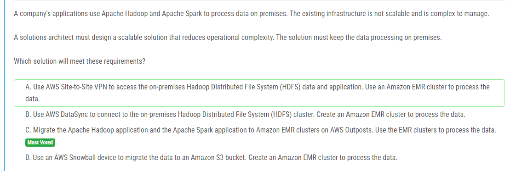

해설:

정답 C.

C. AWS Shield Advanced를 구독하여 DDoS 공격에 대한 전문적인 보호를 받습니다. AWS Shield Advanced는 DDoS 공격을 감지하고 자동으로 방어합니다. AWS DDoS Response Team (DRT)은 AWS Shield Advanced 서비스와 함께 협력하여 공격에 대응하고 추가적인 보호 조치를 제공합니다. 또한 AWS Shield Advanced는 공격에 대한 실시간 알림을 제공하고, 공격의 원본을 추적하여 보안 감사를 제공합니다.

이 방법은 구성 변경이 필요 없이 DDoS 공격으로부터 애플리케이션을 보호하며, AWS DDoS Response Team과의 협력을 통해 추가적인 보호 및 대응을 받을 수 있습니다. 또한 공격의 원본을 추적하여 보안 감사를 제공하므로 공격자에 대한 추적이 가능합니다.

따라서 선택 C가 요구 사항을 충족하고, 구성 변경을 최소화하면서도 DDoS 공격에 대한 효과적인 보호를 제공하는 가장 적절한 솔루션입니다.

해설:

정답 D.

D. Amazon FSx for Lustre 파일 시스템을 생성합니다. Amazon Snowball Edge Storage Optimized 장치로부터 데이터를 직접 FSx for Lustre 파일 시스템으로 가져옵니다. Amazon FSx for Lustre는 고성능 파일 시스템으로, HPC 클러스터 인스턴스에 대한 일관된 하위 밀리초 레이턴시 및 고 처리량 액세스를 제공합니다.

이 방법은 Amazon S3 및 Amazon EFS와 달리 데이터를 직접 파일 시스템으로 가져오므로 더 빠르고 효율적인 액세스를 제공합니다. 또한 Amazon FSx for Lustre는 HPC 애플리케이션에 필요한 높은 성능과 낮은 레이턴시를 제공하여 요구 사항을 충족시킵니다.

따라서 선택 D가 요구 사항을 충족하는 가장 적절한 솔루션입니다.

해설:

정답 B.

B. 온프레미스 서버에 AWS DataSync 에이전트를 설정하고 데이터를 Amazon S3로 동기화합니다. AWS DataSync는 네트워크 파일 시스템(NFS)에서 Amazon S3로의 데이터 전송을 담당하는 관리형 서비스입니다. 소량의 데이터를 주기적으로 백업해야 하므로 AWS DataSync가 비용 효율적인 솔루션입니다. 또한 AWS DataSync는 변경된 파일만 동기화하므로 필요한 데이터만 전송되어 네트워크 대역폭과 스토리지 비용을 최소화합니다.

AWS Glue는 데이터 ETL(추출, 변환, 로드) 작업에 사용되는 관리형 서비스로, 이 경우에는 비용면에서 더 비효율적일 수 있습니다. AWS Transfer for SFTP는 파일 전송에 사용되지만, 이 경우 데이터의 주기적인 백업을 위해 온프레미스 서버와의 연결 및 설정이 추가로 필요하므로 비용 측면에서 유연성이 떨어집니다. 마지막으로, AWS Direct Connect는 온프레미스 데이터 센터와 AWS의 프라이빗 네트워크 간의 연결을 제공하는데, 이는 온프레미스 서버에서 Amazon S3로의 데이터 전송을 위한 과도한 구성과 비용이 발생할 수 있습니다.

따라서 선택 B가 요구 사항을 충족하면서도 가장 비용 효율적인 솔루션입니다.

해설:

정답 C.

C. 네트워크 로드 밸런서(Network Load Balancer)를 구성하여 인터넷 트래픽을 처리합니다. 네트워크 로드 밸런서는 TCP, UDP 및 TLS 트래픽을 처리할 수 있으며, 특히 UDP 인터넷 트래픽 요청을 처리하는 데 효과적입니다. 또한 네트워크 로드 밸런서는 초당 수백만 개의 연결을 처리할 수 있으며, 초당 수백만 개의 패킷을 처리할 수 있어 매우 높은 처리량을 제공합니다. 이는 온라인 게임과 같이 초저지연이 필요한 애플리케이션에 적합합니다.

해설:

정답 A, D.

A. AWS Database Migration Service (AWS DMS) 스키마 변환을 사용하여 데이터베이스 객체를 변환합니다. 이를 통해 MySQL에서 PostgreSQL로의 스키마 변환 작업을 수행할 수 있습니다. 이는 데이터베이스 구조를 PostgreSQL 형식으로 변환하는 데 필요한 작업을 자동화하여 마이그레이션 프로세스를 간소화합니다.

D. 변경 데이터 캡처(CDC)를 사용하여 AWS Database Migration Service (AWS DMS) 작업을 정의하여 데이터 변경 사항을 마이그레이션합니다. CDC는 데이터베이스의 변경 사항을 실시간으로 감지하고 추적하여 변경 사항을 대상 데이터베이스로 전파합니다. 이를 통해 마이그레이션 중에 발생하는 데이터 변경 사항을 신속하게 대상 데이터베이스로 복제할 수 있습니다.

해설:

정답 B.

B. 데이터베이스의 읽기 전용 복제본(read replica)을 생성합니다. 스크립트를 구성하여 새로운 항목을 보고할 때 읽기 전용 복제본만 쿼리하도록 합니다. 읽기 전용 복제본은 주 데이터베이스의 읽기 부하를 분산시키고, 주 데이터베이스에 영향을 주지 않으면서 데이터에 대한 읽기 액세스를 제공합니다. 따라서 이 방법은 스크립트가 주 데이터베이스에 미치는 영향을 최소화하면서 응용 프로그램의 성능을 향상시킬 수 있는 비용 효율적인 솔루션입니다.

해설:

정답 B.

B. ALB 액세스 로깅을 Amazon S3로 활성화합니다. 이를 통해 ALB의 액세스 로그를 S3 버킷에 저장할 수 있습니다. 그런 다음 Amazon Athena를 사용하여 이 로그를 쿼리하여 필요한 정보를 검색할 수 있습니다. 이는 운영 효율성 면에서 가장 효율적인 방법입니다. 로그는 Amazon S3에 자동으로 저장되므로 운영진은 로그 파일을 일일이 확인하거나 로그 파일을 직접 검색할 필요가 없습니다. 대신에 Amazon Athena를 사용하여 간편하게 쿼리를 수행하고 결과를 분석할 수 있습니다.

해설:

정답 C.

C. 공용 NAT 게이트웨이를 VPC 내의 공용 서브넷에 생성합니다. 이렇게 하면 VPC의 개인 서브넷에 있는 EC2 인스턴스가 인터넷에 연결할 수 있습니다. NAT 게이트웨이는 공용 서브넷에 있어야 하며, 개인 서브넷에 있는 EC2 인스턴스는 NAT 게이트웨이를 통해 인터넷에 액세스할 수 있습니다. 이것이 보안 및 네트워크 아키텍처의 일반적인 모범 사례입니다.

해설:

정답 B, E.

B. 이 옵션은 비생산 계정에 SCP를 직접 적용하여 요구 사항을 충족시킵니다. 비생산 계정만 해당 사항에 대한 제한을 받으므로 SCP를 이 계정에 직접 연결하는 것이 합리적입니다.

E. 이 옵션은 새로운 OU를 만들고 비생산 계정을 그 OU로 이동한 다음 해당 OU에 SCP를 적용합니다. 이렇게 하면 비생산 계정만 제한을 받고 생산 계정은 영향을 받지 않으며, 계정의 그룹을 더 효과적으로 관리할 수 있습니다.

해설:

정답 A.

A. S3 버킷 정책을 설정하여 VPC 엔드포인트에서의 액세스를 허용합니다. 이것은 EC2 리소스와 S3 간의 프라이빗하고 안전한 연결을 제공하는 것으로서, VPC 엔드포인트를 통해 S3에 직접 액세스할 수 있습니다. 이를 통해 인터넷을 통한 데이터 전송을 피하고 보안을 강화할 수 있습니다.

해설:

정답 C.

C. Aurora 클러스터에 추가적인 리더 인스턴스를 추가하여 읽기 로드를 분산시킵니다. 그리고 Amazon RDS 프록시를 사용하여 애플리케이션과의 연결을 관리합니다. RDS 프록시는 백엔드 Aurora 클러스터의 스케일링 및 장애 조치에 대한 일부 책임을 담당하므로 애플리케이션의 가용성과 확장성을 향상시키는데 도움이 됩니다. 이러한 변경 사항은 Aurora 클러스터를 중단시키지 않고 수행할 수 있습니다.

해설:

정답 A.

A. Route 53 Resolver 아웃바운드 엔드포인트를 생성하여 VPC와의 연결을 설정합니다. 그런 다음 리졸버 규칙을 생성하고 해당 VPC에 연결합니다. 이를 통해 VPC 내부의 리소스는 내부 DNS 이름 해결을 사용하여 온프레미스 서비스에 연결할 수 있습니다. 이러한 방법으로 데이터는 VPN 연결을 통해 안전하게 전송되며, 내부 DNS 이름을 사용하여 올바른 서비스에 연결되므로 보안과 프라이버시가 보장됩니다.

해설:

정답 B.

B. Amazon S3 Intelligent-Tiering 스토리지 클래스를 사용하여 사진을 저장합니다. 이 클래스는 자주 액세스되는 항목을 자동으로 S3 Standard으로 유지하고, 드물게 액세스되는 항목을 S3 Standard-IA로 자동으로 이동시킵니다. 또한, DynamoDB에 사진 메타데이터와 해당 S3 위치를 저장하여 필요한 경우에 사진에 대한 메타데이터에 액세스할 수 있습니다. 이 방법을 사용하면 자주 액세스되는 사진에 대한 비용을 낮추면서도 데이터에 빠르게 액세스할 수 있으며, 드물게 액세스되는 사진은 더 저렴한 스토리지 클래스로 이동하여 비용을 최적화할 수 있습니다.

해설:

정답 B.

이 옵션은 "가장 적은 대기 중인 요청" 알고리즘을 사용하여 부하 분산을 수행합니다. 이 알고리즘은 대상(EC2 인스턴스)마다 처리 중인 요청의 수를 기준으로 대기 중인 요청이 가장 적은 대상에게 트래픽을 보냅니다. 이를 통해 이미 과부하 상태인 EC2 인스턴스에 새로운 요청을 전달하지 않고 부하를 분산할 수 있습니다. CloudWatch 메트릭을 사용하여 대상(EC2 인스턴스)의 처리 중인 요청 수를 모니터링하여 부하를 고려할 수 있습니다.

해설:

정답 A.

AWS Budgets를 사용하여 Compute Savings Plans에 대한 일일 예산을 생성하고, 해당 예산을 적절한 이메일 수신자에게 알림을 보내도록 구성합니다. 이를 통해 예산의 커버리지가 하락할 때 경고를 받을 수 있으며, 이는 회사가 Savings Plans를 최대한 활용하고 놓치지 않을 수 있도록 도와줍니다. AWS Budgets를 사용하면 예산을 모니터링하고 예산을 초과하는 경우 알림을 받을 수 있으므로, 운영 효율성이 높아집니다.

해설:

정답 A.

기존 VPC에 공용 서브넷을 구성하고, 해당 서브넷에 MSK 클러스터를 배포합니다. 그런 다음 MSK 클러스터 보안 설정을 업데이트하여 상호 TLS 인증을 활성화합니다. 이렇게 하면 데이터 수집 솔루션이 인터넷을 통해 공개적으로 사용 가능하고, 데이터 이동 중에도 암호화됩니다. 새로운 VPC를 생성하고 클러스터를 배포하는 대신 기존 VPC를 활용하여 운영 효율성을 높일 수 있습니다.

해설:

정답 D.

기존 온프레미스 ERP 시스템과의 통합을 지원하기 위해 AWS Transfer Family를 사용하여 내부 SFTP 서버를 생성합니다. 다중 가용 영역에서 SFTP 서버를 생성하여 내결함성을 확보합니다. Amazon S3를 사용하여 파일을 저장하고, Lambda 함수를 생성하여 주문 파일을 처리합니다. AWS Transfer Family의 관리 워크플로를 사용하여 Lambda 함수를 호출하도록 구성합니다. 이 방법을 통해 주문 파일을 즉시 처리할 수 있고, 보안 및 내결함성을 유지할 수 있습니다.

해설:

정답 C.

기존의 복잡한 온프레미스 인프라를 대체하기 위해 Apache Hadoop 및 Apache Spark 애플리케이션을 AWS Outposts에 배포합니다. 이렇게 하면 온프레미스 데이터 처리를 유지하면서 확장 가능하고 관리가 용이한 솔루션을 구현할 수 있습니다. AWS Outposts는 온프레미스 환경에서 AWS 인프라와 서비스를 실행할 수 있는 완전관리형 서비스로, 지역 AWS 인프라 확장이 필요한 경우에도 데이터 처리를 온프레미스에서 수행할 수 있습니다.

해설:

정답 B.

Amazon FSx for ONTAP은 Windows, Mac 및 Linux 기반의 EC2 인스턴스에서 SMB 및 NFS 저장 프로토콜을 사용하여 데이터에 액세스할 수 있는 관리형 파일 스토리지 서비스입니다. 이 솔루션은 자동 티어링 정책을 사용하여 자주 액세스하는 데이터를 빠르게 액세스할 수 있도록 하면서, 드문 데이터를 저렴한 스토리지 계층으로 이동시킵니다. 또한 관리가 간편하며 특정 데이터에 대한 액세스 요구가 변화해도 조정이 쉽습니다.

해설:

정답 C.

Amazon Elastic Container Service (Amazon ECS)를 사용하여 애플리케이션을 마이크로서비스로 운영하는 것이 가장 적합합니다. 이 솔루션은 애플리케이션을 독립적인 컨테이너로 분할하여 유연성과 확장 가능성을 제공합니다. 서비스 자동 스케일링을 사용하여 부하에 따라 컨테이너 수를 동적으로 조정할 수 있습니다. 또한 컨테이너를 개별적으로 업데이트할 수 있으므로 애플리케이션의 일부 모듈을 업데이트할 때 전체 애플리케이션에 대한 다운타임을 최소화할 수 있습니다.

