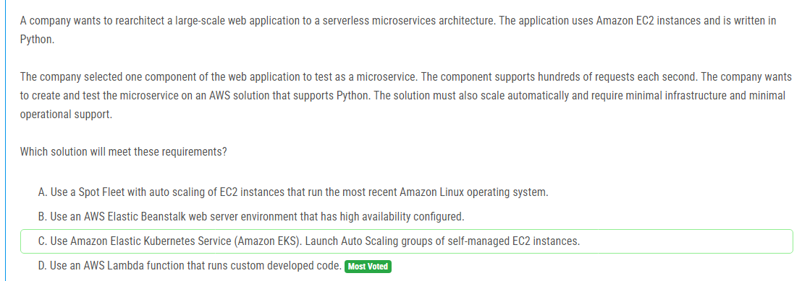

해설:

정답 D.

자동 확장: AWS Lambda는 수요에 따라 자동으로 확장되며, 이는 수백 건의 요청을 초당 처리할 수 있는 능력을 가지고 있습니다. Lambda는 수요가 증가할 때 자동으로 더 많은 인스턴스를 시작하고, 수요가 줄어들면 인스턴스를 종료하여 비용을 절감합니다.

서버리스: Lambda는 서버리스 서비스로, 이는 사용자가 서버를 직접 관리할 필요가 없음을 의미합니다. 따라서 인프라 관리에 필요한 운영 부담이 크게 줄어듭니다.

Python 지원: Lambda는 Python을 포함한 여러 프로그래밍 언어를 지원합니다. 현재 애플리케이션이 Python으로 작성되어 있기 때문에, 코드를 쉽게 Lambda로 이식할 수 있습니다.

최소한의 인프라 필요: Lambda는 실행 환경을 자동으로 관리하고 프로비저닝하며, 사용자는 코드 작성에만 집중할 수 있습니다. 이는 인프라 관리에 필요한 시간과 노력을 절약해 줍니다.

비용 효율성: Lambda는 사용한 만큼만 비용을 지불하는 모델로, 서버를 계속 실행하는 다른 방법들보다 비용 효율적일 수 있습니다.

위와 같은 이유로, AWS Lambda는 자동 확장 기능, 최소한의 인프라 요구 사항, Python 지원 및 운영 부담 감소를 통해 회사의 요구 사항을 충족하는 최적의 솔루션입니다.

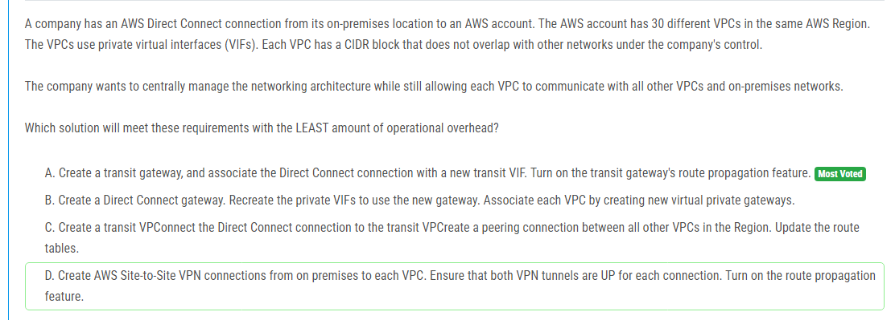

해설:

정답 A.

중앙 관리: 트랜짓 게이트웨이는 중앙에서 네트워킹을 관리할 수 있는 기능을 제공합니다. 모든 VPC와 온프레미스 네트워크를 트랜짓 게이트웨이를 통해 연결할 수 있어 관리가 용이합니다.

간편한 연결: 트랜짓 게이트웨이를 사용하면 모든 VPC 간의 연결을 중앙에서 처리할 수 있으며, VPC 간의 피어링 연결을 개별적으로 설정할 필요가 없습니다. 이는 설정 및 관리의 복잡성을 크게 줄입니다.

자동 경로 전파: 트랜짓 게이트웨이는 경로 전파 기능을 제공하여, 각 VPC 및 온프레미스 네트워크 간의 경로를 자동으로 전파할 수 있습니다. 이를 통해 라우팅 테이블을 수동으로 업데이트해야 하는 작업을 줄일 수 있습니다.

확장성: 트랜짓 게이트웨이는 많은 수의 VPC를 연결하는 데 적합하며, 새로운 VPC가 추가되더라도 쉽게 통합할 수 있습니다. 이는 현재 30개의 VPC를 가지고 있는 회사의 요구사항에 부합합니다.

운영 오버헤드 감소: 트랜짓 게이트웨이를 사용하면 네트워크 연결을 일원화하고, 경로 전파 기능을 통해 수동으로 라우팅을 설정하는 작업을 최소화할 수 있어 운영 오버헤드가 감소합니다.

따라서, 트랜짓 게이트웨이를 사용하고 Direct Connect 연결을 새로운 트랜짓 VIF로 연결하는 솔루션이 가장 적은 운영 오버헤드로 회사의 요구사항을 충족할 수 있습니다.

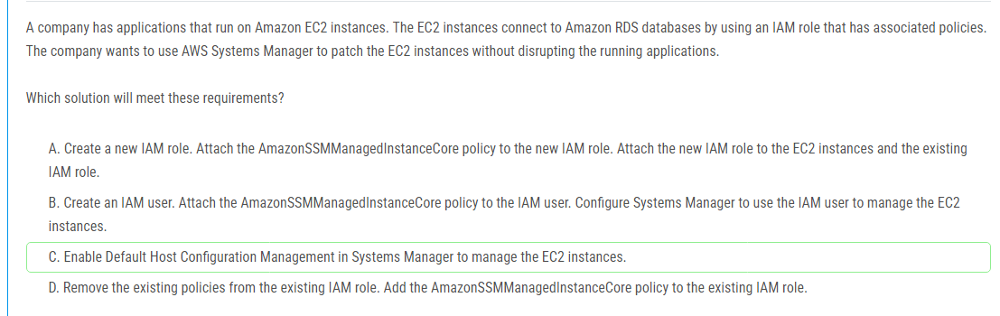

해설:

정답 C.

간편한 설정: Default Host Configuration Management 기능을 사용하면 EC2 인스턴스를 관리하기 위한 기본 설정을 자동으로 적용할 수 있습니다. 이는 수동으로 IAM 역할을 수정하거나 새로운 역할을 생성할 필요가 없음을 의미합니다.

기존 역할 유지: 이 방법은 기존 IAM 역할과 정책을 변경할 필요가 없으므로, 현재 EC2 인스턴스와 RDS 데이터베이스 간의 연결을 유지하면서도 Systems Manager를 통한 패치 관리를 할 수 있습니다.

무중단 운영: Systems Manager의 Default Host Configuration Management는 인스턴스의 애플리케이션을 중단시키지 않고 패치 작업을 수행할 수 있도록 도와줍니다. 이는 서비스의 가용성을 유지하는 데 중요한 역할을 합니다.

최소한의 운영 오버헤드: 이 솔루션은 추가적인 IAM 사용자나 역할을 생성하지 않으므로 관리 오버헤드가 줄어듭니다. 또한, 설정이 간단하고 자동화된 방식으로 관리할 수 있습니다.

따라서, AWS Systems Manager의 Default Host Configuration Management 기능을 활성화하여 EC2 인스턴스를 관리하는 것이 가장 적절한 솔루션입니다. 이는 기존 시스템에 최소한의 영향을 주면서도 요구사항을 충족시킬 수 있는 방법입니다.

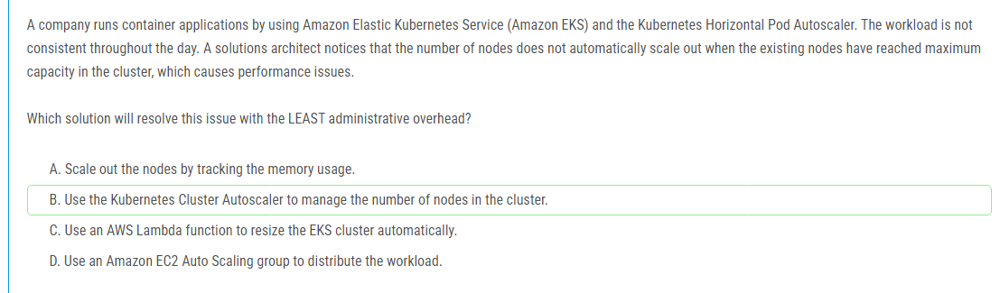

해설:

정답 B.

자동 노드 확장: Kubernetes Cluster Autoscaler는 클러스터의 노드 수를 자동으로 조절하여 필요한 리소스를 제공할 수 있습니다. 이는 현재 노드가 최대 용량에 도달했을 때 새로운 노드를 자동으로 추가할 수 있음을 의미합니다.

적은 관리 오버헤드: Cluster Autoscaler는 Kubernetes와 직접 통합되어 작동하므로 추가적인 스크립트나 Lambda 함수를 작성할 필요가 없습니다. 이는 관리 오버헤드를 크게 줄여줍니다.

효율적인 자원 사용: Cluster Autoscaler는 실제 리소스 요구에 따라 노드를 동적으로 추가 및 제거하므로, 자원을 효율적으로 사용할 수 있습니다. 이는 비용 절감에도 도움이 됩니다.

내장 기능 사용: Kubernetes Cluster Autoscaler는 Kubernetes의 기본 제공 기능 중 하나로, 별도의 설정 없이도 쉽게 사용할 수 있습니다. 이는 클러스터 관리에 필요한 복잡성을 줄여줍니다.

성능 문제 해결: 노드 수가 자동으로 조절되므로, 클러스터가 최대 용량에 도달하여 성능 문제가 발생하는 상황을 방지할 수 있습니다. 이는 애플리케이션의 가용성과 성능을 유지하는 데 중요합니다.

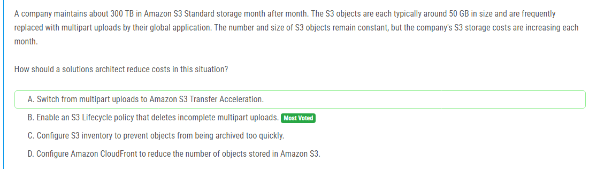

해설:

정답 B.

불완전한 멀티파트 업로드 제거: S3에서는 멀티파트 업로드를 통해 대용량 파일을 업로드할 수 있습니다. 그러나 업로드가 중간에 중단되거나 실패할 경우 불완전한 멀티파트 업로드 파트들이 S3에 남아 있을 수 있습니다. 이러한 불완전한 업로드 파트들이 계속 쌓이면 스토리지 비용이 증가합니다.

스토리지 비용 절감: S3 Lifecycle 정책을 사용하여 불완전한 멀티파트 업로드를 자동으로 삭제하면, 이러한 불필요한 데이터가 저장되지 않도록 할 수 있습니다. 이는 스토리지 사용량을 줄이고, 그 결과 스토리지 비용도 줄어들게 됩니다.

자동 관리: Lifecycle 정책을 설정하면 S3가 자동으로 지정된 조건에 따라 불완전한 업로드를 삭제하므로, 관리자가 수동으로 정리할 필요가 없습니다. 이는 관리 오버헤드를 줄여줍니다.

글로벌 애플리케이션 사용 시 효율성: 글로벌 애플리케이션이 자주 데이터를 대체하는 경우, 불완전한 멀티파트 업로드가 발생할 가능성이 높습니다. Lifecycle 정책을 통해 이러한 문제를 자동으로 관리함으로써, 지속적으로 효율적인 스토리지 사용을 유지할 수 있습니다.

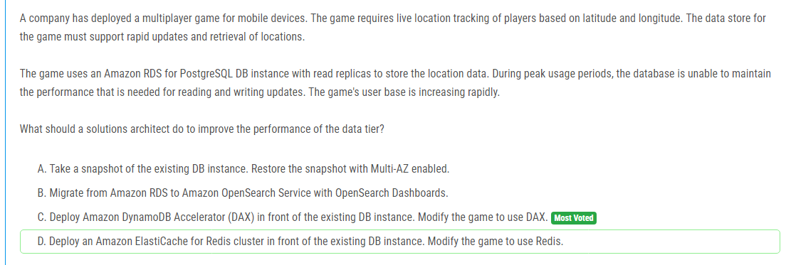

해설:

정답 C.

고성능 읽기 및 쓰기: Amazon DynamoDB Accelerator (DAX)는 DynamoDB 테이블의 읽기 성능을 크게 향상시키는 인메모리 캐시입니다. DAX를 사용하면 밀리초에서 마이크로초 수준의 응답 시간을 제공할 수 있어, 실시간 위치 추적과 같은 높은 처리량이 요구되는 애플리케이션에 적합합니다.

간단한 통합: DAX를 사용하는 것은 비교적 간단하며, 기존 DynamoDB API 호출을 거의 변경하지 않고도 애플리케이션을 DAX와 통합할 수 있습니다. 이는 애플리케이션의 코드 변경을 최소화하면서 성능을 최적화할 수 있는 방법입니다.

자동 확장: DAX는 자동으로 확장되어 증가하는 사용자 기반을 효과적으로 지원할 수 있습니다. 이를 통해 급속히 증가하는 사용자 수에도 불구하고 일관된 성능을 유지할 수 있습니다.

읽기 작업의 부하 감소: DAX는 읽기 성능을 극대화하기 위해 설계되었으며, 이는 RDS 데이터베이스에서 읽기 작업의 부하를 줄여 전체 시스템의 성능을 향상시킵니다. 특히, 읽기 작업이 많은 시나리오에서 효과적입니다.

비용 효율성: DAX를 사용하면 높은 성능의 인메모리 캐싱 솔루션을 사용할 수 있으며, 이는 종종 RDS 데이터베이스의 성능을 개선하는 것보다 비용 효율적입니다.

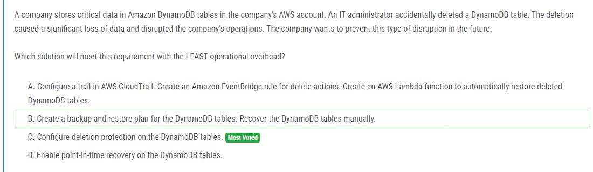

해설:

정답 C.

직접적인 보호: 삭제 보호 기능을 활성화하면 실수로 인해 DynamoDB 테이블이 삭제되는 것을 방지할 수 있습니다. 이 기능은 사용자나 관리자에 의해 의도치 않게 삭제 명령이 실행되는 것을 막아줍니다.

운영 오버헤드 최소화: 삭제 보호 기능은 설정이 간단하며, 별도의 유지 보수가 필요하지 않습니다. 이는 다른 솔루션에 비해 운영 오버헤드가 적습니다.

추가 작업 불필요: 삭제 보호를 설정하면 테이블 삭제 시도를 즉시 차단하므로, 다른 복구 작업이나 이벤트 트리거 설정 등이 필요 없습니다.

즉각적인 효과: 이 기능은 즉시 적용되며, 활성화 후 바로 효과를 발휘합니다. 이는 데이터 보호를 위한 신속한 해결책을 제공합니다.

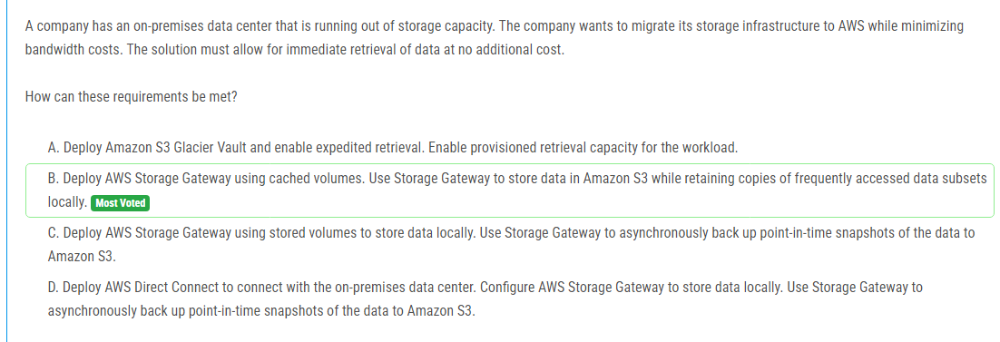

해설:

정답 B.

저장 용량 확장: AWS Storage Gateway의 캐시된 볼륨을 사용하면 데이터가 Amazon S3에 저장되므로 온프레미스 스토리지 용량 문제를 해결할 수 있습니다. 데이터는 클라우드에 안전하게 저장되며, S3의 무한한 확장성을 활용할 수 있습니다.

대역폭 비용 최소화: 캐시된 볼륨 방식은 자주 접근하는 데이터를 로컬에 저장하여 네트워크 대역폭 사용을 최적화합니다. 이는 빈번한 데이터 접근 시 AWS로의 데이터 전송을 줄여 대역폭 비용을 절감할 수 있습니다.

즉시 데이터 검색: 로컬에 자주 접근하는 데이터의 사본을 유지하므로, 즉각적인 데이터 검색이 가능합니다. 이는 온프레미스 데이터 센터에서 데이터를 신속하게 접근할 수 있도록 합니다.

비용 효율성: Amazon S3에 데이터를 저장하고, 자주 사용하는 데이터만 로컬에 캐싱함으로써 스토리지 비용을 효율적으로 관리할 수 있습니다. S3에 저장된 데이터는 저렴한 비용으로 관리할 수 있으며, 필요한 경우에만 AWS 네트워크를 사용합니다.

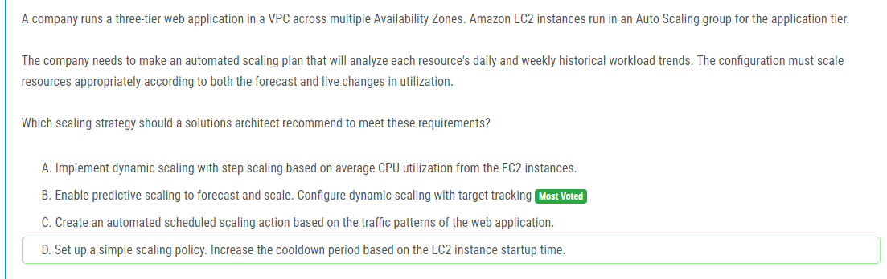

해설:

정답 B.

예측적 확장: 예측적 확장은 EC2 Auto Scaling 그룹에서 사용 가능한 기능으로, 과거의 사용 패턴을 분석하여 향후 리소스 필요량을 예측합니다. 이를 통해 트래픽이 증가하기 전에 미리 리소스를 확장하여 성능을 최적화할 수 있습니다.

동적 확장: 동적 확장은 현재의 실시간 사용량 변화에 따라 리소스를 자동으로 조절합니다. 타겟 추적을 사용하면 특정 메트릭(예: CPU 사용률, 요청 수 등)을 기준으로 자동으로 리소스를 조정할 수 있습니다. 이는 예기치 않은 트래픽 변화에도 빠르게 대응할 수 있게 해줍니다.

혼합 접근법: 예측적 확장과 동적 확장을 함께 사용하면 과거 데이터 기반의 예측과 실시간 데이터 기반의 조정을 모두 활용할 수 있어, 리소스 최적화와 비용 절감을 동시에 달성할 수 있습니다.

자동화된 관리: 이 방법은 수동으로 스케줄링하거나 정책을 조정할 필요 없이, 시스템이 자동으로 확장 및 축소를 관리합니다. 이는 운영 오버헤드를 줄이고, 안정적인 성능을 유지하는 데 도움이 됩니다.

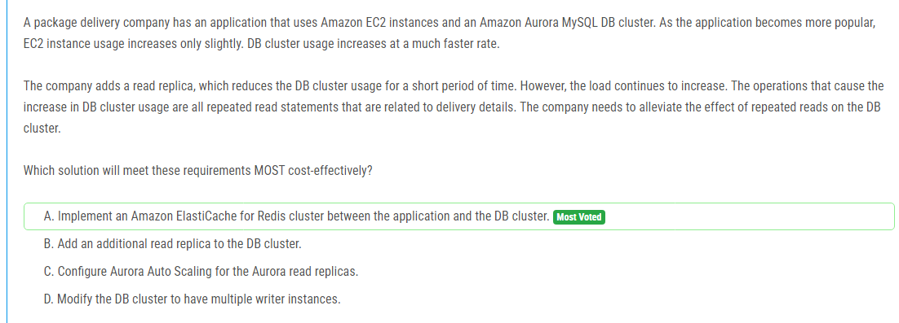

해설:

정답 A.

고속 캐싱 솔루션: Amazon ElastiCache for Redis는 인메모리 데이터 저장소로, 매우 빠른 읽기 및 쓰기 성능을 제공합니다. 이는 자주 반복되는 읽기 작업에 적합하며, 데이터베이스의 부하를 크게 줄일 수 있습니다.

반복된 읽기 요청 처리: 문제의 주요 원인은 반복된 읽기 작업으로 인한 DB 클러스터의 높은 사용률입니다. Redis 클러스터를 사용하여 이러한 읽기 요청을 캐시하면, 애플리케이션은 데이터베이스에 직접 접근하는 대신 Redis에서 빠르게 데이터를 가져올 수 있습니다.

비용 효율성: ElastiCache를 사용하면, 데이터베이스 리소스를 확장하는 것보다 비용 효율적으로 성능을 개선할 수 있습니다. 읽기 요청의 상당 부분이 캐시에서 처리되므로, 데이터베이스 리소스의 사용량이 감소합니다.

확장성: ElastiCache for Redis는 수평 확장이 가능하여, 필요에 따라 용량을 쉽게 조정할 수 있습니다. 이는 사용자 수와 읽기 요청이 증가함에 따라 유연하게 대응할 수 있는 솔루션입니다.

다양한 사용 사례 지원: Redis는 다양한 데이터 구조를 지원하며, 고급 캐싱 기능을 제공하여 애플리케이션의 요구사항을 효과적으로 충족시킬 수 있습니다.

따라서, Amazon ElastiCache for Redis를 도입하면 데이터베이스의 부하를 줄이고 성능을 최적화할 수 있는 가장 비용 효율적인 솔루션입니다. 이는 데이터베이스에 대한 반복된 읽기 요청을 효과적으로 처리하여, 전체 시스템의 응답 속도와 안정성을 높이는 데 도움이 됩니다.

해설:

정답 C.

최신 데이터 보장: 강력한 일관성 읽기(strongly consistent read)는 항상 최신 데이터를 반환합니다. 현재의 문제는 최신 데이터가 반환되지 않는다는 것이므로, 강력한 일관성 읽기를 요청함으로써 이 문제를 해결할 수 있습니다.

기본 설정: DynamoDB의 기본 읽기 모드는 결국 일관성 읽기(eventually consistent read)입니다. 결국 일관성 읽기는 데이터가 복제되는 동안 최신 상태가 아닐 수 있으므로, 최신 데이터를 필요로 하는 경우 강력한 일관성 읽기를 사용해야 합니다.

성능 및 지연 시간: 질문에서 지연 시간은 허용 범위 내에 있으므로, 강력한 일관성 읽기를 사용하는 것이 성능에 큰 영향을 주지 않을 것으로 보입니다. 이는 최신 데이터 접근을 보장하면서도 사용자가 만족할 만한 성능을 유지할 수 있습니다.

간단한 변경: 강력한 일관성 읽기를 요청하는 것은 코드 수준에서 간단한 변경으로 구현할 수 있습니다. 이는 다른 복잡한 설계 변경 없이 문제를 해결할 수 있는 효율적인 방법입니다.

따라서, 강력한 일관성 읽기를 요청하도록 설계를 변경하면 최신 데이터를 반환하지 않는 문제를 해결할 수 있으며, 이는 현재 상황에서 가장 적절한 솔루션입니다.

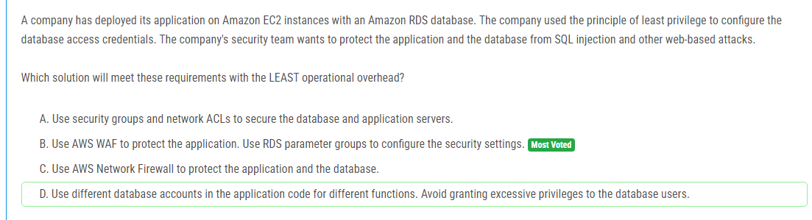

해설:

정답 B.

웹 애플리케이션 보호: AWS WAF (Web Application Firewall)는 웹 애플리케이션에 대한 SQL 인젝션, 크로스 사이트 스크립팅(XSS) 등 다양한 웹 기반 공격을 방어하는 데 효과적입니다. 이를 통해 애플리케이션 레이어에서 발생할 수 있는 공격을 방어할 수 있습니다.

자동화된 보호: AWS WAF는 AWS 관리 규칙과 사용자 정의 규칙을 사용하여 웹 애플리케이션을 보호할 수 있습니다. 이러한 규칙은 자동으로 업데이트되어 새로운 위협으로부터 보호할 수 있으며, 운영 오버헤드를 최소화합니다.

데이터베이스 보안 설정: RDS 파라미터 그룹을 사용하면 데이터베이스의 보안 설정을 관리할 수 있습니다. 이를 통해 데이터베이스의 구성 설정을 세밀하게 조정하고 보안 수준을 높일 수 있습니다.

최소한의 운영 오버헤드: AWS WAF와 RDS 파라미터 그룹을 사용하는 솔루션은 설정 후 지속적인 관리가 거의 필요하지 않으므로 운영 오버헤드를 크게 줄일 수 있습니다. 이는 보안 팀이 다른 중요한 작업에 집중할 수 있도록 합니다.

따라서, AWS WAF를 사용하여 애플리케이션을 보호하고, RDS 파라미터 그룹을 사용하여 데이터베이스 보안 설정을 강화하는 것이 가장 적절한 솔루션입니다. 이 솔루션은 최소한의 운영 오버헤드로 웹 기반 공격과 데이터베이스 보안을 효과적으로 관리할 수 있습니다.

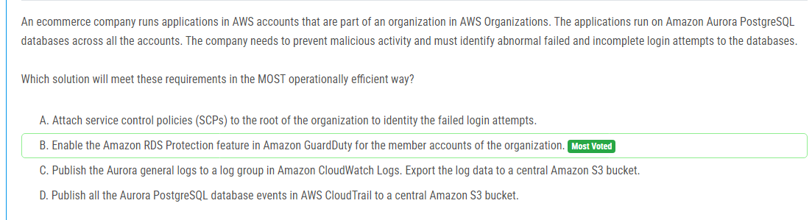

해설:

정답 B.

통합된 보안 관리: Amazon GuardDuty는 AWS 계정 전반에 걸쳐 중앙 집중식으로 보안 위협을 모니터링하고 탐지할 수 있는 관리형 서비스입니다. 이를 통해 여러 계정에서 발생하는 보안 이벤트를 효과적으로 관리할 수 있습니다.

자동화된 위협 탐지: GuardDuty는 비정상적인 활동을 자동으로 감지하고 경고를 생성합니다. 이는 사용자가 수동으로 로그를 분석할 필요 없이 자동으로 잠재적인 보안 위협을 식별할 수 있게 해줍니다.

운영 효율성: GuardDuty를 사용하면 운영 오버헤드가 크게 줄어듭니다. 보안 팀은 수동으로 로그를 수집하고 분석하는 대신, GuardDuty의 자동화된 기능을 활용하여 더 신속하게 위협을 감지하고 대응할 수 있습니다.

RDS 보호: GuardDuty의 RDS Protection 기능은 데이터베이스 로그인 시도의 실패 및 비정상적인 활동을 모니터링하여 이를 감지합니다. 이를 통해 Aurora PostgreSQL 데이터베이스에 대한 보안 위협을 효과적으로 관리할 수 있습니다.

중앙 집중식 관리: AWS Organizations와 통합하여 여러 계정에 걸친 보안 위협을 중앙에서 관리할 수 있으므로, 보안 상태를 전체적으로 파악하고 대응할 수 있습니다.

따라서, Amazon GuardDuty의 RDS Protection 기능을 활성화하는 것이 가장 운영 효율적이고 효과적인 솔루션입니다. 이는 비정상적인 데이터베이스 로그인 시도를 자동으로 감지하고 경고함으로써 보안 위협을 최소화할 수 있습니다.

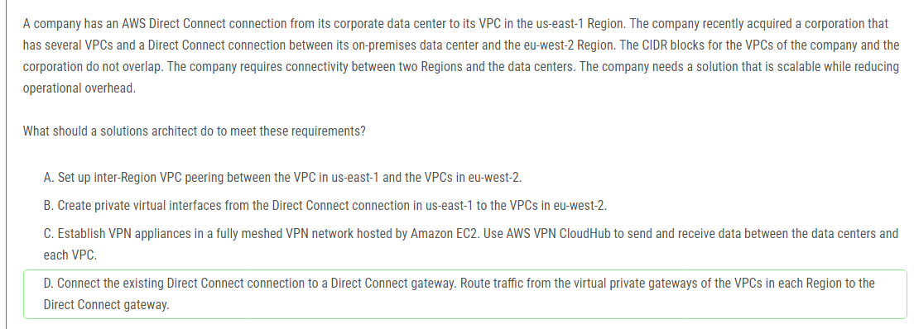

해설:

정답 D.

확장성: Direct Connect 게이트웨이는 여러 VPC 및 여러 리전 간의 연결을 허용합니다. 이를 통해 여러 리전 및 데이터 센터 간의 네트워크 연결을 확장할 수 있습니다.

운영 오버헤드 감소: Direct Connect 게이트웨이를 사용하면 각 VPC와 리전 간의 개별 설정 및 관리가 필요 없으므로 운영 오버헤드가 줄어듭니다. 이는 네트워크 인프라 관리의 복잡성을 크게 줄여줍니다.

중앙 집중식 관리: Direct Connect 게이트웨이를 사용하면 트래픽을 중앙에서 관리할 수 있으며, 여러 VPC와 리전 간의 트래픽을 효율적으로 라우팅할 수 있습니다.

리전 간 연결: Direct Connect 게이트웨이는 리전 간의 트래픽을 라우팅할 수 있어 us-east-1 리전과 eu-west-2 리전 간의 연결을 쉽게 설정할 수 있습니다. 이는 두 리전 간의 네트워크 통합을 용이하게 합니다.

보안 및 성능: Direct Connect 게이트웨이를 사용하면 높은 대역폭과 낮은 지연 시간을 제공하는 Direct Connect의 이점을 누리면서 보안이 강화된 전용 네트워크 연결을 유지할 수 있습니다.

따라서, Direct Connect 게이트웨이를 설정하고 각 리전의 VPC와 데이터 센터 간의 트래픽을 라우팅하는 것이 가장 적절한 솔루션입니다. 이는 확장 가능하고 운영 오버헤드를 최소화하며 두 리전 및 데이터 센터 간의 효율적인 연결을 제공할 수 있습니다.

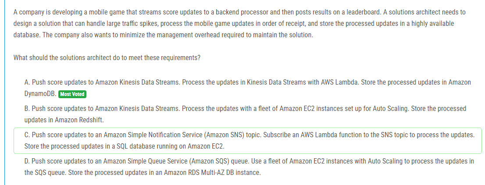

해설:

정답 A.

순서 보장: Amazon Kinesis Data Streams는 데이터를 샤드에 순서대로 기록하므로, 데이터가 수신된 순서대로 처리될 수 있습니다. 이는 게임 점수 업데이트를 순서대로 처리해야 하는 요구사항에 부합합니다.

자동 확장: Kinesis Data Streams는 트래픽 스파이크를 자동으로 처리할 수 있도록 설계되어 있습니다. 트래픽이 급증하더라도 스트림이 자동으로 확장되어 높은 처리량을 유지할 수 있습니다.

서버리스 아키텍처: AWS Lambda를 사용하여 Kinesis Data Streams의 데이터를 처리하면, 인프라 관리를 최소화할 수 있습니다. Lambda는 이벤트 기반으로 작동하며, 서버 관리가 필요하지 않아 관리 오버헤드를 줄일 수 있습니다.

고가용성 데이터 저장: Amazon DynamoDB는 높은 가용성과 확장성을 제공하는 NoSQL 데이터베이스입니다. 이를 통해 처리된 점수 업데이트를 안전하고 빠르게 저장할 수 있습니다.

관리 오버헤드 최소화: 이 솔루션은 대부분 서버리스 서비스로 구성되어 있어, EC2 인스턴스와 같은 인프라를 직접 관리할 필요가 없습니다. 이는 운영 및 유지 관리에 필요한 노력을 줄여줍니다.

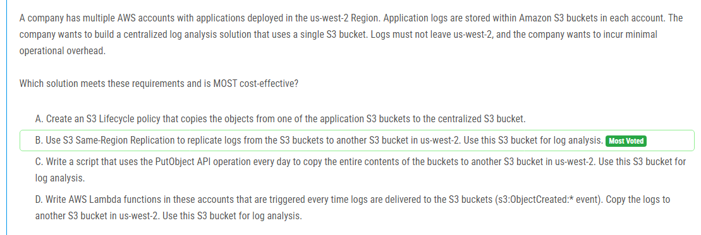

해설:

정답 B.

지역 내 복제: S3 Same-Region Replication(SRR)은 동일한 AWS 리전 내에서 S3 버킷 간에 데이터를 복제합니다. 이를 통해 로그 데이터가 us-west-2 리전을 벗어나지 않으므로, 데이터 주권 요구사항을 충족할 수 있습니다.

자동화 및 운영 오버헤드 최소화: SRR을 사용하면 설정 후 자동으로 로그 데이터를 중앙 집중식 버킷으로 복제하므로, 수동으로 데이터를 복사하거나 스크립트를 실행할 필요가 없습니다. 이는 운영 오버헤드를 크게 줄여줍니다.

비용 효율성: S3 SRR은 비용 효율적인 데이터 복제 솔루션을 제공합니다. 또한, 로그 데이터가 한 번만 전송되고, 나중에 복제본을 기반으로 분석을 수행할 수 있으므로, 추가적인 데이터 전송 비용이 최소화됩니다.

실시간 데이터 복제: SRR은 새로운 로그 파일이 원본 버킷에 추가될 때마다 자동으로 중앙 집중식 버킷에 복제합니다. 이는 로그 데이터의 실시간 분석을 가능하게 합니다.

보안 및 무결성: S3 SRR은 데이터 복제 과정에서 암호화 및 데이터 무결성을 보장할 수 있으며, IAM 정책과 버킷 정책을 통해 접근을 제어할 수 있습니다.

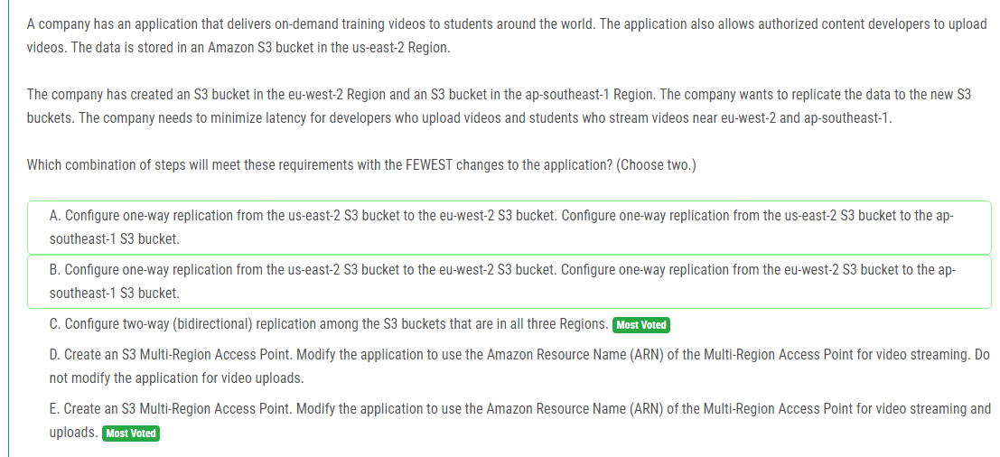

해설:

정답 C, E.

C: 

양방향 복제: 모든 세 리전의 S3 버킷 간에 양방향 복제를 설정하면 데이터가 어느 리전에서 생성되든지 간에 모든 리전에 복제되어 데이터 일관성을 유지할 수 있습니다.
최소 변경: 애플리케이션의 업로드 로직을 수정할 필요 없이, 모든 리전에서 동일한 데이터를 사용할 수 있게 됩니다.

E:

단일 엔드포인트: S3 Multi-Region Access Point를 사용하면 여러 리전의 S3 버킷에 접근하기 위한 단일 ARN을 사용할 수 있습니다. 이는 애플리케이션이 단일 엔드포인트를 통해 데이터에 접근하도록 하여 지연 시간을 줄이고 가용성을 높입니다.
최소 변경: 애플리케이션에서 ARN만 수정하면 되므로, 코드 변경이 최소화됩니다.

이 두 가지 솔루션을 조합하면, 데이터 일관성과 지연 시간 감소를 모두 충족할 수 있으며, 애플리케이션의 변경 사항도 최소화할 수 있습니다. 양방향 복제는 모든 리전에 최신 데이터를 제공하고, Multi-Region Access Point는 애플리케이션이 이를 쉽게 활용할 수 있도록 합니다.

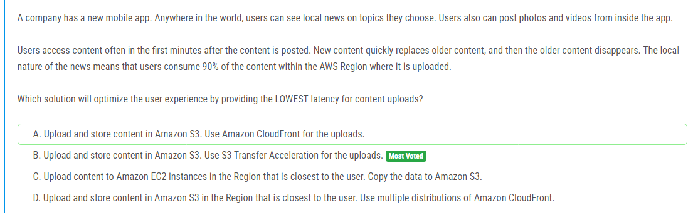

해설:

정답 B.

전송 가속화: S3 Transfer Acceleration은 AWS의 글로벌 엣지 로케이션 네트워크를 활용하여, 사용자에게 가장 가까운 엣지 로케이션으로 업로드 요청을 라우팅합니다. 이는 업로드 속도를 크게 향상시켜 지연 시간을 최소화합니다.

사용 편의성: S3 Transfer Acceleration을 사용하면, 기존의 S3 버킷을 그대로 사용하면서 전송 속도를 개선할 수 있습니다. 애플리케이션에 큰 변경 없이 쉽게 설정할 수 있습니다.

저장소 통합: S3에 직접 데이터를 저장함으로써, 데이터가 중앙 집중화되고 관리가 용이해집니다. 또한, S3의 다양한 내장 기능(버전 관리, 라이프사이클 관리 등)을 그대로 활용할 수 있습니다.

글로벌 사용자 지원: 전 세계 어디서든 사용자가 로컬 뉴스를 빠르게 업로드하고 액세스할 수 있도록 지원합니다. 특히, 90%의 콘텐츠가 업로드된 AWS 리전 내에서 소비된다는 점을 감안할 때, S3 Transfer Acceleration은 최적의 업로드 성능을 제공합니다.

따라서, S3 Transfer Acceleration을 사용하여 S3에 콘텐츠를 업로드하는 것이 사용자 경험을 최적화하고 업로드 지연 시간을 최소화하는 가장 적합한 솔루션입니다.

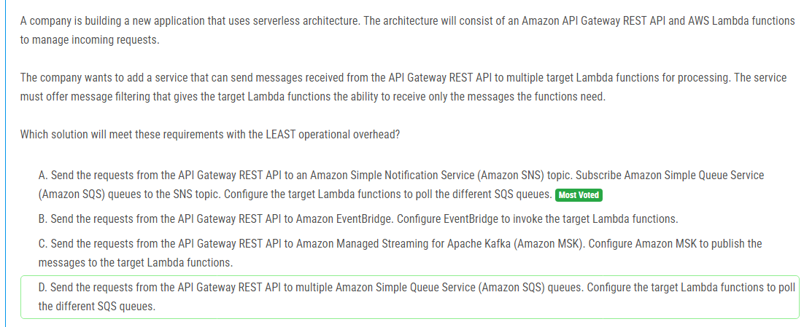

해설:

정답 A.

메시지 필터링: SNS와 SQS를 조합하면, SNS 주제에 메시지를 게시한 후 SQS 대기열을 구독자로 설정할 수 있습니다. 이때 SQS 대기열의 필터 정책을 통해 각 Lambda 함수가 필요한 메시지만 받을 수 있습니다. 이는 메시지 필터링을 통해 특정 Lambda 함수가 필요로 하는 메시지만 처리할 수 있도록 합니다.

서버리스 구성 요소: SNS와 SQS는 모두 완전 관리형 서비스로, 운영 오버헤드가 최소화됩니다. 이러한 서비스는 인프라를 관리할 필요 없이 자동으로 확장되므로, 관리 부담을 줄이고 애플리케이션의 복잡성을 낮출 수 있습니다.

확장성: SNS와 SQS는 둘 다 높은 확장성을 제공하여, 대량의 메시지를 효율적으로 처리할 수 있습니다. 이는 트래픽 스파이크에도 안정적인 성능을 유지할 수 있게 해줍니다.

신뢰성: SQS는 메시지의 내구성을 보장하여, 메시지가 손실되지 않고 안정적으로 전달되도록 합니다. Lambda 함수는 SQS 대기열을 폴링하여 메시지를 처리하므로, 메시지 유실 없이 신뢰성 있는 처리 메커니즘을 제공합니다.

따라서, API Gateway REST API에서 수신된 메시지를 SNS 주제로 전송하고, 각 SNS 주제를 SQS 대기열에 구독시키며, Lambda 함수가 해당 SQS 대기열을 폴링하여 필요한 메시지를 처리하는 방법이 운영 오버헤드를 최소화하면서 요구사항을 충족하는 가장 적합한 솔루션입니다.

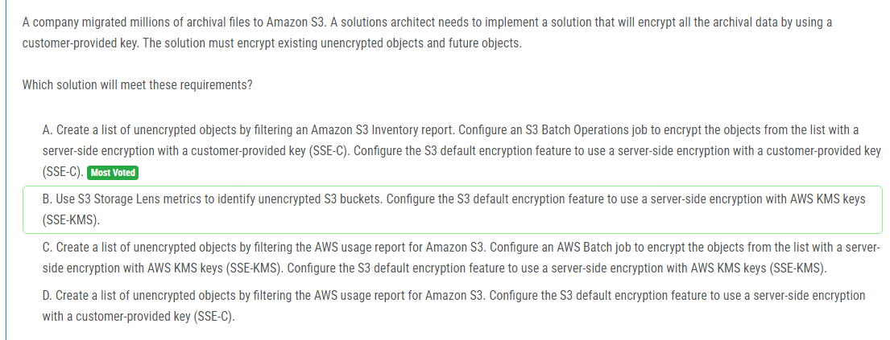

해설:

정답 A.

기존 객체 암호화: S3 Inventory 보고서를 사용하여 암호화되지 않은 객체 목록을 생성할 수 있습니다. 이를 통해 기존의 모든 비암호화 객체를 식별하고, S3 Batch Operations를 사용하여 이 목록의 객체들을 서버 측 암호화(SSE-C)로 암호화할 수 있습니다. 이는 기존 데이터를 암호화하는 데 필요한 단계입니다.

미래 객체 암호화: S3의 기본 암호화 기능을 사용하여 새로운 객체가 업로드될 때 자동으로 SSE-C를 사용하여 암호화되도록 설정할 수 있습니다. 이를 통해 향후 업로드되는 모든 객체가 고객 제공 키를 사용하여 암호화됩니다.

고객 제공 키 사용: SSE-C는 고객이 제공한 키를 사용하여 데이터를 암호화합니다. 이는 회사의 요구 사항을 충족시키며, 암호화 키를 직접 제어할 수 있습니다.

운영 오버헤드 최소화: S3 Batch Operations를 사용하여 대규모 객체 목록을 일괄 처리할 수 있습니다. 이는 수작업으로 객체를 하나씩 암호화하는 것보다 훨씬 효율적이며 운영 오버헤드를 줄입니다.

따라서, 기존의 비암호화 객체를 SSE-C를 사용하여 암호화하고, 향후 업로드되는 객체도 자동으로 SSE-C를 사용하여 암호화하도록 설정하는 것이 회사의 요구사항을 충족시키는 가장 적절하고 효율적인 솔루션입니다.

