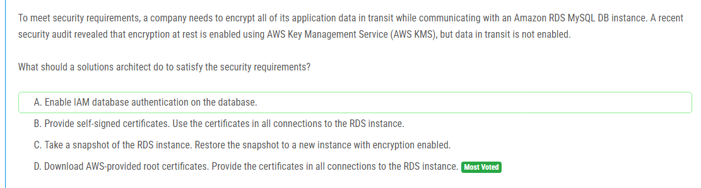
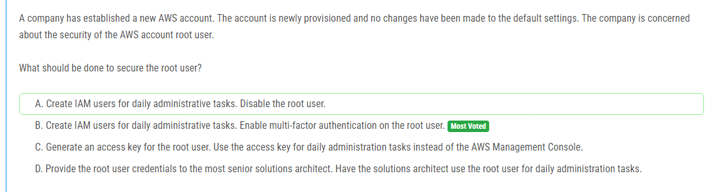
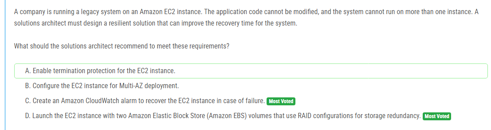

해설:

정답 A.

고가용성 및 신뢰성: Amazon Route 53은 AWS 인프라를 기반으로 하여 높은 가용성과 신뢰성을 제공합니다. 이는 기존 DNS 제공업체의 장애 문제를 해결하는 데 도움이 됩니다.

신속한 마이그레이션: 기존 DNS 제공업체에서 사용하던 도메인 레코드를 포함한 존 파일을 Route 53에 쉽게 가져올 수 있습니다. 이렇게 하면 서비스 중단을 최소화하면서 신속하게 마이그레이션할 수 있습니다.

공용 호스티드 존(public hosted zone): 도메인 이름이 인터넷에서 접근 가능해야 하므로, 공용 호스티드 존을 생성해야 합니다. 이는 도메인 이름을 공용 DNS 서버에서 조회할 수 있도록 합니다.

단순성과 효율성: 다른 옵션(B, C, D)은 특정 상황이나 추가 설정이 필요하며, 이로 인해 마이그레이션 과정이 복잡해질 수 있습니다. 반면에 공용 호스티드 존을 사용하는 것은 단순하고 효율적입니다.

따라서, 도메인 이름 레코드를 포함한 존 파일을 Route 53 공용 호스티드 존에 가져오는 것이 가장 빠르고 효과적인 방법입니다. 이는 회사의 서비스 중단 문제를 신속하게 해결할 수 있는 최선의 선택입니다.

해설:

정답 A.

AWS AppConfig 사용: AWS AppConfig는 애플리케이션 구성 데이터를 안전하고 효율적으로 관리할 수 있는 서비스입니다. 이를 사용하면 애플리케이션이 실행 중일 때도 구성을 안전하게 업데이트할 수 있습니다. 이 서비스는 구성 데이터의 배포를 자동화하여 관리 부담을 줄이고, 구성 오류로 인한 애플리케이션 문제를 예방하는 데 도움을 줍니다.

AWS Secrets Manager 사용: AWS Secrets Manager는 데이터베이스 및 다른 서비스의 자격 증명을 안전하게 저장하고, 자동으로 교체 및 관리할 수 있는 서비스입니다. Secrets Manager는 자격 증명을 자동으로 교체할 수 있으며, 애플리케이션이 필요할 때 안전하게 이 정보를 검색할 수 있도록 API를 제공합니다. 이를 통해 보안과 관리 효율성을 동시에 높일 수 있습니다.

최소한의 관리 오버헤드: AWS AppConfig와 AWS Secrets Manager를 함께 사용하면 구성 데이터와 자격 증명을 각각의 전문화된 관리 서비스에서 처리하게 됩니다. 이는 수동으로 구성 파일을 업데이트하거나 자격 증명을 관리할 필요 없이, 자동화된 방식으로 필요한 작업을 수행할 수 있게 합니다. 이는 관리 부담을 크게 줄이고 보안을 강화하는 데 효과적입니다.

따라서, AWS AppConfig를 통해 애플리케이션 구성을 관리하고, AWS Secrets Manager를 통해 자격 증명을 안전하게 저장하고 검색하는 솔루션이 가장 적합하며, 최소한의 관리 오버헤드로 요구 사항을 충족할 수 있습니다.

해설:

정답 D.

AWS 제공 루트 인증서 사용: AWS에서는 RDS 데이터베이스에 대한 안전한 통신을 보장하기 위해 SSL/TLS를 사용할 수 있도록 루트 인증서를 제공합니다. 이 인증서를 사용하면 데이터가 전송되는 동안 암호화되어 보안 요구 사항을 충족할 수 있습니다.

데이터 전송 암호화: AWS 제공 루트 인증서를 다운로드하여 애플리케이션과 RDS 인스턴스 간의 모든 연결에 사용하면, 데이터가 전송되는 동안 암호화됩니다. 이는 데이터 무결성과 기밀성을 보장하는 중요한 보안 조치입니다.

기존 인스턴스의 활용: 이 방법은 현재 사용 중인 RDS 인스턴스를 계속 사용할 수 있도록 하며, 데이터 암호화를 활성화하기 위해 새로운 인스턴스를 생성하거나 스냅샷을 복원할 필요가 없습니다. 이는 관리 오버헤드를 줄이고, 서비스 중단을 최소화할 수 있습니다.

관리 간편성: AWS에서 제공하는 인증서를 사용하는 것은 자체 서명된 인증서를 사용하는 것보다 관리가 간편하며, 보안 감사 요구 사항을 충족하는 데 도움이 됩니다.

따라서, 정답 D는 데이터 전송 중 암호화를 구현하기 위해 필요한 보안 요구 사항을 가장 효율적으로 충족할 수 있는 방법입니다.

해설:

정답 A.

고정 IP 주소 제공: Network Load Balancer(NLB)는 고정된 Elastic IP 주소를 제공할 수 있습니다. 이는 웹 서비스 클라이언트들이 해당 IP 주소를 방화벽에 허용할 수 있도록 합니다. Elastic IP 주소는 변경되지 않기 때문에 클라이언트의 방화벽 규칙을 안정적으로 유지할 수 있습니다.

고성능 및 저지연: NLB는 레이어 4(TCP/UDP)에서 동작하여 고성능과 저지연을 제공합니다. 이는 웹 서비스의 성능 요구 사항을 충족할 수 있습니다.

고가용성: NLB는 여러 가용 영역에 걸쳐 트래픽을 분산시키므로, 고가용성을 제공합니다. 이는 서비스 중단을 최소화하고 안정적인 서비스 제공을 보장합니다.

클라이언트의 요구 사항 충족: 클라이언트가 특정 IP 주소만 허용하는 방화벽 설정을 가지고 있을 때, NLB와 Elastic IP 주소를 사용하면 이러한 요구 사항을 쉽게 충족할 수 있습니다.

따라서, Network Load Balancer(NLB)와 Elastic IP 주소를 사용하는 것이 클라이언트의 방화벽 규칙을 만족시키면서도 높은 성능과 가용성을 유지하는 최적의 솔루션입니다.

해설:

정답 B.

IAM 사용자 생성: AWS 계정을 안전하게 관리하기 위해서는 루트 사용자를 사용하지 않고, 일상적인 관리 작업을 위해 IAM 사용자 계정을 생성하는 것이 가장 좋습니다. 이는 최소 권한 원칙을 준수하게 합니다.

다중 요소 인증(MFA) 활성화: 루트 사용자 계정에 MFA를 활성화하면 계정의 보안이 크게 강화됩니다. MFA는 비밀번호 외에 추가적인 인증 수단을 요구하므로, 계정 탈취의 위험을 줄입니다.

루트 사용자 제한 사용: 루트 사용자는 AWS 계정의 모든 리소스와 서비스에 대한 무제한 액세스를 가지고 있기 때문에, 가능한 한 사용을 최소화해야 합니다. MFA를 활성화하면 루트 사용자 계정을 사용할 때 추가적인 보안 계층이 생겨 안전하게 보호할 수 있습니다.

따라서, 일상적인 관리 작업을 위해 IAM 사용자를 생성하고, 루트 사용자 계정에 MFA를 활성화하는 것이 AWS 계정의 보안을 강화하는 가장 효과적인 방법입니다. 이는 루트 사용자 계정의 무단 액세스를 방지하고, 최소 권한 원칙을 준수하며, 전반적인 계정 보안을 향상시킵니다.

해설:

정답 A, C.

향상된 네트워킹(Enhanced Networking) 활성화 (A):

낮은 지연 시간: Enhanced Networking 기능을 활성화하면, EC2 인스턴스는 더 높은 패킷 퍼 세컨드(PPS) 성능, 낮은 지연 시간, 그리고 일관된 네트워크 성능을 제공합니다.

고대역폭: Enhanced Networking은 고대역폭을 제공하여 네트워크 트래픽의 병목 현상을 줄일 수 있습니다. 이는 스트리밍 데이터를 실시간으로 처리할 때 매우 유리합니다.

클러스터 배치 그룹(Cluster Placement Group) 사용 (C):

최소 지연 시간: 클러스터 배치 그룹을 사용하면 EC2 인스턴스가 물리적으로 가까운 호스트에 배치되어, 인스턴스 간의 네트워크 지연 시간이 최소화됩니다.

고성능: 클러스터 배치 그룹은 높은 성능의 네트워크를 필요로 하는 워크로드에 적합하며, 인스턴스 간의 트래픽이 매우 빠르게 전달될 수 있도록 합니다.

이 두 가지 옵션(A와 C)은 네트워크 성능을 최적화하고, 지연 시간을 최소화하여 스트리밍 데이터를 실시간으로 처리하는 워크로드에 적합한 환경을 제공합니다.

해설:

정답 C.

AWS DataSync 사용: AWS DataSync는 온프레미스 스토리지를 AWS로 효율적으로 마이그레이션할 수 있는 관리형 서비스입니다. DataSync를 사용하면 데이터 전송 속도를 높이고, 데이터 전송 중 발생할 수 있는 오류를 자동으로 처리하며, 데이터 무결성을 보장할 수 있습니다.

Amazon FSx for Windows File Server: FSx for Windows File Server는 SMB 프로토콜을 완벽하게 지원합니다. 이는 현재 사용 중인 SMB 기반 스토리지와 호환되므로, 애플리케이션을 변경하지 않고도 데이터를 마이그레이션할 수 있습니다. 이 파일 시스템은 Windows 환경에서 널리 사용되는 기능과 성능을 제공하여 기존 환경과의 호환성을 유지합니다.

최소 운영 오버헤드: DataSync와 FSx for Windows File Server를 함께 사용하면, 데이터 마이그레이션 과정에서의 운영 오버헤드를 최소화할 수 있습니다. DataSync는 데이터 전송 작업을 자동화하고, FSx는 SMB 기반 접근을 제공하므로, 마이그레이션 후에도 애플리케이션에 대한 접근 방식을 변경할 필요가 없습니다.

복잡한 디렉터리 구조 지원: DataSync는 복잡한 디렉터리 구조와 많은 수의 작은 파일을 효율적으로 처리할 수 있습니다. 이는 수백 테라바이트의 데이터를 AWS로 안전하게 전송하는 데 적합합니다.

이러한 이유로, AWS DataSync를 사용하여 데이터를 Amazon FSx for Windows File Server로 마이그레이션하는 것이, 운영 오버헤드를 최소화하면서 요구 사항을 충족하는 최적의 솔루션입니다.

해설:

정답 A.

CloudWatch 크로스-계정 관찰 가능성 활성화: CloudWatch는 여러 AWS 계정에서 데이터를 중앙에서 모니터링할 수 있는 기능을 제공합니다. 이를 통해 각 계정의 데이터를 중앙 모니터링 계정에서 시각화하고 쿼리할 수 있습니다.

AWS CloudFormation 템플릿 배포: 모니터링 계정에서 제공하는 CloudFormation 템플릿을 각 AWS 계정에 배포함으로써, 각 계정의 CloudWatch 데이터가 모니터링 계정으로 공유되도록 설정할 수 있습니다. 이는 수동 설정의 복잡성을 줄이고, 일관된 설정을 보장합니다.

운영 오버헤드 최소화: 중앙 모니터링 계정에서 모든 계정의 데이터를 관리하므로, 각 계정마다 별도로 설정할 필요 없이 운영 오버헤드를 최소화할 수 있습니다.

보안 및 관리 용이성: CloudFormation 템플릿을 사용하면 권한 설정과 리소스 배포가 자동화되어 보안 관리가 용이해집니다. 각 계정에서의 수동 작업을 줄이고, 설정 오류를 방지할 수 있습니다.

따라서, CloudWatch 크로스-계정 관찰 가능성을 모니터링 계정에 활성화하고, 모니터링 계정에서 제공하는 AWS CloudFormation 템플릿을 각 AWS 계정에 배포하여 데이터를 공유하는 방법이 요구 사항을 충족하는 가장 효과적이고 관리가 용이한 솔루션입니다.

해설:

정답 B.

AWS WAF의 IP 매치 조건 사용: AWS WAF는 웹 애플리케이션 방화벽으로, 특정 IP 주소를 차단할 수 있는 기능을 제공합니다. IP 매치 조건을 사용하면, 악의적인 IP 주소를 쉽게 차단할 수 있으며, 이는 CloudFront 배포와 ALB 모두에 적용됩니다.

중앙집중식 관리: AWS WAF를 사용하면 IP 차단 규칙을 중앙에서 관리할 수 있습니다. 이는 보안 규칙을 일관되게 적용할 수 있으며, CloudFront와 ALB를 통해 트래픽이 전달될 때 적용됩니다.

네트워크 ACL과 보안 그룹의 한계: 네트워크 ACL과 보안 그룹은 VPC 내에서만 작동하며, CloudFront 배포에 직접 적용할 수 없습니다. 또한, 여러 계층의 트래픽 관리가 필요할 때는 각 계층마다 규칙을 설정해야 하는 불편함이 있습니다.

CloudFront와 통합: AWS WAF는 CloudFront와 직접 통합되어, WAF 규칙이 CloudFront에서 제공하는 콘텐츠에 바로 적용됩니다. 이를 통해 악의적인 트래픽이 ALB에 도달하기 전에 차단됩니다.

따라서, AWS WAF의 IP 매치 조건을 사용하여 악의적인 IP 주소를 차단하는 것이 가장 효과적이고 일관된 보안 대책입니다. 이는 CloudFront와 ALB 모두에 적용되어 전체 애플리케이션을 보호할 수 있습니다.

해설:

정답 C.

AWS IAM Identity Center (AWS Single Sign-On) 사용: AWS IAM Identity Center는 AWS 계정 및 여러 AWS 서비스에 대한 중앙집중식 접근 관리 솔루션을 제공합니다. 이를 사용하면 여러 계정에 대한 접근을 쉽게 관리할 수 있습니다.

기존 IdP와의 통합: AWS IAM Identity Center는 SAML 2.0 기반의 IdP와 통합할 수 있습니다. 이를 통해 기존 IdP를 사용하여 AWS 리소스에 대한 인증을 처리할 수 있습니다. 회사의 기존 인증 시스템을 유지하면서 AWS 계정 접근을 관리할 수 있습니다.

유저 및 그룹 프로비저닝: AWS IAM Identity Center는 IdP에서 유저 및 그룹을 가져와서 프로비저닝할 수 있습니다. 이를 통해 직원들의 접근 권한을 중앙에서 관리하고, 필요한 권한을 AWS 계정에 쉽게 할당할 수 있습니다.

확장성 및 관리 용이성: 수천 명의 직원이 있는 상황에서 개별 AWS 계정에 IAM 사용자를 생성하고 관리하는 것은 비효율적이며, 관리 오버헤드가 큽니다. IAM Identity Center를 사용하면 이러한 관리 작업이 간소화되고, 확장성 있게 접근 권한을 관리할 수 있습니다.

해설:

정답 C.

AdministratorAccess 정책 사용: AdministratorAccess 정책은 AWS 계정 내의 모든 서비스와 리소스에 대한 전체 액세스 권한을 부여합니다. 따라서 지정된 다섯 명의 직원에게 필요한 모든 권한을 제공할 수 있습니다.

Identity-based 정책 사용: Identity-based 정책은 특정 IAM 사용자 또는 그룹에 대해 권한을 부여하는 데 사용됩니다. 사용자 그룹에 이 정책을 연결하면 그룹 내 모든 사용자에게 해당 권한이 적용됩니다.

IAM 사용자 그룹 활용: 다섯 명의 지정된 직원들을 IAM 사용자 그룹에 배치하고, 그 그룹에 AdministratorAccess 정책을 부여하면 관리가 단순해집니다. 사용자 개별적으로 권한을 설정할 필요 없이, 그룹에 속한 모든 사용자에게 동일한 권한이 적용됩니다.

해설:

정답 A, D.

AWS Lambda 사용 (A):

최소한의 인프라 관리: AWS Lambda는 서버리스 컴퓨팅 서비스를 제공하여 인프라 관리의 필요성을 최소화합니다. 이를 통해 서버 관리, 패치, 스케일링 등을 AWS가 자동으로 처리합니다.

비용 효율성: 사용한 만큼만 비용을 지불하게 되므로, 전통적인 VM 기반 아키텍처에 비해 비용 효율성이 높습니다.

Amazon SQS FIFO 큐 사용 (D):

정확히 한 번(Exactly-once) 전달 보장: SQS FIFO 큐는 메시지의 정확히 한 번 전달을 보장하여, 메시지의 중복 전송을 방지하고 순서 보장을 제공합니다.

비동기 통신: SQS는 비동기 통신을 지원하여 애플리케이션의 각 계층 간의 메시지 전달을 효율적으로 처리합니다.

해설:

정답 A.

AWS Transfer for SFTP 사용: AWS Transfer for SFTP는 AWS에서 관리되는 SFTP 서비스를 제공하여, 운영 오버헤드를 최소화하고 높은 가용성과 내구성을 보장합니다. 이를 통해 온프레미스에서 SFTP로 파일을 수신하는 것을 클라우드로 쉽게 이전할 수 있습니다.

Amazon Elastic File System (Amazon EFS) 사용: EFS는 고가용성 및 내구성을 제공하는 파일 시스템으로, 여러 가용 영역에 걸쳐 데이터를 저장할 수 있습니다. 이는 데이터의 가용성과 탄력성을 보장합니다.

EC2 인스턴스와 Auto Scaling 그룹 사용: EC2 인스턴스를 Auto Scaling 그룹에 배포하고, 스케줄된 스케일링 정책을 사용하면, 배치 작업을 정해진 시간에 자동으로 실행할 수 있습니다. 이는 배치 작업의 운영 부담을 줄여줍니다.

고가용성 및 복원력: 이 솔루션은 EFS와 Auto Scaling 그룹을 사용하여 고가용성과 복원력을 보장합니다. 파일 저장소는 EFS를 통해 자동으로 다중 AZ에 걸쳐 복제되며, EC2 인스턴스는 Auto Scaling 그룹을 통해 장애 발생 시 자동으로 교체될 수 있습니다.

해설:

정답 B.

Application Load Balancers (ALBs) 사용: ALB는 HTTP/HTTPS 트래픽에 최적화되어 있으며, 레이어 7 로드 밸런싱을 제공하여 복잡한 라우팅 규칙을 적용할 수 있습니다. 이는 HTTP 기반 애플리케이션에 적합합니다.

AWS WAF 통합: ALB에 AWS WAF를 배포하면, 일반적인 웹 공격으로부터 애플리케이션을 보호할 수 있습니다. WAF는 SQL 인젝션, 크로스 사이트 스크립팅(XSS) 등과 같은 웹 공격을 차단하는데 도움을 줍니다.

AWS Global Accelerator 사용: AWS Global Accelerator는 전 세계적으로 사용자가 가장 가까운 엔드포인트로 트래픽을 라우팅하여 성능과 가용성을 향상시킵니다. 또한, 고정된 IP 주소를 제공하므로, IP 주소를 고정적으로 사용할 수 있습니다.

Global Accelerator와 ALB의 통합: Global Accelerator는 각 지역의 ALB를 엔드포인트로 등록하여, 사용자가 가장 가까운 지역의 애플리케이션 서버로 접속할 수 있도록 합니다. 이는 지연 시간을 최소화하고 애플리케이션의 성능을 향상시킵니다.

해설:

정답 B.

Amazon RDS Proxy 사용: Amazon RDS Proxy는 데이터베이스 연결을 관리하고 풀링하는 서비스로, 데이터베이스에 대한 연결을 효율적으로 관리하여 최대 연결 수를 줄이고, 연결 관리의 부하를 줄일 수 있습니다. 이는 데이터베이스에 과도한 연결이 발생하는 문제를 해결하는 데 도움이 됩니다.

자동 연결 재시도 및 페일오버 관리: RDS Proxy는 데이터베이스 연결을 관리하면서 페일오버 이벤트가 발생할 때 연결을 유지하여 애플리케이션이 중단 없이 동작하도록 합니다. 이는 페일오버 시간을 단축하고, 사용자에게 투명하게 처리할 수 있습니다.

Aurora와의 통합: RDS Proxy는 Amazon Aurora와 완벽하게 통합되어, Aurora의 고가용성과 성능을 유지하면서 연결 관리의 효율성을 높일 수 있습니다. Aurora 클러스터의 페일오버 시간을 줄이는 데 효과적입니다.

해설:

정답 A.

운영 오버헤드 최소화: Object Lambda Access Point를 사용하면 별도의 배치 처리나 EC2 인스턴스를 운영할 필요 없이, S3 객체에 접근할 때마다 자동으로 PII를 제거할 수 있습니다. 이는 운영 오버헤드를 크게 줄여줍니다.

실시간 데이터 처리: AWS Lambda를 사용하여 S3 객체를 읽을 때 실시간으로 PII를 제거할 수 있습니다. 이는 파일이 추가될 때마다 별도의 처리 과정을 거치지 않고, 즉시 외부 서비스 제공자에게 안전한 데이터를 제공할 수 있음을 의미합니다.

확장성: AWS Lambda와 Object Lambda Access Point는 자동으로 확장되므로, 고객 대화 수가 증가하더라도 처리 성능이 저하되지 않습니다. 이는 증가하는 데이터 양을 처리하는 데 매우 유리합니다.

보안: PII가 포함된 원본 파일은 Amazon S3에 안전하게 보관되고, 외부 서비스 제공자는 Object Lambda Access Point를 통해서만 접근할 수 있습니다. Lambda 함수는 PII를 제거한 데이터를 반환하므로, 외부 서비스 제공자는 PII에 접근할 수 없습니다.

해설:

정답 C.

Amazon CloudWatch 알람을 사용한 복구: CloudWatch 알람을 설정하여 EC2 인스턴스의 상태를 모니터링하고, 인스턴스가 실패할 경우 자동으로 복구하도록 구성할 수 있습니다. 이는 인스턴스가 비정상 상태에 빠질 경우 자동으로 재시작되어 다운타임을 최소화하고, 빠른 복구 시간을 보장합니다.

운영 오버헤드 감소: 자동화된 복구 프로세스를 통해 관리자가 수동으로 인스턴스를 모니터링하고 복구하는 작업을 줄일 수 있습니다. 이는 운영 오버헤드를 감소시키고, 시스템 가용성을 높이는 데 도움이 됩니다.

해설:

정답 A.

Amazon ECS 사용: Amazon Elastic Container Service (ECS)는 관리형 컨테이너 오케스트레이션 서비스로, 운영 오버헤드를 최소화하면서 컨테이너화된 애플리케이션을 쉽게 배포하고 관리할 수 있습니다.

ECS Service Auto Scaling: Service Auto Scaling을 사용하면 자동으로 서비스의 용량을 조절할 수 있습니다. 이는 애플리케이션의 부하 변화에 따라 자동으로 인스턴스 수를 조정하여 높은 가용성과 성능을 유지하는 데 도움이 됩니다.

다중 가용 영역 배포: Task placement strategy를 사용하여 태스크를 세 개의 가용 영역에 고르게 분배함으로써, 가용 영역 하나에 문제가 발생하더라도 애플리케이션이 계속 동작할 수 있도록 합니다. 이는 높은 가용성을 보장합니다.

최소 변경: ECS와 Auto Scaling을 사용하는 솔루션은 애플리케이션 코드를 변경할 필요가 거의 없습니다. 설정만으로도 높은 가용성과 성능을 제공할 수 있습니다.

해설:

정답 C.

S3 Intelligent-Tiering 사용: S3 Intelligent-Tiering은 객체의 액세스 패턴을 자동으로 모니터링하고, 액세스 빈도에 따라 비용을 최적화합니다. 새로운 영화는 초기에는 높은 액세스 빈도를 가질 수 있으므로, Intelligent-Tiering을 사용하여 비용을 절감하면서도 성능을 유지할 수 있습니다.

S3 Glacier Flexible Retrieval 사용: 20년 이상 된 오래된 영화는 접근 빈도가 낮을 수 있으므로, 비용을 절감하기 위해 S3 Glacier Flexible Retrieval에 저장합니다. 이는 장기 보관과 낮은 비용이 요구되는 데이터에 적합합니다.

Expedited Retrieval 사용: S3 Glacier Flexible Retrieval에서 긴급하게 데이터를 복구해야 할 경우, Expedited Retrieval 옵션을 사용하여 몇 분 이내에 데이터를 검색할 수 있습니다. 이는 사용자 주문 후 5분 내에 스트리밍을 시작해야 하는 요구 사항을 충족시킵니다.

해설:

정답 C.

서버리스 환경: Amazon ECS Fargate를 사용하면 인프라를 관리할 필요 없이 컨테이너를 실행할 수 있는 서버리스 환경을 제공합니다. 이는 운영 오버헤드를 최소화하면서 애플리케이션을 실행할 수 있는 이상적인 방법입니다.

Amazon EFS 사용: EFS는 확장 가능한 파일 스토리지를 제공하며, 50GB 이상의 스토리지를 손쉽게 사용할 수 있습니다. EFS를 ECS 태스크 정의에 포함시키면, 컨테이너가 필요한 스토리지 공간을 확보할 수 있습니다.

자동 확장 및 관리: Fargate는 인프라 리소스를 자동으로 확장하고 관리하므로, 서버 및 클러스터를 직접 관리할 필요가 없습니다. 이는 운영 오버헤드를 크게 줄여줍니다.