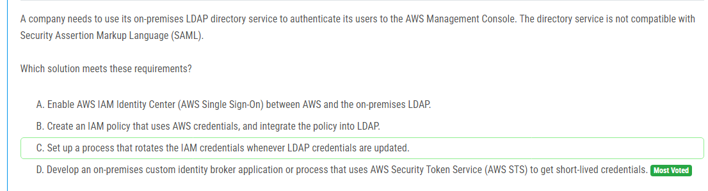
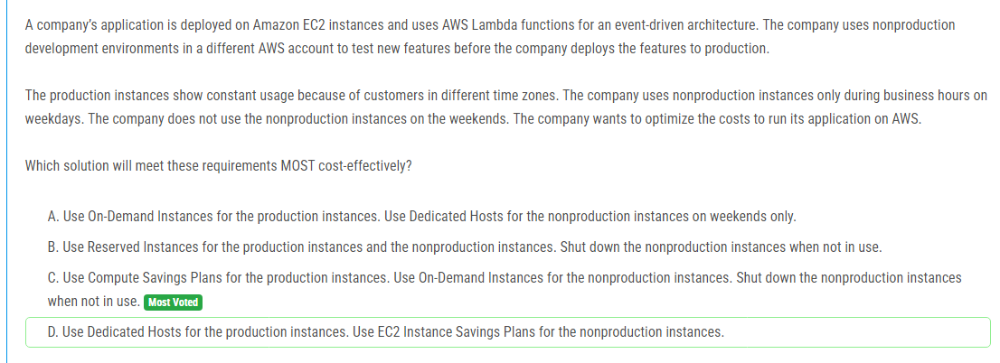
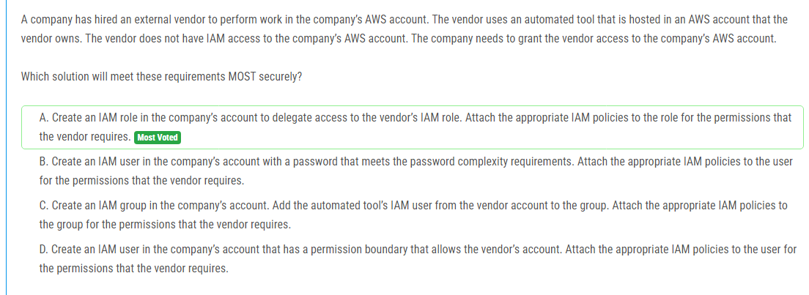

해설:

정답 D.

LDAP와 SAML 비호환성: 질문에서 주어진 조건은 LDAP 디렉터리 서비스가 SAML과 호환되지 않는다는 것입니다. 이는 SAML을 사용하는 일반적인 SSO 솔루션을 사용할 수 없음을 의미합니다.

AWS STS 사용: AWS Security Token Service (STS)를 사용하면 짧은 수명의 임시 보안 자격 증명을 생성할 수 있습니다. 이는 LDAP와 AWS 간의 인증을 중계할 수 있는 방법을 제공합니다.

커스텀 아이덴티티 브로커 개발: LDAP와 AWS를 연결하기 위해서는 LDAP 인증 정보를 받아서 AWS STS로 임시 자격 증명을 요청하는 커스텀 아이덴티티 브로커 애플리케이션 또는 프로세스를 개발하는 것이 필요합니다. 이 브로커는 사용자가 LDAP에 로그인하면 해당 사용자에게 AWS 접근 권한을 부여하기 위해 AWS STS를 통해 임시 자격 증명을 생성합니다.

해설:

정답 C.

Recycle Bin 사용: AWS Recycle Bin을 사용하여 삭제된 AMI를 복구할 수 있는 보존 규칙을 설정할 수 있습니다. 이는 삭제된 AMI가 일정 기간 동안 삭제되지 않고 보관되도록 하여 실수로 삭제된 경우에도 쉽게 복구할 수 있습니다.

운영 오버헤드 최소화: Recycle Bin을 사용하면 추가적인 스크립팅이나 관리 작업 없이 삭제된 AMI를 자동으로 보존하고 복구할 수 있습니다. 이는 운영 오버헤드를 크게 줄여줍니다.

빠른 복구: Recycle Bin에 보존된 AMI는 즉시 복구할 수 있으므로, 복구 시간이 매우 짧습니다. 이는 비즈니스 운영에 중요한 AMI를 빠르게 복구하는 데 도움이 됩니다.

해설:

정답 B.

AWS Snowball 사용: AWS Snowball는 대용량 데이터를 AWS로 안전하고 비용 효율적으로 이동할 수 있는 장치입니다. Snowball 장치를 사용하면 대규모 데이터를 물리적으로 AWS로 옮길 수 있으며, 네트워크 대역폭 제한 없이 데이터를 전송할 수 있습니다.

시간 제약 충족: 150 TB의 데이터를 100 Mbps의 네트워크 대역폭으로 업로드하는 것은 비현실적입니다. 계산해 보면, 150 TB를 100 Mbps로 업로드하는 데 약 139일이 걸립니다. 반면에 Snowball 장치를 사용하면 데이터를 로컬에서 복사한 다음 AWS로 배송하면 되므로, 한 달 내에 데이터를 전송할 수 있습니다.

비용 효율성: AWS Snowball은 대용량 데이터 전송에 적합하며, 네트워크 비용을 절감할 수 있습니다. 특히, 네트워크 대역폭이 제한된 상황에서는 Snowball이 가장 비용 효율적인 솔루션입니다.

해설:

정답 B.

웹 티어와 애플리케이션 티어의 분리: 웹 티어를 퍼블릭 서브넷에 배포하고 애플리케이션 티어를 프라이빗 서브넷에 배포하면 보안 및 성능 측면에서 장점을 가질 수 있습니다. 웹 티어는 외부에서 접근 가능해야 하므로 퍼블릭 서브넷에 배포하고, 애플리케이션 티어는 내부 통신을 위해 프라이빗 서브넷에 배포합니다.

Amazon Aurora MySQL 사용: Aurora MySQL은 고성능과 고가용성을 제공하는 관리형 데이터베이스 서비스로, MySQL과 호환되며 데이터베이스를 특정 시점으로 복원할 수 있는 기능(Point-in-time recovery)을 제공합니다. 이는 데이터 손실을 최소화하고, 운영 오버헤드를 줄여줍니다.

최소 변경: 현재의 온프레미스 아키텍처를 AWS로 마이그레이션하면서 최소한의 변경을 통해 동일한 세 가지 티어 구조를 유지할 수 있습니다. 이는 애플리케이션의 코드를 크게 변경하지 않고도 클라우드로 이동할 수 있음을 의미합니다.

해설:

정답 C.

SQS 접근 정책 사용: SQS 접근 정책을 사용하면 다른 AWS 계정에 있는 사용자나 역할이 특정 SQS 큐에 접근할 수 있도록 권한을 부여할 수 있습니다. 이를 통해 다른 회사가 자신들의 계정 권한을 유지하면서도 개발 팀의 SQS 큐에 접근할 수 있습니다.

정밀한 권한 제어: SQS 접근 정책을 사용하면 특정 큐에 대한 세부적인 권한을 정의할 수 있습니다. 예를 들어, 큐를 폴링(polling)하는 권한만 부여할 수 있으며, 이는 최소 권한 원칙을 준수하는 데 도움이 됩니다.

해설:

정답 D.

AWS Systems Manager Session Manager 사용: Session Manager는 SSH를 사용하지 않고도 안전하게 EC2 인스턴스에 접근할 수 있는 관리형 서비스입니다. 이를 통해 보안 그룹 및 SSH 키 관리를 단순화하고, 네트워크 설정을 간소화할 수 있습니다.

관리 오버헤드 감소: Session Manager를 사용하면 별도의 배스천 호스트를 설정하거나 VPN 연결을 구성할 필요가 없습니다. 이는 운영 오버헤드를 크게 줄여줍니다.

비용 효율성: Session Manager는 AWS Systems Manager의 일부로 추가 비용 없이 사용할 수 있으며, NAT 게이트웨이를 통한 추가적인 데이터 전송 비용이 발생하지 않습니다.

보안 강화: Session Manager는 AWS Identity and Access Management (IAM)와 통합되어 있어, 접근 제어를 세밀하게 관리할 수 있습니다. 또한, 세션 로그를 AWS CloudTrail에 저장하여 감사 및 보안을 강화할 수 있습니다.

해설:

정답 C.

AWS Storage Gateway Volume Gateway (Cached Volumes): Volume Gateway의 캐시드 볼륨을 사용하면 자주 액세스되는 데이터는 로컬 온프레미스 스토리지에 캐시되고, 전체 데이터는 Amazon S3에 저장됩니다. 이는 데이터에 대한 빠른 접근성을 제공하면서도, 전체 데이터 세트를 경제적으로 관리할 수 있습니다.

저비용 스토리지: Amazon S3를 백엔드 스토리지로 사용하여 전체 데이터 세트를 저장함으로써, 온프레미스 스토리지 비용을 줄일 수 있습니다. S3는 저렴한 비용으로 대용량 데이터를 저장할 수 있는 서비스입니다.

즉시 사용 가능한 데이터: 캐시드 볼륨을 사용하면 자주 사용되는 데이터에 대한 액세스가 매우 빠르며, 연구자들이 필요한 데이터를 즉시 사용할 수 있습니다. 이는 데이터 접근의 지연을 최소화하는 데 도움이 됩니다.

해설:

정답 A.

포인트 인 타임 복구(Point-in-Time Recovery, PITR) 설정: Amazon DynamoDB의 포인트 인 타임 복구 기능은 테이블을 지난 35일 내의 특정 시점으로 복구할 수 있게 해줍니다. 이는 자동으로 데이터를 지속적으로 백업하며, 추가적인 운영 작업이 필요하지 않습니다.

최소 운영 오버헤드: PITR은 설정 후 자동으로 작동하므로, 추가적인 관리나 스케줄링이 필요 없습니다. 이는 운영 오버헤드를 최소화합니다.

즉각적인 복구 가능: PITR을 사용하면 테이블의 상태를 특정 시점으로 빠르게 복구할 수 있어, 비즈니스 크리티컬 애플리케이션의 데이터 복구 요구 사항을 충족합니다.

해설:

정답 B.

S3 이벤트 알림: Amazon S3는 객체 생성 이벤트(예: 파일 업로드)를 감지할 수 있습니다. 이를 통해 파일이 업로드될 때마다 자동으로 처리 작업을 트리거할 수 있습니다.

AWS Lambda 사용: Lambda 함수는 서버리스 컴퓨팅 서비스로, 파일이 업로드될 때마다 자동으로 호출되어 파일을 처리할 수 있습니다. 이는 초기 설정 후 운영 오버헤드가 거의 없으며, 필요할 때만 실행되므로 비용 효율적입니다.

자동 확장성: Lambda 함수는 수요에 따라 자동으로 확장될 수 있으므로, 몇 개의 파일이 업로드되든 수백 개의 파일이 동시에 업로드되든 문제 없이 처리할 수 있습니다. 이는 변동이 심한 파일 업로드 패턴을 처리하는 데 매우 적합합니다.

해설:

정답 C.

Compute Savings Plans 사용: Compute Savings Plans는 특정 인스턴스 유형에 제한되지 않고 모든 EC2 인스턴스, AWS Lambda, 그리고 AWS Fargate에 적용됩니다. 이는 유연성을 제공하며, EC2 인스턴스 사용량에 대한 할인 혜택을 제공합니다. 따라서, 상시 사용되는 프로덕션 인스턴스에 대해 비용을 절감할 수 있습니다.

온디맨드 인스턴스 사용: 개발 및 테스트 환경에서는 사용량이 일정하지 않고, 주로 주중에만 사용됩니다. 이러한 경우 온디맨드 인스턴스를 사용하는 것이 더 비용 효율적입니다. 온디맨드 인스턴스는 사용한 만큼만 비용을 지불하면 되기 때문에, 비즈니스 시간이 아닐 때 인스턴스를 종료하여 비용을 절감할 수 있습니다.

비즈니스 시간 외 인스턴스 종료: 개발 및 테스트 인스턴스를 주중 업무 시간 외에 종료하면 비용을 크게 절감할 수 있습니다. 이는 주중 밤 시간과 주말 동안 인스턴스가 작동하지 않도록 하여 불필요한 비용을 방지합니다.

해설:

정답 C.

AWS Schema Conversion Tool (AWS SCT) 사용: SCT를 사용하면 Oracle 스키마를 Aurora PostgreSQL 스키마로 변환할 수 있습니다. 이는 두 데이터베이스 간의 스키마 차이를 자동으로 변환하여 데이터베이스 마이그레이션을 용이하게 합니다.

AWS Database Migration Service (AWS DMS) 사용: DMS는 데이터베이스 마이그레이션을 수행하는 관리형 서비스입니다. DMS는 전체 로드(full-load) 마이그레이션을 수행하고, 이후 변경 데이터 캡처(Change Data Capture, CDC) 기능을 통해 소스 데이터베이스에서 발생하는 변경 사항을 실시간으로 타겟 데이터베이스로 복제할 수 있습니다. 이는 데이터의 연속성을 보장하면서, 마이그레이션 동안 발생하는 데이터 변경 사항을 처리하는 데 이상적입니다.

연속적인 데이터 복제: DMS의 CDC 기능을 통해 Oracle 데이터베이스에서 Aurora PostgreSQL로의 변경 사항을 지속적으로 캡처하고 적용할 수 있습니다. 이는 데이터가 항상 최신 상태로 유지되도록 보장합니다.

해설:

정답 A, C.

Amazon ECS with AWS Fargate (A):

관리형 서비스: Amazon ECS는 AWS에서 제공하는 관리형 컨테이너 오케스트레이션 서비스입니다. AWS Fargate를 사용하면 인프라를 관리할 필요 없이 컨테이너를 쉽게 배포하고 관리할 수 있습니다.

자동 확장: AWS Fargate는 트래픽에 따라 컨테이너 수를 자동으로 조정할 수 있어, 수요에 맞게 적절히 확장 및 축소할 수 있습니다.

Amazon API Gateway와 AWS Lambda를 사용한 컨테이너 실행 (C):

서버리스 아키텍처: API Gateway와 Lambda를 사용하면 추가적인 인프라 관리 없이 컨테이너화된 애플리케이션을 실행할 수 있습니다. Lambda는 코드 실행에만 집중할 수 있도록 해주며, 자동으로 확장됩니다.

운영 오버헤드 최소화: Lambda와 API Gateway를 사용하면 인프라를 관리할 필요가 없으며, AWS가 모든 인프라를 자동으로 관리합니다. 이는 운영 오버헤드를 최소화하는 데 도움이 됩니다.

해설:

정답 D.

Auto Scaling 그룹 사용: Auto Scaling 그룹을 사용하면 트래픽 증가에 따라 자동으로 EC2 인스턴스를 추가하여 트래픽을 처리할 수 있습니다. 이는 트래픽 패턴에 따라 자동으로 인프라를 확장 및 축소할 수 있어 매우 유연하고 비용 효율적입니다.

런치 템플릿과 프리컨피규어된 AMI 사용: 런치 템플릿을 사용하여 사전에 설정된 AMI에서 인스턴스를 시작하면, 인스턴스가 신속하게 시작되어 빠르게 트래픽 증가에 대응할 수 있습니다. 이는 트래픽 증가에 따른 지연 시간을 최소화합니다.

비용 효율성: 필요할 때만 인스턴스를 추가로 시작하고, 트래픽이 감소하면 자동으로 인스턴스를 종료하여 비용을 절감할 수 있습니다. 이는 항상 최대 용량을 유지하는 것보다 훨씬 비용 효율적입니다.

해설:

정답 B.

AWS Config 사용: AWS Config는 AWS 리소스의 구성을 평가, 감사 및 평가할 수 있는 관리형 서비스입니다. 이는 리소스가 회사의 규정 준수 정책을 준수하는지 지속적으로 모니터링할 수 있습니다.

Managed Rule 사용: restricted-ssh라는 AWS Config의 관리형 규칙을 사용하면, 보안 그룹이 0.0.0.0/0에서 SSH를 허용하는 규칙을 포함하는지 자동으로 검사할 수 있습니다. 이는 추가적인 코드 작성이나 복잡한 설정 없이 바로 사용할 수 있습니다.

자동화된 알림: AWS Config 규칙이 위반될 경우 Amazon SNS와 통합하여 자동으로 알림을 생성할 수 있습니다. 이를 통해 규정 준수 정책 위반이 발생할 때마다 즉시 통보받을 수 있습니다.

해설:

정답 B.

VPC Lattice 사용: VPC Lattice는 다양한 VPC에 걸쳐 서비스 간 통신을 쉽게 설정할 수 있는 관리형 서비스입니다. 이는 각 팀이 독립적으로 관리하는 여러 AWS 계정과 VPC에 걸쳐 있는 마이크로서비스를 연결하는 데 유리합니다.

HTTPS 리스너 및 서비스 레지스트리: VPC Lattice는 HTTPS 리스너를 정의하여 서비스 간의 보안 통신을 보장할 수 있습니다. 또한, 서비스 레지스트리를 제공하여 서비스 발견을 용이하게 합니다. 이는 서비스 간 통신을 효율적으로 관리하고, 각 서비스가 어디에 있는지를 쉽게 발견할 수 있도록 합니다.

VPC와의 통합: VPC Lattice는 여러 VPC와의 통합을 지원하여, 서비스 네트워크에 필요한 VPC를 연관시킴으로써 통신을 설정할 수 있습니다. 이는 팀별로 분리된 VPC와 계정을 사용하는 구조에서 매우 유용합니다.

해설:

정답 C.

Amazon ElastiCache for Redis 사용: Redis는 고성능의 인메모리 데이터 저장소로, 매우 짧은 응답 시간과 높은 처리량을 제공합니다. 게임의 메타데이터와 같은 자주 조회되는 데이터를 캐싱하여, 데이터베이스에 대한 요청을 줄이고, 응답 시간을 크게 단축할 수 있습니다.

스냅샷 및 복제 기능: ElastiCache for Redis는 스냅샷과 복제 기능을 제공합니다. 이를 통해 데이터의 내구성과 가용성을 높일 수 있습니다. Redis 복제본을 통해 읽기 성능을 향상시키고, 장애 발생 시 신속하게 복구할 수 있습니다.

서브 밀리초 응답 시간: Redis는 인메모리 데이터 저장소로, 매우 빠른 응답 시간을 제공합니다. 이는 게임의 메타데이터 조회 성능을 크게 향상시킬 수 있습니다.

해설:

정답 A, C.

A: 개발 팀의 OU Amazon Resource Name (ARN)을 AMI의 시작 권한 목록에 추가:

AMI 시작 권한 부여: Amazon Machine Images (AMIs)를 다른 계정과 공유하려면 해당 계정에 AMI의 시작 권한을 부여해야 합니다. 이를 위해 개발 팀의 OU의 ARN을 AMI의 시작 권한 목록에 추가하면 개발 팀이 해당 AMI를 사용할 수 있게 됩니다.

C: 키 정책을 업데이트하여 개발 팀의 OU가 스냅샷을 복호화하는 데 사용된 AWS KMS 키를 사용할 수 있도록 허용:

KMS 키 사용 권한 부여: AMI가 KMS로 암호화된 스냅샷을 사용하여 생성된 경우, 해당 KMS 키에 대한 권한이 필요합니다. 키 정책을 업데이트하여 개발 팀의 OU가 해당 KMS 키를 사용할 수 있도록 허용하면, 개발 팀이 암호화된 스냅샷을 사용할 수 있게 됩니다.

해설:

정답 B.

대용량 데이터 전송에 적합: AWS Snowball Edge는 대용량 데이터를 물리적으로 전송할 수 있는 장치로, 각 장치는 최대 수백 테라바이트의 데이터를 저장할 수 있습니다. 이를 통해 1PB의 데이터를 효율적으로 전송할 수 있습니다.

글로벌 오피스 지원: Snowball Edge 장치는 여러 오피스에서 데이터를 수집하고, AWS로 안전하게 전송할 수 있습니다. 이를 통해 분산된 80개의 오피스에서 데이터를 한 번에 전송할 수 있습니다.

비용 효율성: Snowball Edge는 데이터 전송을 위해 고가의 네트워크 인프라를 구축할 필요가 없으므로 비용 효율적입니다. 인터넷 대역폭을 사용하는 것보다 더 빠르고 안정적으로 대용량 데이터를 전송할 수 있습니다.

해설:

정답 B.

EFS 자원 정책 사용: EFS 파일 시스템에 대한 액세스 제어를 강화하려면, 자원 정책(Resource Policy)을 사용하는 것이 효과적입니다. 자원 정책은 특정 IAM 역할이나 사용자에 대해 파일 시스템에 대한 권한을 정의할 수 있습니다.

쓰기 작업 금지: elasticfilesystem 작업을 거부하는 정책을 사용하여 EC2 인스턴스에 연결된 IAM 역할이 파일 시스템에 쓰기 또는 삭제 작업을 수행하지 못하도록 할 수 있습니다. 이를 통해 데이터셋을 읽기 전용으로 유지할 수 있습니다.

해설:

정답 A.

안전한 접근 방식: IAM 역할을 사용하여 외부 벤더에게 접근 권한을 부여하는 것은 AWS에서 권장하는 안전한 접근 방식입니다. 역할을 통해 필요한 최소한의 권한만 부여할 수 있으며, 외부 벤더가 자신의 자격 증명을 사용하지 않고도 회사의 AWS 계정에 접근할 수 있습니다.

임시 보안 자격 증명: IAM 역할을 사용하면 벤더는 임시 보안 자격 증명을 통해 회사의 리소스에 접근하게 됩니다. 이는 접근 권한을 제한된 시간 동안만 허용하므로 보안이 강화됩니다.

정밀한 권한 관리: 역할에 필요한 IAM 정책을 첨부하여 벤더가 수행할 작업에 필요한 정확한 권한만 부여할 수 있습니다. 이를 통해 최소 권한 원칙을 준수할 수 있습니다.

벤더의 계정과 통합: 벤더의 AWS 계정에서 회사의 역할을 신뢰할 수 있도록 설정하면, 벤더는 자신의 계정에서 회사 계정으로 신뢰 관계를 통해 접근할 수 있습니다. 이는 벤더의 계정과 회사의 계정 간의 통합을 용이하게 합니다.

