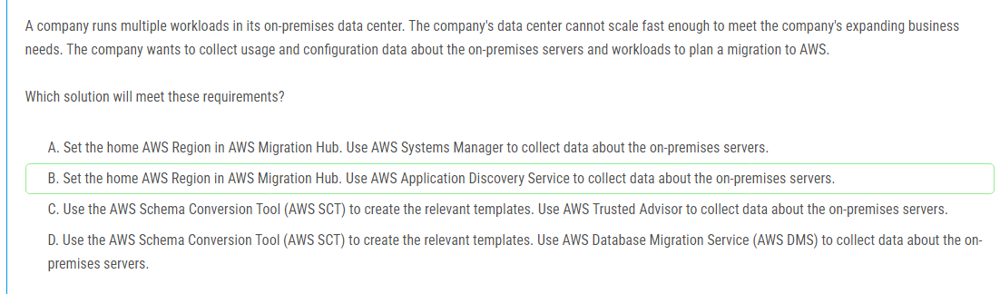
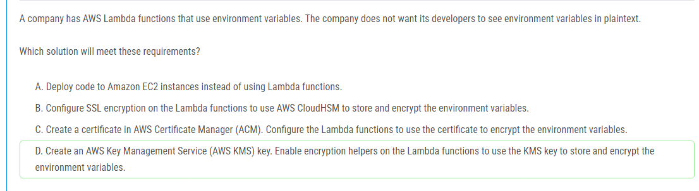

해설:

정답 A.

비용 할당 태그 사용: AWS 리소스에 태그를 지정하여 각 부서의 리소스 소유자를 명확하게 구분할 수 있습니다. 이는 각 부서가 사용한 리소스와 비용을 정확하게 추적할 수 있게 해줍니다.

AWS Budgets 사용: AWS Budgets는 사용자가 예산을 설정하고, 특정 조건이 충족될 때 알림을 받을 수 있게 해줍니다. 예산의 60%를 초과할 때 알림을 받도록 설정할 수 있습니다.

알림 임계값 설정: 예산의 60%를 초과할 때 CFO가 알림을 받을 수 있도록 임계값을 설정할 수 있습니다. 이는 예산 초과를 사전에 감지하고 조치를 취할 수 있게 해줍니다.

이 접근 방식은 비용 관리와 예산 초과 방지를 위한 가장 직접적이고 효과적인 방법입니다. 다른 선택지들은 비용 소유자 식별이나 알림 설정이 비효율적이거나 부적절할 수 있기 때문에 적합하지 않습니다.

해설:

정답 B.

내부 웹 애플리케이션 접근 제어: 웹 애플리케이션이 회사의 사무실에서만 접근 가능하도록 프라이빗 서브넷에 EC2 인스턴스를 배치하고 내부 ALB를 사용하여 외부에서 직접 접근할 수 없게 합니다. ALB의 보안 그룹 인바운드 규칙을 회사 사무실 네트워크 CIDR 블록으로 설정하여 보안성을 강화합니다.

인터넷으로부터 보안 패치 다운로드: 프라이빗 서브넷에 있는 인스턴스가 인터넷에 접근할 수 있도록 퍼블릭 서브넷에 NAT 게이트웨이를 배포합니다. 이를 통해 인스턴스가 인터넷에서 필요한 보안 패치를 다운로드할 수 있습니다.

인터넷 게이트웨이 연결: 인터넷 게이트웨이를 VPC에 연결하여 NAT 게이트웨이를 통해 인터넷에 접근할 수 있도록 합니다.

해설:

정답 D.

불변성 및 암호학적 검증 가능성: Amazon QLDB는 변경 불가능한 트랜잭션 로그를 유지하고, 데이터 변경 사항에 대한 암호학적으로 검증 가능한 기록을 제공합니다. 이는 회계 기록의 무결성을 보장하는 데 이상적입니다.

관리형 서비스: Amazon QLDB는 완전 관리형 서비스로서, 데이터베이스 관리에 대한 부담을 크게 줄여 줍니다. 이는 개발 및 유지보수 작업을 최소화하려는 요구사항에 부합합니다.

비용 효율성: QLDB는 고성능과 확장성을 제공하며, 관리형 서비스이기 때문에 인프라 관리와 관련된 추가 비용을 줄일 수 있습니다. 이는 전체적인 비용 효율성을 높입니다.

회계 데이터에 적합: 회계 기록은 변경 불가능하고 검증 가능한 로그를 필요로 합니다. QLDB는 이러한 요구사항을 만족시키기 위한 기능을 제공하므로, 회계 데이터 관리에 최적화된 선택입니다.

해설:

정답 C.

데이터 준비 작업: AWS Glue DataBrew는 사용자가 데이터를 준비하고 변환할 수 있는 시각적 인터페이스를 제공하여 데이터 준비 작업을 쉽게 처리할 수 있습니다.

정기적 실행 및 순차 실행: AWS Step Functions는 워크플로우를 정의하고, 여러 작업을 정기적으로 실행할 수 있도록 도와줍니다. 또한, 작업을 특정 순서로 실행할 수 있는 상태 머신을 지원하여 몇몇 작업을 특정 순서로 실행해야 하는 요구사항을 충족시킵니다.

운영 오버헤드 감소: AWS Step Functions는 오류 처리, 재시도 로직 및 상태 관리를 자동으로 처리합니다. 이는 회사의 운영 오버헤드를 줄이는 데 큰 도움이 됩니다.

확장성: AWS Step Functions와 Glue DataBrew는 AWS의 관리형 서비스로, 자동으로 확장 가능하며, 유지 보수와 관련된 작업을 최소화합니다.

해설:

정답 C.

중복 방지: Amazon SQS FIFO(First-In-First-Out) 큐는 메시지의 순서를 보장하고, 메시지가 중복되지 않도록 합니다. 이는 중복 결제 처리를 방지하는 데 매우 중요합니다.

확장성 및 안정성: Lambda와 SQS FIFO 큐의 조합은 높은 트랜잭션 볼륨을 처리할 수 있는 확장성과 안정성을 제공합니다. Lambda 함수는 트리거될 때마다 SQS FIFO 큐에서 메시지를 받아 처리할 수 있으며, 큐는 메시지의 순서를 보장합니다.

멀티 AZ 지원: 이 아키텍처는 여러 가용 영역(Availability Zones)에 걸쳐 있어 높은 가용성을 유지합니다. SQS와 Lambda 모두 멀티 AZ 지원을 통해 내구성과 가용성을 높입니다.

비용 효율성: Lambda와 SQS를 사용하는 것은 서버리스 아키텍처로, 필요할 때만 비용이 발생하여 비용 효율적인 솔루션입니다.

해설:

정답 B.

AWS Migration Hub: Migration Hub는 여러 AWS 마이그레이션 도구를 중앙에서 관리하고 모니터링할 수 있는 서비스입니다. 홈 리전을 설정하면 마이그레이션 활동을 추적하고 관리하기 쉽습니다.

AWS Application Discovery Service: 이 서비스는 온프레미스 데이터 센터의 서버와 애플리케이션에 대한 사용량 및 구성 데이터를 자동으로 수집합니다. 수집된 데이터는 AWS로의 마이그레이션을 계획하는 데 중요한 정보를 제공합니다. 이 서비스는 에이전트 기반 및 에이전트리스 방식 모두를 지원하여 유연한 데이터 수집을 가능하게 합니다.

해설:

정답 A.

최소 운영 오버헤드: AWS Control Tower는 여러 AWS 계정을 중앙에서 관리하고 거버넌스를 설정하며, 보안 규정 준수를 자동화하는 관리형 서비스입니다. 이를 통해 조직 전체의 API 호출 및 로그인을 감사할 수 있습니다. AWS Control Tower는 보안 설정 및 정책을 자동으로 적용하므로 추가 작업이 최소화됩니다.

비용 효율성: AWS Control Tower는 관리형 서비스로, 자체적으로 복잡한 스크립트를 작성하거나 추가 인프라를 설정할 필요가 없습니다. 이는 운영 비용과 관리 오버헤드를 줄여줍니다.

보안 허브 통합: AWS Security Hub를 활성화하면 모든 AWS 계정에서 보안 표준(예: AWS Foundational Security Best Practices)을 자동으로 모니터링하고 감사할 수 있습니다. AWS Security Hub는 보안 상태를 중앙에서 확인하고 비준수 항목을 신속하게 식별할 수 있게 도와줍니다.

계정 팩토리: AWS Control Tower Account Factory는 새로운 계정을 생성할 때 일관된 보안 및 거버넌스 설정을 자동으로 적용하여 모든 새로운 계정이 정책에 맞게 설정되도록 합니다. 이는 계정 생성 시 추가 작업을 줄여줍니다.

해설:

정답 C.

비용 효율성: Amazon Athena는 서버리스 인터랙티브 쿼리 서비스로, 데이터베이스나 클러스터를 관리할 필요가 없으며, 사용한 만큼만 비용을 지불합니다. 이는 가끔씩만 SQL 쿼리를 실행하는 사용 사례에 매우 비용 효율적입니다. Athena는 S3에 저장된 데이터를 직접 쿼리할 수 있으므로 추가적인 데이터 이동이나 저장 비용이 발생하지 않습니다.

직접 쿼리: Athena는 Apache Parquet 형식을 네이티브로 지원하여 S3에 저장된 Parquet 파일을 효율적으로 쿼리할 수 있습니다. 데이터 형식을 변경하거나 이동할 필요 없이 바로 분석이 가능합니다.

AWS Glue 통합: AWS Glue 크롤러를 사용하면 S3 버킷에 있는 데이터의 메타데이터를 자동으로 수집하고 카탈로그에 저장할 수 있습니다. 이를 통해 Athena가 데이터를 더 쉽게 이해하고 쿼리할 수 있도록 도와줍니다.

관리 오버헤드 감소: Athena는 관리형 서비스로서 클러스터 설정, 관리, 스케일링 등의 작업이 필요 없으므로 운영 오버헤드가 거의 없습니다. Glue 크롤러 또한 자동화된 방식으로 메타데이터를 관리해주기 때문에 추가적인 관리 작업이 필요하지 않습니다.

해설:

정답 A.

Proactive Controls: AWS Control Tower의 proactive controls는 리소스가 배포되기 전에 특정 조건을 미리 검토하고, 조건에 맞지 않는 배포를 차단할 수 있습니다. 이 방식은 미리 정의된 정책에 따라 배포를 제한하므로, EC2 인스턴스의 퍼블릭 IP 주소 할당 및 IAM 인라인 정책에 “*”가 포함된 경우를 사전에 차단할 수 있습니다.

정책 적용의 선제적 접근: 프로액티브 컨트롤은 문제가 발생하기 전에 예방 조치를 취하는 방식으로, 배포 후에 문제가 발생하는 것을 막기 때문에 보안과 컴플라이언스를 보다 효과적으로 유지할 수 있습니다.

AWS Control Tower 통합: AWS Control Tower는 조직 내 여러 계정과 리소스를 중앙에서 관리하고 거버넌스를 설정하는 데 도움을 줍니다. 이를 통해 중앙에서 설정한 정책을 모든 계정에 일관되게 적용할 수 있습니다.

해설:

정답 B, E.

높은 가용성:

B. Amazon EC2 Auto Scaling: Auto Scaling을 사용하여 여러 가용 영역(AZ)에 인스턴스를 배포함으로써 고가용성을 보장합니다. 여러 AZ에 인스턴스를 분산시키면 한 AZ에서 장애가 발생하더라도 애플리케이션이 계속 작동할 수 있습니다.

확장성:

B. Amazon EC2 Auto Scaling: Auto Scaling은 웹 트래픽의 증가에 따라 자동으로 인스턴스를 추가하고, 트래픽이 줄어들면 인스턴스를 줄이는 기능을 제공합니다. 이를 통해 동적으로 애플리케이션의 용량을 조정할 수 있습니다.

부하 분산:

E. Application Load Balancer (ALB): ALB는 여러 EC2 인스턴스에 트래픽을 분산시켜 웹 애플리케이션의 부하를 관리합니다. ALB를 사용하면 트래픽이 특정 인스턴스에 집중되지 않고, 모든 인스턴스에 고르게 분산되므로 성능과 안정성이 향상됩니다.

해설:

정답 D.

환경 변수 암호화: AWS Lambda는 환경 변수를 저장할 때 AWS Key Management Service (KMS)를 사용하여 암호화할 수 있습니다. KMS 키를 사용하면 암호화된 데이터는 AWS에서 자동으로 관리되며, 환경 변수는 암호화된 상태로 저장됩니다.

개발자의 접근 제한: KMS 키를 사용하여 암호화된 환경 변수는 암호화 해독 권한이 있는 경우에만 볼 수 있습니다. 이를 통해 개발자가 환경 변수를 평문으로 보지 못하도록 할 수 있습니다.

관리 편의성: AWS Lambda와 KMS의 통합은 관리형 서비스로서, 추가적인 설정이나 인프라 관리 없이 쉽게 사용할 수 있습니다. 이는 개발자가 직접 환경 변수를 암호화하고 관리하는 것보다 훨씬 간편합니다.

해설:

정답 A.

Amazon Cognito 사용자 풀: Amazon Cognito 사용자 풀은 사용자 인증을 위한 완전 관리형 서비스입니다. 이를 사용하면 사용자 등록, 로그인, 비밀번호 복구 등의 기능을 쉽게 구현할 수 있습니다. 또한, Cognito는 다양한 인증 표준(예: OAuth2, SAML)을 지원합니다.

Amazon API Gateway REST API와 Cognito Authorizer: API Gateway REST API를 사용하면 HTTP 엔드포인트를 쉽게 만들고 관리할 수 있습니다. Cognito Authorizer를 사용하여 API Gateway와 통합하면, 인증된 사용자만 API에 접근할 수 있게 됩니다. 이는 보안성을 높이고, 인증 로직을 간단하게 유지할 수 있습니다.

운영 효율성: Cognito와 API Gateway를 함께 사용하면, 사용자 인증과 API 요청 처리를 자동으로 관리할 수 있습니다. 이를 통해 별도의 서버를 운영할 필요 없이 서버리스로 운영할 수 있으며, 관리 오버헤드를 크게 줄일 수 있습니다.

해설:

정답 C.

EventBridge 규칙 사용: EventBridge는 AWS 서비스 이벤트를 쉽게 추적하고 반응할 수 있게 합니다. KMS 키 삭제 시도를 감지하는 규칙을 설정할 수 있습니다.

Systems Manager Automation 사용: Automation runbook을 통해 KMS 키 삭제 시도를 자동으로 취소할 수 있습니다. 이는 운영 오버헤드를 최소화하면서 실수로 인한 키 삭제를 방지하는 데 매우 효과적입니다.

SNS 알림: EventBridge 규칙이 트리거될 때 SNS를 통해 관리자에게 이메일 알림을 보내는 설정을 추가하여, KMS 키 삭제 시도를 실시간으로 감지하고 알릴 수 있습니다.

운영 효율성: 이 솔루션은 주로 관리형 서비스를 사용하여 최소한의 설정과 유지보수로 요구사항을 충족시킬 수 있습니다. EventBridge와 Systems Manager는 AWS에서 자동으로 관리되므로 추가적인 인프라 관리가 필요 없습니다.

해설:

정답 B.

비용 효율성: AWS Lambda는 서버리스 컴퓨팅 서비스로, 사용한 만큼만 비용을 지불합니다. 프로그램이 한 달에 한 번, 마지막 주에만 주로 사용되므로, Lambda를 사용하면 EC2 인스턴스를 계속 실행하거나 예약하는 것보다 훨씬 저렴합니다.

자동 확장: Lambda는 자동으로 확장되며, 요청에 따라 필요한 만큼의 리소스를 제공합니다. 이는 보고서 생성 요청이 많아질 때도 성능을 유지할 수 있게 합니다.

운영 오버헤드 최소화: Lambda는 서버리스 아키텍처이기 때문에 인프라를 관리할 필요가 없습니다. 이는 운영 오버헤드를 크게 줄여줍니다.

신속한 실행: Lambda 함수는 필요할 때만 실행되며, 각 보고서 생성 시간이 10분 미만이므로 Lambda의 최대 실행 시간(15분) 내에서 충분히 처리할 수 있습니다. 이는 보고서 생성 요청 시 신속하게 작업을 완료할 수 있게 합니다.

해설:

정답 B, D.

Amazon FSx for Lustre:

고성능 스토리지: FSx for Lustre는 HPC 워크로드를 위해 설계된 고성능 파일 시스템입니다. Lustre 파일 시스템은 높은 처리량과 저지연을 제공하며, 수십 기가바이트의 데이터 처리 및 공유가 필요한 HPC 애플리케이션에 최적화되어 있습니다.

스크래치 스토리지: 스크래치 스토리지는 임시 데이터를 저장하는 데 사용되며, 높은 I/O 성능이 요구되는 HPC 작업에 이상적입니다. 따라서, FSx for Lustre와 같은 스토리지 솔루션은 HPC 환경에 적합합니다.

Elastic Fabric Adapter (EFA):

고성능 네트워킹: EFA는 EC2 인스턴스에 연결할 수 있는 네트워크 인터페이스로, 높은 처리량과 낮은 지연 시간을 제공하며, HPC 및 ML/AI 워크로드에 최적화되어 있습니다. EFA는 MPI(메시지 패싱 인터페이스) 애플리케이션과 같은 통신 집약적인 HPC 애플리케이션에 중요한 역할을 합니다.

확장성: EFA를 사용하면 여러 EC2 인스턴스 간의 통신 성능이 크게 향상되어, 대규모 병렬 계산 작업을 효율적으로 수행할 수 있습니다.

해설:

정답 B.

Amazon Rekognition 사용: Amazon Rekognition은 이미지와 비디오의 분석을 위한 완전 관리형 AI 서비스입니다. Rekognition을 사용하면 사전 훈련된 모델을 활용하여 이미지에서 부적절한 콘텐츠를 감지할 수 있습니다. 이는 ML 모델을 직접 훈련할 필요 없이 바로 사용할 수 있는 서비스입니다.

AWS Lambda와 통합: Lambda 함수는 서버리스 컴퓨팅 환경을 제공하며, 이미지가 업로드될 때마다 자동으로 트리거될 수 있습니다. 이를 통해 웹 애플리케이션에 업로드되는 모든 이미지를 자동으로 검사할 수 있습니다.

운영 오버헤드 최소화: Lambda와 Rekognition의 조합은 추가적인 인프라 관리 없이도 쉽게 확장 가능하며, 운영 오버헤드를 최소화할 수 있습니다.

적절한 비용 효율성: 이 솔루션은 사용한 만큼만 비용을 지불하는 구조로, 비용 효율성이 높습니다. Rekognition은 고정된 비용 없이 사용량에 따라 과금되므로, 필요할 때만 비용이 발생합니다.

해설:

정답 B.

여러 MFA 장치 추가: AWS는 루트 계정에 대해 여러 개의 MFA 장치를 추가할 수 있도록 허용합니다. 이렇게 하면 한 MFA 장치를 잃어버리더라도 다른 장치를 사용하여 여전히 루트 계정에 접근할 수 있습니다.

높은 보안 유지: 루트 계정은 AWS 계정의 최고 관리자 권한을 가지고 있기 때문에, 루트 계정 접근의 보안을 유지하는 것이 매우 중요합니다. 여러 MFA 장치를 사용하는 것은 보안을 희생하지 않으면서도 높은 가용성을 제공합니다.

운영 효율성: 여러 MFA 장치를 추가하는 것은 비교적 간단한 과정이며, 추가적인 운영 오버헤드가 거의 없습니다. 반면에, 다른 선택지는 더 복잡하거나 추가적인 보안 위험을 초래할 수 있습니다.

해설:

정답 B.

간편한 구독 및 알림: Amazon SNS는 다양한 프로토콜(HTTP, HTTPS, 이메일, SMS 등)을 지원하여 파트너들이 쉽게 구독할 수 있습니다. 각 파트너는 자신의 HTTP 엔드포인트를 사용하여 SNS 주제에 구독할 수 있으며, 새로운 파트너를 추가하는 것은 매우 간단합니다.

확장성: SNS는 높은 확장성을 제공하므로, 수백 또는 수천 명의 파트너가 구독하더라도 쉽게 처리할 수 있습니다. SNS는 여러 구독자에게 동시에 메시지를 전송할 수 있어 대규모 알림이 필요한 경우에도 성능 저하 없이 동작합니다.

운영 오버헤드 최소화: SNS는 완전 관리형 서비스로, 인프라 관리나 확장 문제를 신경 쓸 필요가 없습니다. 이는 개발과 운영의 복잡성을 크게 줄여줍니다.

유연한 통합: SNS를 사용하면 각 파트너가 자신의 엔드포인트를 통해 HTTP 또는 HTTPS로 알림을 받을 수 있어, 파트너가 쉽게 통합할 수 있습니다. 새로운 파트너가 추가되거나 기존 파트너가 제거되는 경우에도 SNS 주제에 대한 구독 관리만으로 처리가 가능합니다.

해설:

정답 A.

Amazon Comprehend 사용: Amazon Comprehend는 자연어 처리(NLP) 서비스로, 텍스트 데이터에서 유의미한 정보를 추출하는 데 최적화되어 있습니다. 레시피 텍스트 파일에서 재료 이름을 추출하는 작업에 적합합니다. 이를 통해 머신 러닝 지식 없이도 NLP 기능을 쉽게 활용할 수 있습니다.

S3 Event Notifications와 Lambda 통합: S3 Event Notifications를 사용하면 S3 버킷에 파일이 업로드될 때마다 Lambda 함수가 자동으로 트리거됩니다. Lambda 함수는 서버리스로 운영되며, 파일이 업로드될 때마다 실행되어 재료 이름을 추출하고, 이를 DynamoDB 테이블에 저장할 수 있습니다. 이는 운영 오버헤드를 최소화하고 비용 효율성을 높입니다.

비용 효율성: Lambda와 Amazon Comprehend는 사용한 만큼만 비용이 발생하는 관리형 서비스입니다. 파일 업로드가 발생할 때만 Lambda 함수가 실행되고, Comprehend API 호출이 발생하므로, 필요 이상의 비용이 발생하지 않습니다.

해설:

정답 B.

VPC Peering 사용: VPC Peering을 통해 두 VPC 간에 사설 IP 주소 공간에서의 네트워크 연결을 설정할 수 있습니다. 이는 기본 계정의 Lambda 함수가 보조 계정의 EFS 파일 시스템에 직접 접근할 수 있도록 합니다.

비용 효율성: VPC Peering은 설정이 간단하고, 데이터 전송 비용이 상대적으로 저렴합니다. 추가적인 인프라나 데이터 복제 비용이 발생하지 않으므로, 비용 효율적입니다.

확장성: VPC Peering을 사용하면 파일 시스템의 크기나 트래픽 양에 관계없이 자동으로 확장할 수 있습니다. Lambda 함수와 EFS 파일 시스템의 자연스러운 통합을 통해 요구사항을 충족할 수 있습니다.

