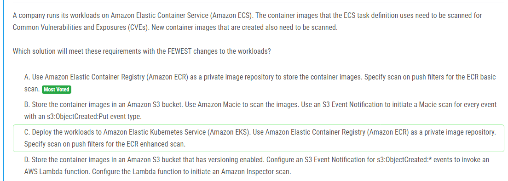
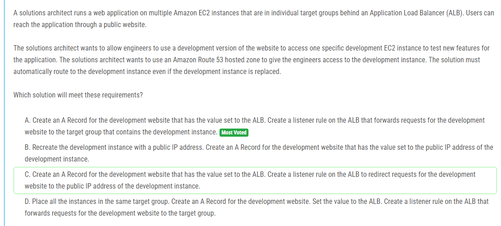

해설:

정답 D.

데이터의 민감성: 금융회사는 고도로 민감한 데이터를 다루기 때문에, 데이터 암호화는 필수적입니다. 데이터를 전송 중과 저장 중 모두 암호화해야 합니다.

암호화 키의 외부 관리: 문제에서 암호화 키를 AWS 클라우드 외부에서 관리해야 한다고 명시하고 있습니다. 이는 AWS 내에서 제공하는 키 관리 서비스를 사용할 수 없다는 것을 의미합니다.

전송 중 암호화: 회사의 데이터 센터에서 데이터를 암호화하면, 이 암호화된 데이터는 전송 중에도 보호됩니다.

저장 중 암호화: 데이터가 이미 암호화된 상태로 S3에 저장되기 때문에, S3에서 추가적인 암호화를 수행할 필요가 없습니다.

해설:

정답 D.

관리할 인프라의 최소화: AWS Lambda와 Amazon API Gateway는 서버리스 서비스로, 인프라 관리의 필요성을 최소화합니다. Lambda 함수는 필요한 경우에만 실행되며, 관리할 서버가 없습니다.

유연한 리소스 조정: AWS Fargate는 서버리스 컨테이너 서비스로, 사용자가 인프라를 관리할 필요 없이 애플리케이션의 컴퓨팅 및 메모리 리소스를 조정할 수 있습니다. 이는 장시간 실행되는 백엔드 처리 애플리케이션에 적합합니다.

자동 확장: Fargate는 자동으로 확장되므로, 애플리케이션의 부하에 따라 필요한 리소스를 자동으로 조정할 수 있습니다.

운영 오버헤드 최소화: 다른 옵션들(A, B, C)과 비교했을 때, 이 솔루션은 관리해야 할 인프라가 가장 적습니다. 특히 EKS나 EC2 Spot Instances를 사용하는 경우, 클러스터 관리나 인스턴스 수명 주기 관리를 해야 하지만, Fargate와 Lambda를 사용하면 이러한 관리가 필요 없습니다.

해설:

정답 A.

위험 기반 적응형 인증: Amazon Cognito 사용자 풀은 위험 기반 적응형 인증을 지원합니다. 이는 사용자가 일관되지 않은 지리적 위치, IP 주소 또는 장치에서 로그인할 때 추가적인 보안 단계를 요구하는 기능입니다. 이 기능을 통해 이중 요소 인증(2FA)을 상황에 맞게 적용할 수 있습니다.

다중 요소 인증(MFA): Amazon Cognito는 기본적으로 MFA를 지원하며, 이를 통해 사용자가 추가적인 보안 코드를 입력해야 하는 두 번째 인증 단계를 추가할 수 있습니다.

확장성: Amazon Cognito는 수백만 명의 사용자를 처리할 수 있도록 설계되었습니다. 이는 대규모 사용자 기반을 가진 애플리케이션에 적합합니다.

통합 관리: Amazon Cognito를 사용하면 사용자 관리, 인증, 권한 부여를 하나의 서비스에서 통합적으로 처리할 수 있습니다.

해설:

정답 C.

서버리스 솔루션: AWS Glue와 Amazon Redshift Serverless는 모두 서버리스 서비스입니다. 이는 인프라를 관리할 필요 없이 자동으로 확장되며, 사용한 만큼만 비용을 지불할 수 있습니다. 따라서 운영 오버헤드가 최소화됩니다.

데이터 변환: AWS Glue는 ETL(추출, 변환, 적재) 작업을 자동화하고 일상적으로 실행할 수 있는 관리형 서비스입니다. 데이터 레이크에서 데이터를 추출하고 변환하는 데 적합합니다.

MPP 능력: Amazon Redshift는 대규모 병렬 처리(MPP) 기능을 갖춘 데이터 웨어하우스입니다. 이는 대규모 데이터를 신속하게 처리하고 쿼리할 수 있는 능력을 제공합니다.

ML 모델 생성 및 훈련: Amazon Redshift ML을 사용하면 SQL 명령을 사용하여 머신 러닝 모델을 생성하고 훈련할 수 있습니다. 이는 데이터 분석가들이 익숙한 SQL 언어를 사용하여 쉽게 ML 모델을 만들고 적용할 수 있도록 합니다.

데일리 배치 작업: AWS Glue 작업을 일별로 스케줄링하여 데이터 변환 및 로드 작업을 자동화할 수 있습니다.

해설:

정답 C.

데이터 로컬 유지: AWS Outposts는 AWS 인프라 및 서비스를 온프레미스 데이터 센터에 설치할 수 있는 솔루션으로, 데이터를 로컬에 유지하면서 AWS 관리 서비스를 사용할 수 있습니다. 이는 데이터가 원격 사이트나 클라우드에 저장되지 않도록 하여 컴플라이언스 요구사항을 충족합니다.

Amazon EKS 통합: AWS Outposts는 Amazon EKS를 포함한 여러 AWS 서비스를 지원하므로, 기존의 로컬 Kubernetes 환경을 Amazon EKS로 확장할 수 있습니다. 이렇게 하면 AWS의 관리형 Kubernetes 서비스를 사용할 수 있으며, 데이터는 로컬 데이터 센터에 남아 있게 됩니다.

완전한 AWS 서비스 접근: AWS Outposts는 온프레미스 환경에서 AWS의 다양한 서비스(Amazon EC2, Amazon EBS, Amazon RDS 등)를 사용할 수 있게 해주므로, 로컬 환경에서 클라우드의 이점을 누릴 수 있습니다.

해설:

정답 B.

비용 효율성: Amazon S3는 매우 비용 효율적인 스토리지 솔루션을 제공하며, 다양한 스토리지 클래스를 통해 데이터를 비용 효율적으로 관리할 수 있습니다. Amazon S3 File Gateway는 데이터를 Amazon S3에 저장하고, S3 수명 주기 정책을 사용하여 데이터를 적절한 스토리지 클래스로 자동으로 전환할 수 있습니다.

확장성: Amazon S3는 매우 확장성이 뛰어나므로, 회사의 비즈니스 확장 요구를 충분히 충족할 수 있습니다. 데이터가 증가하더라도 자동으로 확장되며, 스토리지 용량에 대한 걱정 없이 데이터를 저장할 수 있습니다.

기존 환경과의 통합: AWS Storage Gateway의 File Gateway는 기존의 온프레미스 NFS 스토리지와 원활하게 통합되어, 애플리케이션 변경 없이 AWS로 데이터를 전환할 수 있습니다.

데이터 전환 및 관리: S3 수명 주기 정책을 사용하면 데이터 접근 패턴에 따라 데이터를 자동으로 전환할 수 있어, 자주 접근하지 않는 데이터를 더 저렴한 스토리지 클래스로 이동시켜 비용을 절감할 수 있습니다.

해설:

정답 D.

프로비저닝된 동시성: 프로비저닝된 동시성을 사용하면 Lambda 함수가 항상 준비 상태를 유지하며, 콜드 스타트 문제를 줄여서 고객에게 일관된 낮은 대기 시간을 제공합니다. 이는 높은 동시성을 요구하는 상황에서 특히 유용합니다.

메모리 증가: Lambda 함수의 메모리를 증가시키면, 함수에 할당된 CPU 자원도 증가합니다. CPU 집약적인 코드를 처리하는 데 필요한 CPU 자원을 확보하여 함수 실행 시간을 단축하고, 이를 통해 비용을 절감할 수 있습니다. AWS Compute Optimizer는 이러한 메모리 할당을 최적화하는 데 도움을 줍니다.

비용 절감: CPU 집약적인 작업을 더 빠르게 처리함으로써 Lambda 함수의 실행 시간을 줄일 수 있습니다. 실행 시간이 줄어들면 총 비용도 줄어듭니다. 메모리를 증가시켜 더 많은 CPU 자원을 사용하게 되면, 오히려 함수가 더 빠르게 실행되어 비용 효율적일 수 있습니다.

해설:

정답 A.

최소한의 변경: Amazon ECR을 사용하면 현재 Amazon ECS 환경에서 큰 변화를 주지 않고도 이미지를 스캔할 수 있습니다. 컨테이너 이미지를 ECR에 저장하고 푸시할 때 자동으로 스캔이 수행되므로, 워크로드 변경 없이 보안 요구사항을 충족할 수 있습니다.

자동 스캔: ECR의 기본 스캔 기능은 이미지를 푸시할 때 자동으로 CVE 스캔을 수행합니다. 이는 새로운 이미지가 생성될 때마다 자동으로 스캔을 수행하여 보안 취약점을 식별합니다.

통합 및 관리: ECR은 AWS 서비스와 원활하게 통합되며, 추가적인 설정 없이도 ECS와 함께 쉽게 사용할 수 있습니다. 이는 관리 오버헤드를 줄이고 효율적인 운영을 가능하게 합니다.

해설:

정답 A.

서버리스 솔루션: 이 솔루션은 완전히 서버리스 방식으로 동작하여 관리할 인프라가 필요 없습니다. EventBridge를 사용하면 AWS Batch 작업이 성공했을 때 자동으로 트리거됩니다.

직접 통합: EventBridge는 타사 API를 직접 호출할 수 있는 API 대상을 지원합니다. 사용자 이름과 비밀번호를 포함한 인증 정보를 설정할 수 있으므로, 별도의 Lambda 함수나 API Gateway 설정 없이 간단하게 통합할 수 있습니다.

비용 효율성: 추가적인 Lambda 함수나 API Gateway를 설정하지 않아도 되므로, 비용과 복잡성을 줄일 수 있습니다. EventBridge의 기본 기능만으로 요구 사항을 충족할 수 있습니다.

신뢰성: EventBridge는 높은 신뢰성과 가용성을 제공하며, 이벤트 기반 아키텍처를 쉽게 구축할 수 있도록 지원합니다.

해설:

정답 C.

AWS PrivateLink: PrivateLink는 프라이빗 네트워크를 통해 VPC 간에 서비스 연결을 제공하여, 인터넷을 통한 연결 없이 안전하게 데이터를 접근할 수 있게 합니다. 이를 통해 회사의 VPC와 벤더의 VPC 간에 안전한 데이터 전송이 가능합니다.

네트워크 로드 밸런서 (NLB): NLB는 고성능, 저지연의 네트워크 레벨 로드 밸런서를 제공하며, AWS PrivateLink와 통합하여 다른 VPC에서 액세스할 수 있는 엔드포인트를 만들 수 있습니다.

인터넷 게이트웨이, Direct Connect 또는 VPN 없이 연결: 이 솔루션은 인터넷 게이트웨이, Direct Connect 또는 VPN 연결이 필요 없으므로, 현재 회사의 네트워크 구성에 가장 적합합니다.

간편한 설정: PrivateLink를 사용하면, 벤더가 NLB를 설정하고 PrivateLink 엔드포인트를 제공하면 되므로, 상대적으로 간편하게 설정할 수 있습니다.

해설:

정답 B.

보안: 데이터를 인터넷을 통해 노출하지 않기 위해, VPC 내에서 작업을 수행해야 합니다. 프라이빗 엔드포인트를 사용하면 데이터가 퍼블릭 인터넷을 통해 전송되지 않으며, 보안이 강화됩니다.

VPC 통합: Amazon Managed Grafana를 VPC 내에 생성하면, Grafana와 RDS 간의 통신이 프라이빗 네트워크 내에서 이루어져 보안이 유지됩니다.

프라이빗 엔드포인트 사용: RDS 데이터베이스에 대한 프라이빗 엔드포인트를 생성하면, VPC 내의 서비스에서 안전하게 데이터에 접근할 수 있습니다. 이는 보안 요구사항을 충족시키는 데 중요한 역할을 합니다.

해설:

정답 C.

코드 필요 없음: AWS Glue DataBrew는 코드 없이 시각적 인터페이스를 통해 데이터를 변환할 수 있도록 도와줍니다. 이는 코딩 지식이 없는 사용자도 쉽게 데이터 변환 작업을 수행할 수 있게 합니다.

데이터 계보 및 데이터 프로파일링: DataBrew는 데이터 계보와 데이터 프로파일링 기능을 제공하여 데이터의 출처를 추적하고 데이터 품질을 평가할 수 있습니다. 이를 통해 데이터의 신뢰성을 높이고 문제를 신속하게 식별할 수 있습니다.

공유 가능한 변환 단계: DataBrew 레시피를 사용하면 데이터 변환 단계를 쉽게 공유하고 재사용할 수 있습니다. 이는 직원들이 동일한 변환 단계를 따를 수 있도록 하여 일관성을 유지합니다.

시각적 변환: DataBrew는 사용자가 시각적으로 데이터를 변환할 수 있도록 도와주며, 변환 과정에서 실시간으로 결과를 확인할 수 있습니다. 이를 통해 변환 작업의 정확성을 높일 수 있습니다.

해설:

정답 A.

로드 밸런서 활용: ALB를 사용하여 트래픽을 관리하면 개발 인스턴스가 교체되더라도 로드 밸런서의 설정만 업데이트하면 되므로 유연성과 관리 편의성이 향상됩니다.

자동 라우팅: ALB의 리스너 규칙을 사용하여 특정 도메인(예: development.example.com)에 대한 요청을 개발 인스턴스가 포함된 타겟 그룹으로 자동으로 포워딩할 수 있습니다. 이렇게 하면 개발 인스턴스가 교체되더라도 새로운 인스턴스를 같은 타겟 그룹에 추가하기만 하면 되므로 관리가 용이합니다.

단일 접점: ALB를 통해 모든 트래픽을 관리하면 보안 및 모니터링을 중앙 집중식으로 수행할 수 있어 운영 효율성이 높아집니다.

해설:

정답 B.

Kubernetes 환경 유지: 현재 애플리케이션이 Kubernetes 클러스터에서 실행되고 있으므로, Amazon EKS로 마이그레이션하면 기존 Kubernetes 환경을 유지할 수 있어 마이그레이션 과정이 용이합니다. 이는 운영 오버헤드를 최소화하는 데 도움이 됩니다.

AMQP 지원: Amazon MQ는 AMQP를 포함한 여러 메시징 프로토콜을 지원하는 관리형 메시지 브로커 서비스입니다. 이를 통해 기존 메시지 큐 시스템과의 호환성을 유지할 수 있습니다.

관리형 서비스: Amazon EKS와 Amazon MQ는 모두 관리형 서비스로, 인프라 관리에 대한 부담을 AWS가 담당하므로 운영 오버헤드를 줄일 수 있습니다.

확장성: AWS의 관리형 서비스들은 자동으로 확장 가능하므로, 데이터 센터의 확장성 문제를 해결할 수 있습니다.

해설:

정답 D.

글로벌 가속화: AWS Global Accelerator는 사용자로부터 가장 가까운 AWS 엣지 로케이션으로 트래픽을 라우팅하여 네트워크 지연 시간을 줄입니다. 이를 통해 전 세계 사용자의 엔드 투 엔드 로드 타임을 개선할 수 있습니다.

빠른 전환: Global Accelerator는 인터넷의 혼잡한 경로를 피하고, Amazon 글로벌 네트워크를 통해 트래픽을 라우팅하여 성능을 최적화합니다.

기존 인프라 활용: 현재 사용 중인 NLB를 그대로 유지하면서 Global Accelerator를 추가로 설정하여 손쉽게 성능을 개선할 수 있습니다. 이는 운영 오버헤드를 최소화합니다.

고가용성: Global Accelerator는 자동으로 여러 AWS 리전으로 트래픽을 분산시키며, 리전 간 장애 조치를 통해 고가용성을 제공합니다.

해설:

정답 B.

관리형 서비스: AWS Transfer Family는 완전 관리형 서비스로, 운영 오버헤드를 최소화합니다. 이를 통해 SFTP 서버의 설정, 관리 및 유지보수에 대한 부담이 줄어듭니다.

S3 통합: Transfer Family는 SFTP, FTPS 및 FTP를 통해 전송된 파일을 자동으로 Amazon S3 버킷에 저장할 수 있습니다. 이는 벤더들이 SFTP를 통해 데이터를 업로드할 수 있게 하면서도 회사가 S3를 통해 데이터를 관리할 수 있도록 합니다.

보안 및 규정 준수: Transfer Family는 전송된 데이터를 암호화하고, AWS IAM을 사용하여 액세스를 제어할 수 있어 보안과 규정 준수를 보장합니다.

유연성: 레거시 애플리케이션을 사용하는 벤더들이 기존의 SFTP 기반 워크플로를 변경할 필요 없이 계속 사용할 수 있게 해줍니다.

해설:

정답 C.

운영 오버헤드 최소화: Amazon Textract와 Amazon Comprehend는 모두 관리형 서비스로, 별도의 서버 설정이나 유지보수가 필요 없습니다. 따라서 운영 오버헤드가 최소화됩니다.

통합된 분석 기능: Amazon Comprehend는 텍스트에서 인사이트를 추출하고 감정 분석을 수행할 수 있는 자연어 처리(NLP) 서비스입니다. Textract로 추출한 데이터를 바로 Comprehend에 전달하여 분석할 수 있습니다.

자동화된 데이터 처리: Amazon Textract는 PDF에서 텍스트를 자동으로 추출할 수 있으며, 이를 Amazon Comprehend로 전달하여 감정 분석과 내용 분석을 자동으로 수행할 수 있습니다.

결과 저장 및 접근 용이성: 분석 결과를 Amazon S3 버킷에 저장하면, 다양한 애플리케이션과 서비스에서 손쉽게 접근하고 활용할 수 있습니다.

해설:

정답 A.

실시간 데이터 수집: Amazon Kinesis Data Streams는 높은 처리량과 낮은 지연 시간을 가지고 실시간으로 데이터를 수집할 수 있는 서비스입니다. 이는 실시간 데이터 수집이 필요한 애플리케이션에 적합합니다.

간단한 데이터 파이프라인: Kinesis Data Firehose를 사용하면 Kinesis Data Streams에서 데이터를 소비하여 지정된 Amazon S3 버킷으로 자동으로 데이터를 전달할 수 있습니다. 이 과정은 코드 작성 없이 간단하게 설정할 수 있습니다.

유연한 확장성: Kinesis Data Streams와 Data Firehose는 수집되는 데이터의 양에 따라 자동으로 확장되므로, 애플리케이션의 부하가 증가하더라도 안정적으로 데이터를 수집하고 저장할 수 있습니다.

관리형 서비스: Kinesis Data Firehose는 완전 관리형 서비스로, 데이터 배치, 전송 실패 처리, 재시도 등 많은 관리 작업을 자동으로 처리합니다. 이는 운영 오버헤드를 줄이고, 데이터 파이프라인의 신뢰성을 높입니다.

해설:

정답 B.

DynamoDB의 아이템 크기 제한: Amazon DynamoDB는 개별 아이템의 크기를 400KB로 제한합니다. 현재 데이터 크기(최대 700KB)를 고려하면, 큰 데이터를 직접 DynamoDB에 저장하는 것은 불가능합니다.

효율적인 데이터 저장: Amazon S3는 대용량 데이터를 저장하는 데 최적화된 서비스입니다. 데이터 크기가 증가하더라도 S3는 쉽게 확장할 수 있으며, 비용 효율적인 스토리지를 제공합니다.

DynamoDB와 S3의 통합: DynamoDB 항목에 S3 URL을 저장함으로써, 작은 메타데이터는 DynamoDB에 저장하고 큰 데이터는 S3에 저장하는 접근 방식을 사용할 수 있습니다. 이는 데이터 접근 및 관리에 효율적입니다.

운영 오버헤드 최소화: 이 솔루션은 데이터의 크기와 관계없이 자동으로 확장 가능한 관리형 서비스를 사용하므로, 별도의 추가 관리 작업이 필요 없습니다.

해설:

정답 C.

최소 리팩토링: 이 솔루션은 기존 cron 작업을 컨테이너화하고, AWS Fargate에서 실행함으로써 최소한의 코드 변경으로 애플리케이션을 마이그레이션할 수 있습니다.

서버리스 및 관리형 서비스: AWS Fargate는 서버리스 컨테이너 실행 서비스로, 인프라 관리 없이 컨테이너를 실행할 수 있습니다. 이는 운영 오버헤드를 크게 줄여줍니다.

유연한 스케줄링: Amazon EventBridge Scheduler를 사용하면 다양한 반복 스케줄을 설정할 수 있으며, cron 표현식을 통해 세밀하게 작업 실행 시간을 조정할 수 있습니다.

미래 이벤트 처리: EventBridge Scheduler는 향후 이벤트에 대응하는 스케줄링을 지원하므로, 예약된 시간에 맞춰 작업을 실행할 수 있습니다.
