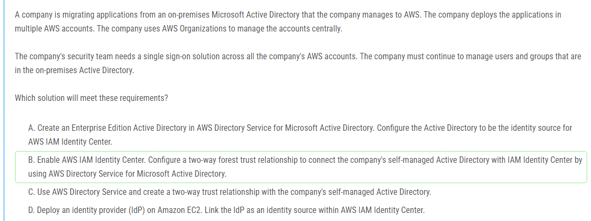
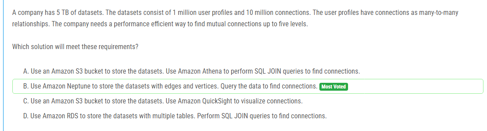
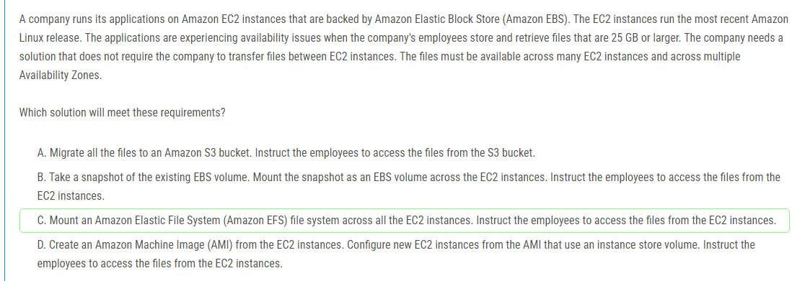

해설:

정답 C.

PrivateLink 보안: AWS PrivateLink를 사용하면 데이터가 공용 인터넷을 거치지 않고 AWS 네트워크 내에서 안전하게 전송됩니다. 이는 데이터 보안을 강화합니다.

최소 개발 노력: Amazon AppFlow는 Salesforce와 같은 SaaS 애플리케이션에서 Amazon Redshift로 데이터를 쉽게 전송할 수 있는 관리형 서비스입니다. AppFlow는 코드 없이 데이터 전송을 자동화할 수 있어 개발 노력을 최소화합니다.

직접 연결: AWS PrivateLink를 통해 Salesforce와의 프라이빗 연결을 설정하여 데이터 전송의 안정성과 보안을 보장합니다.

실시간 및 배치 데이터 전송: Amazon AppFlow는 실시간 데이터 전송뿐만 아니라 스케줄된 배치 데이터 전송도 지원하므로, 기존 데이터 로드와 지속적인 데이터 변경 전송 모두에 적합합니다.

해설:

정답 A.

비용 효율성: Amazon S3 Intelligent-Tiering은 객체 스토리지의 자동 계층화를 통해 비용을 최적화합니다. 데이터 액세스 패턴에 따라 자동으로 빈번하게 액세스되는 데이터를 더 저렴한 계층으로 이동시키므로, 저장 비용을 절감할 수 있습니다.

간편한 관리: S3는 높은 내구성과 가용성을 제공하며, 인프라 관리에 대한 부담이 거의 없습니다. 기존의 EFS를 관리하는 것보다 운영 오버헤드가 적습니다.

자동 계층화: Intelligent-Tiering을 사용하면 데이터를 자주 액세스되는 경우와 그렇지 않은 경우에 따라 자동으로 적절한 스토리지 클래스에 배치합니다. 이는 데이터 액세스 패턴을 분석하고 최적의 스토리지 클래스를 선택하는 수작업을 줄여줍니다.

애플리케이션 업데이트: S3 API를 사용하는 것으로 애플리케이션을 업데이트하는 것은 상대적으로 간단한 작업입니다. 이는 EFS에서 S3로의 마이그레이션을 용이하게 합니다.

기존 RDS 인덱스 유지: RDS에 저장된 인덱스를 그대로 유지하면서 파일 저장 위치만 변경하면 되므로, 데이터베이스 구조를 크게 변경할 필요가 없습니다.

해설:

정답 C.

쿼리 파라미터 기반 라우팅: Application Load Balancer (ALB)는 HTTP/HTTPS 기반의 고급 라우팅 기능을 제공하며, 쿼리 파라미터를 기반으로 트래픽을 다양한 타겟 그룹으로 라우팅할 수 있습니다. 이는 필요한 요구사항을 충족합니다.

트래픽 암호화: ALB는 AWS Certificate Manager (ACM)에서 제공하는 SSL/TLS 인증서를 사용하여 트래픽을 암호화할 수 있습니다. 이를 통해 로드 밸런서와 클라이언트 간의 통신이 안전하게 보호됩니다.

HTTP/HTTPS 지원: ALB는 HTTP 및 HTTPS 트래픽을 지원하며, 이는 웹 애플리케이션에 최적화된 로드 밸런서입니다. AI 알고리즘과 센서를 사용하는 로봇과 백엔드 서비스 간의 통신이 원활하게 이루어지도록 합니다.

고급 라우팅 기능: ALB는 경로 기반, 호스트 기반, 쿼리 파라미터 기반 등 다양한 라우팅 옵션을 제공하여 복잡한 트래픽 관리 요구를 충족할 수 있습니다.

해설:

정답 C.

자동 확장성: Auto Scaling 그룹을 사용하여 EC2 인스턴스의 수를 자동으로 조정하면, 트래픽 증가에 따라 애플리케이션의 인스턴스 수가 자동으로 확장 및 축소됩니다. 이는 높은 가용성과 확장성을 보장합니다.

고가용성: Application Load Balancer는 여러 가용 영역에 걸쳐 트래픽을 분산시켜 고가용성을 제공합니다. 이를 통해 인스턴스 장애가 발생하더라도 애플리케이션의 가용성을 유지할 수 있습니다.

Aurora Serverless MySQL: Amazon Aurora Serverless는 MySQL 호환 데이터베이스를 제공하며, 자동으로 용량을 조정합니다. 이는 트래픽 패턴에 따라 데이터베이스가 자동으로 확장 및 축소되므로, 데이터베이스 관리의 복잡성을 줄이고 비용 효율성을 높입니다.

관리형 서비스: Amazon Aurora는 관리형 데이터베이스 서비스로, 데이터베이스 관리 작업을 자동화하여 운영 오버헤드를 줄입니다.

해설:

정답 B.

자동 키 회전: 고객 관리 KMS 키를 사용하면 AWS KMS에서 자동으로 매년 키를 회전할 수 있습니다. 이를 통해 키 관리의 복잡성을 줄이고 보안을 유지할 수 있습니다.

투명한 데이터 암호화: S3 버킷의 기본 암호화 동작을 설정하여, 모든 업로드된 데이터가 자동으로 KMS 키로 암호화됩니다. 이는 운영 오버헤드를 최소화하고 보안 요구 사항을 충족합니다.

관리형 서비스: AWS KMS는 관리형 서비스로, 키 생성, 저장, 회전 및 사용 정책을 쉽게 관리할 수 있습니다. 이는 키 관리 작업의 부담을 줄여줍니다.

최소한의 운영 오버헤드: 자동 키 회전 기능을 사용하면 키를 수동으로 회전할 필요가 없어 운영 오버헤드가 최소화됩니다.

해설:

정답 B.

중앙 관리: AWS IAM Identity Center를 사용하면 여러 AWS 계정에 걸쳐 중앙에서 액세스를 관리할 수 있습니다. 이는 AWS Organizations와 통합되어, 계정 관리를 중앙 집중식으로 수행할 수 있습니다.

기존 AD 통합: 자체 관리 Active Directory와 AWS Directory Service for Microsoft Active Directory 간에 양방향 트러스트를 설정하면, 회사의 기존 Active Directory 사용자와 그룹을 그대로 사용하여 SSO(단일 사인온) 솔루션을 구성할 수 있습니다. 이는 사용자와 그룹 관리를 기존 방식대로 유지할 수 있게 해줍니다.

SSO 솔루션: AWS IAM Identity Center는 SSO 기능을 제공하여, 사용자가 한 번의 로그인으로 여러 AWS 계정에 액세스할 수 있게 합니다. 이는 보안팀의 요구사항을 충족합니다.

운영 간소화: 이 솔루션은 AWS에서 제공하는 관리형 서비스를 사용하여 운영 오버헤드를 줄이고, 회사의 보안 정책을 유지하면서 클라우드 환경으로 마이그레이션할 수 있게 합니다.

해설:

정답 D.

성능 최적화: Aurora I/O-Optimized 스토리지 구성은 높은 I/O 성능을 제공하며, 대규모 트래픽을 처리하는 애플리케이션에 적합합니다. 이는 스토리지의 성능을 최적화하여 애플리케이션의 부하가 증가할 때도 안정적인 성능을 유지할 수 있습니다.

비용 효율성: I/O-Optimized 스토리지는 IOPS 사용량에 대한 요금을 부과하지 않으며, 비용은 GB 단위로 청구됩니다. 이는 대량의 I/O 작업을 수행하는 워크로드에 대해 더 예측 가능하고 효율적인 비용 구조를 제공합니다.

자동 확장: Aurora Serverless v2는 자동으로 용량을 조정하여 트래픽 부하에 따라 성능을 최적화합니다. I/O-Optimized 스토리지와 결합하면, 스토리지 성능을 자동으로 확장하여 애플리케이션의 성능 요구를 충족할 수 있습니다.

해설:

정답 D.

통합된 보안 모니터링: AWS Security Hub는 여러 AWS 계정에 걸쳐 보안 모니터링을 통합하고, 보안 상태를 중앙에서 관리할 수 있는 기능을 제공합니다. 이를 통해 모든 계정의 보안 상태를 한 곳에서 확인할 수 있습니다.

산업 표준 준수: Security Hub는 NIST와 PCI DSS와 같은 여러 산업 표준을 준수하는 보안 모범 사례와 규정 준수 검사를 제공합니다. 이를 통해 회사가 필요한 표준을 준수하고 있는지 확인할 수 있습니다.

자동화된 검사: Security Hub는 계정과 리소스에 대해 자동으로 보안 검사를 수행하여, 보안 모범 사례와 규정 준수 요구사항에 따라 문제가 있는 부분을 식별하고 보고합니다.

확장성: Security Hub는 AWS Organizations와 통합되어, 조직 내 모든 계정에 대해 중앙에서 보안 검사를 확장하고 관리할 수 있습니다. 이는 수백 개의 계정에 대한 보안 상태를 효율적으로 모니터링하는 데 도움이 됩니다.

제3자 감사 증빙: Security Hub의 보고서와 대시보드는 제3자 감사인에게 회사의 보안 통제 사항이 설계대로 구현되고 올바르게 작동하고 있음을 증명하는 데 필요한 증빙 자료를 제공합니다.

해설:

정답 A.

자동화된 비용 최적화: S3 Intelligent-Tiering은 객체의 액세스 패턴을 자동으로 모니터링하고, 자주 액세스되는 객체는 빈번한 액세스 계층에, 드물게 액세스되는 객체는 드문드문 액세스 계층에 배치합니다. 이를 통해 별도의 관리 작업 없이 자동으로 비용을 최적화할 수 있습니다.

즉시 가용성: S3 Intelligent-Tiering은 모든 계층에서 객체를 즉시 사용할 수 있으므로, 자주 액세스되는 객체에 대한 지연 시간을 최소화합니다.

운영 효율성: S3 Intelligent-Tiering은 사용자가 액세스 패턴을 수동으로 분석하거나, 특정 시간에 따라 객체를 이동시킬 필요가 없으므로 운영 오버헤드를 줄여줍니다.

예측 가능한 비용: 객체의 액세스 패턴에 따라 비용이 자동으로 최적화되므로, 저장 비용을 예측 가능하게 유지할 수 있습니다.

해설:

정답 B.

그래프 데이터베이스 최적화: Amazon Neptune은 그래프 데이터베이스로, 많은-to-많은 관계를 처리하는 데 최적화되어 있습니다. 이는 사용자 프로필과 연결 데이터를 그래프 모델로 표현하여 효율적으로 저장하고 쿼리할 수 있습니다.

효율적인 관계 탐색: 그래프 데이터베이스는 연결된 데이터를 여러 레벨로 탐색하는 작업에 매우 효율적입니다. 최대 5단계의 상호 연결을 찾는 작업을 빠르고 성능 효율적으로 수행할 수 있습니다.

전용 쿼리 언어: Neptune은 Gremlin과 SPARQL과 같은 그래프 쿼리 언어를 지원하여, 복잡한 관계 쿼리를 손쉽게 작성하고 실행할 수 있습니다.

해설:

정답 D.

보안: AWS Site-to-Site VPN은 암호화된 터널을 통해 온프레미스 환경과 AWS 간의 안전한 통신을 보장합니다. 이를 통해 데이터가 전송 중에 보호됩니다.

빠른 설정: Site-to-Site VPN은 설정이 비교적 빠르고 간단합니다. VPN 게이트웨이를 설정하고 온프레미스 라우터와의 터널을 구성하면 됩니다.

비용 효율성: Site-to-Site VPN은 고비용의 전용 회선이 필요 없으며, 설정 비용도 상대적으로 저렴합니다. 낮은 대역폭 요구사항과 적은 트래픽 처리에 적합합니다.

유연성: VPN 연결은 고정된 대역폭이 아니라 필요에 따라 유동적으로 사용할 수 있어 작은 양의 트래픽을 처리하는 데 적합합니다.

해설:

정답 C.

기존 AD 통합: AWS Directory Service를 사용하여 AD Connector를 통해 온프레미스 Active Directory와 통합할 수 있습니다. 이를 통해 기존의 사용자 인증 및 권한 부여 메커니즘을 그대로 유지할 수 있습니다.

운영 오버헤드 최소화: AWS Transfer Family는 완전 관리형 서비스로, 서버 설정, 패치, 유지 보수 등의 작업이 필요 없습니다. 이를 통해 운영 오버헤드를 크게 줄일 수 있습니다.

확장성: AWS Transfer Family는 기본적으로 고가용성과 확장성을 제공하므로, 파일 전송 솔루션이 증가하는 트래픽을 쉽게 처리할 수 있습니다.

S3와의 통합: AWS Transfer Family는 Amazon S3와 통합되어 파일을 직접 S3 버킷에 저장할 수 있어, 비용 효율적이고 안전한 데이터 저장이 가능합니다.

해설:

정답 C.

느슨한 결합: EventBridge를 사용하면 시스템의 컴포넌트가 느슨하게 결합되어, 각 검증 단계가 독립적으로 실행되고, 새로운 검증 단계를 쉽게 추가할 수 있습니다.

데이터 필터링 및 변환: 입력 변환기를 사용하여 각 검증 단계 Lambda 함수가 필요로 하는 데이터만 전송할 수 있습니다. 이를 통해 각 Lambda 함수가 불필요한 데이터를 처리하지 않도록 할 수 있습니다.

확장성 및 유연성: EventBridge는 이벤트 기반 아키텍처로, 이벤트를 중심으로 한 시스템 확장이 용이하며, 다양한 이벤트 소스와 타겟을 지원하여 유연성을 제공합니다.

독립적 실행: 각 검증 단계는 독립적으로 실행되므로, 특정 검증 단계가 실패하더라도 다른 검증 단계에는 영향을 미치지 않습니다. 이는 시스템의 신뢰성을 높입니다.

해설:

정답 C.

읽기 복제본 활용: 여러 읽기 복제본을 사용하여 보고서 생성을 분산시키면, 데이터베이스의 읽기 부하가 분산되어 메인 데이터베이스의 쓰기 성능에 미치는 영향을 최소화할 수 있습니다. 이는 새로운 항목을 생성할 때의 성능 저하를 방지합니다.

리더 엔드포인트: Aurora의 리더 엔드포인트를 사용하면 읽기 복제본으로의 연결을 자동으로 분산시킬 수 있습니다. 이를 통해 애플리케이션이 읽기 작업을 수행할 때 항상 최적의 성능을 유지할 수 있습니다.

고가용성: Multi-AZ 설정은 고가용성을 보장하며, 하나의 가용 영역에 장애가 발생하더라도 다른 가용 영역에서 데이터베이스를 사용할 수 있습니다. 이는 데이터베이스의 가용성을 높이고, 장애로 인한 성능 저하를 방지합니다.

자동 확장: Aurora는 자동으로 읽기 복제본을 추가할 수 있어, 애플리케이션의 트래픽 증가에 따라 확장할 수 있습니다. 이는 성능을 유지하면서 더 많은 사용자를 처리할 수 있게 합니다.

해설:

정답 C.

비용 효율성: S3 인터페이스 엔드포인트를 사용하면 VPC 내에서 Amazon S3에 직접 액세스할 수 있으며, 트래픽이 AWS 네트워크 내에서만 이동하므로 데이터 전송 비용이 절감됩니다.

보안: S3 인터페이스 엔드포인트는 AWS 프라이빗 링크를 사용하여 Amazon S3에 안전하게 연결됩니다. 이는 트래픽이 공용 인터넷을 통하지 않으므로, 보안 요구 사항을 충족합니다.

인터넷 접속 불필요: 온프레미스 네트워크가 직접 인터넷에 접근할 수 없기 때문에, S3 인터페이스 엔드포인트를 사용하면 필요한 모든 통신이 AWS 네트워크 내에서 이루어집니다.

구성 용이성: VPC와 S3 인터페이스 엔드포인트를 설정하고 온프레미스 네트워크의 트래픽을 해당 엔드포인트로 라우팅하는 것은 비교적 간단하며, 기존 Direct Connect 연결을 통해 쉽게 설정할 수 있습니다.

해설:

정답 B.

건강 상태 확인: 다중 값 응답 라우팅 정책을 사용하면 Route 53이 각 리전의 EC2 인스턴스의 상태를 모니터링하고, 건강하지 않은 리전의 트래픽을 자동으로 다른 리전으로 라우팅할 수 있습니다. 이는 재해 복구와 고가용성을 보장합니다.

트래픽 분배: 이 라우팅 정책은 여러 리전의 IP 주소를 반환하여 트래픽을 분산시킬 수 있습니다. 이를 통해 두 리전에 걸쳐 트래픽을 균등하게 분산시킬 수 있습니다.

단순성과 효율성: 다중 값 응답 라우팅은 설정과 관리가 비교적 간단하면서도 강력한 트래픽 분배 및 상태 확인 기능을 제공합니다.

해설:

정답 C.

다중 AZ 지원: Amazon EFS는 여러 가용 영역(AZ)에 걸쳐 데이터를 저장하고 접근할 수 있게 해줍니다. 이는 가용성을 높이고 데이터 손실 위험을 줄입니다.

파일 공유: EFS는 여러 EC2 인스턴스에서 동시에 마운트할 수 있는 파일 시스템을 제공하여, 파일을 쉽게 공유하고 접근할 수 있게 합니다. 이를 통해 파일 전송 없이 여러 인스턴스에서 파일에 접근할 수 있습니다.

대용량 파일 처리: EFS는 대용량 파일을 처리하는 데 적합하며, 성능 요구 사항에 맞게 확장할 수 있습니다. 따라서 25GB 이상의 파일을 처리하는 데 적합합니다.

관리의 용이성: EFS는 관리형 서비스로, 스토리지 관리 작업이 최소화되며 자동 확장 기능을 제공합니다. 이를 통해 운영 오버헤드를 줄일 수 있습니다.

해설:

정답 D.

기본 제공 암호화 지원: Amazon EBS와 Amazon RDS는 모두 AWS KMS를 사용한 기본 제공 암호화 기능을 제공합니다. 이를 통해 추가적인 설정 없이 PII 데이터를 암호화할 수 있습니다.

최소한의 변경: 기존 인프라에 큰 변경을 가하지 않고도 EBS 및 RDS 볼륨의 암호화를 활성화할 수 있습니다. 이는 운영 중단 없이 암호화를 구현할 수 있는 간단한 방법입니다.

규정 준수: AWS KMS를 사용한 암호화는 다양한 규정 준수 요구사항을 충족할 수 있습니다. KMS 키를 사용하여 데이터를 안전하게 보호할 수 있습니다.

관리의 용이성: AWS KMS를 사용하면 키 관리를 중앙 집중화하고, 키 회전 및 감사 로그 기능을 활용할 수 있어 관리가 용이합니다.

해설:

정답 C.

인터넷 트래픽 회피: Amazon S3 게이트웨이 엔드포인트를 사용하면 VPC 내에서 S3에 직접 연결할 수 있어, 인터넷을 경유하지 않습니다. 이는 NAT 인스턴스나 NAT 게이트웨이의 트래픽 부하를 줄여줍니다.

성능 및 안정성: 게이트웨이 엔드포인트를 사용하면 S3로의 연결이 안정적이고 성능이 보장되며, 트래픽 혼잡으로 인한 Lambda 함수의 타임아웃 문제를 해결할 수 있습니다.

비용 효율성: 게이트웨이 엔드포인트는 데이터 전송 비용을 줄이고, NAT 인스턴스나 NAT 게이트웨이의 사용량을 줄여 비용을 절감할 수 있습니다.

해설:

정답 B.

가속화된 TCP 연결: AWS Global Accelerator는 전 세계의 사용자가 AWS 글로벌 네트워크를 통해 트래픽을 전송할 수 있도록 하여, 대기 시간을 줄이고 네트워크 성능을 향상시킵니다. 이는 기자들이 높은 품질의 실시간 스트림을 전송하는 데 매우 적합합니다.

고가용성 및 안정성: Global Accelerator는 여러 AWS 리전과 가용 영역을 활용하여 고가용성과 안정성을 제공합니다. 이를 통해 중단 없는 안정적인 스트리밍 서비스를 유지할 수 있습니다.

자동 장애 조치: Global Accelerator는 건강 상태 확인을 통해 비정상적인 엔드포인트를 자동으로 우회하여 트래픽을 정상적인 엔드포인트로 라우팅합니다. 이는 스트리밍 서비스의 연속성을 보장합니다.